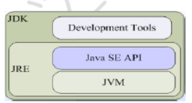
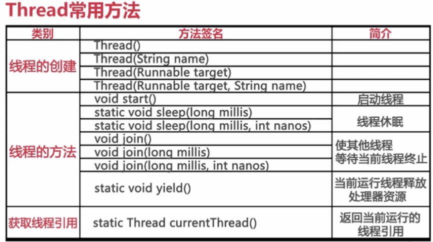
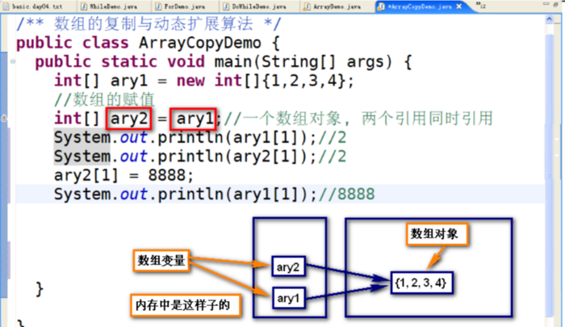
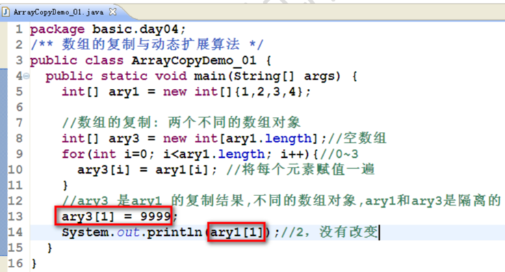
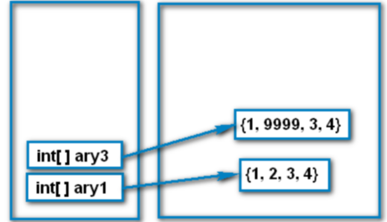
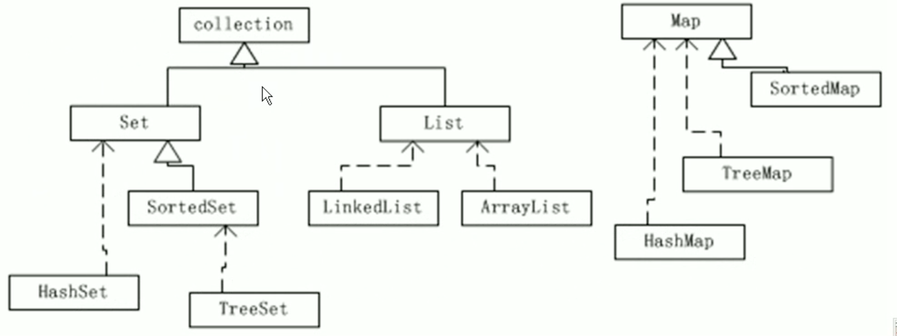

[TOC]

# Java

## Install

### Install On Mac

**Install multi-version JDK for mac**

jdk1.6 should be downloaded from [www.apple.com](http://www.apple.com) ([http://support.apple.com/kb/DL1572](http://support.apple.com/kb/DL1572)).

jdk1.7 or newer can be downloadedfrom [www.oracle.com](http://www.oracle.com) 

The primary thing of java settingon mac is setting JAVA_HOME. using the method below:

(1) Set JAVA_x_HOME for differentvision of JDK by modifying .bash_profile or /etc/bashrc.

```shell
exportJAVA6HOME=/System/Library/Java/JavaVirtualMachines/1.6.0.jdk/Contents/Home

exportJAVA7HOME=/Library/Java/JavaVirtualMachines/jdk1.7.0.jdk/Contents/Home

exportJAVA8HOME=/Library/Java/JavaVirtualMachines/jdk1.8.0.jdk/Contents/Home
```

The default install directory ofjava7 or newer is /Library/Java/JavaVirtualMachines/…

(2) target JAVA_HOME to one ofthe JAVA_x_HOME above.

`exportJAVA_HOME=$JAVA_7_HOME`

(3) Set alias for change JDKversion by modifying .bash_profile or /etc/bashrc.

```shell
aliasjdk8='export JAVA_HOME=$JAVA8HOME'

aliasjdk7='export JAVA_HOME=$JAVA7HOME'

aliasjdk6='export JAVA_HOME=$JAVA6HOME'
```

Then you can use the command jdkx to change tothe version that you want to use.

## Basic Concept

 JDK、 JRE 和 JVM 之间的关系：



Java 是一个跨平台的语言， 其跨平台的性质主要表现在其源文件编译生成的字节码文件。 即 JVM 是不跨平台的， 其余都是跨平台的（即所有 .class文件时跨平台的）。 

若仅运行 Java 程序，则只需要在用户系统上安装 JRE 即可，如果还要开发那就需要完整安装 JDK 了。

**Java开发一般遵循以下几个原则:**

- Java 中得代码必须封装到类中；
- Java 中又两种值： 对象的引用和元数据类型值
- 引用代表根本类创建的对象
- 对象只能通过引用加以操作
- Java 中得对象不能包含其他对象， 对象只能拥有指向其他对象的引用


**标识符**

标识符是一个语言的基本语言， 在 Java 开发语言中， 标识符可以用来表示类、 方法、 变量和标签。 标识符是由一系列的字符组成， 每个字符可以是由字母、 数字、 连接符号或者任意的货币符号。 应注意， Java 标识符的第一个字母不能为数字，Java 语言是区分字母大小写的。中文变量和中文字符是合法的。

**注意**： Java使用的 Unicode 编码。 Unicode 中每个字符都对应了一个唯一的数字， 而不论是什么平台， 使用什么语言， 编写什么程序。

## 基本数据类型

Java 内部数据存储有如下规则：

- Java 内部只有二进制补码， 计算机内部数据以二进制补码表示；
- Java 内部采用补码运算， 自动发送上溢出（乘法为上溢出）和下溢出（除法为下溢出）
- Java 内部没有 10 进制！ 但是 Java 尽量按照人类习惯输入输出；
- 补码的负数最高位是1， 称为符号位。

 Java  底层 byte，short 按照 32 位计算（注意 int 类型范围也是32 位）

int 类型的数据能表示的范围比float 类型小， int 类型数据表示的精度比float 大。

Java 中， 整型的字面量默认是 int， 而浮点数的字面量默认是 double。 故 long 和float 在初始化时， 需要加上l/L 或 f/F 来标识。

浮点数的运算时尽可能的精确， 不要对浮点数进行比较， 比的不准。 如：

- 2.5- 2 = 0.5
- 2.6- 2 = 0.6000000000000001

强制类型转换时， 尽量注意规避边界数的风险， 在使用时一定要考虑源数据类型有没有超过目标数据类型的取值范围。

**原始数据类型（基本数据类型）**

JavaAPI 中大部分的方法返回类型和数据成员时使用double 型。

Java 中一个字符（用char 表达）表示 Unicode 字符集中的一个元素。Unicode 字符由 16 位组成， 因此， 由65536 个不同的字符可用， 这与C++ 的标准 128 个ASCII 字符不同， Unicode 字符集提供了很大的灵活性， 它能包含所有不同语言的字符，以及常用符号。

**注意： **与 C++ 不同， Java 中一个字符数组没有必要组成一个字符串。 JavaAPI定义了自己的 String 类型。 一般只有敏感信息， 如密码字段， 才会作为字符数组处理。 这是因为 Java 对象在没有被 JVM 作为不被引用的对象清空之前一直驻留在内存中， 把敏感数据留在内存中可能会造成危险的局面。

Java 中， 任何一个 boolean 变量只有两个有效值： true 和 false。 没有等价的数值赋值， 也不允许类型转换。

**Java 数学运算的封闭性（补码运算的封闭性）**

Java 运算的封闭性就是补码运算的封闭性。Java 运算的规则如下：

- 同种类型参与运算（可能需要自动类型转换）
- 返回同种类型（可能发生： 上溢出和下溢出）
- byte, short, char 三种类型在 Java 中是表象， 底层都是按照 int 运算的。


## 流程控制

**在使用switch 时有如下注意点**：

- Switch（表达式）， 只能是整数（int, byte, char, short）表示（switch不能处理 long 或者其他类型）
- case条件只能是整数（int, byte, char, short）常量， 不能是变量及表达式
- case条件的内容可以为空，如果为空， 则继续执行直辖代码；
- default表示如果没有满足 case 的条件的其他一切情况；
- 注意别忘记写break， 会出现 “穿透”（一直执行接下来的代码， 直到遇到break 或者本代码块执行结束）


## Key Words

需要注意的是Java 中 true， false，null， then， sizeof 不是关键字， 是字面量

特殊关键字（Java保留字， 他不用， 开发时也不能用）： goto，const

Java 的关键字都是小写的

### this

this是对当前对象的引用，是运行期间当前对象本身。

- 可以使用this明确的访问当前对象的属性或者方法，类似于"我"
- this() 可调用本类的其他构造器, 可以使用构造器的重用简化代码的实现
- **this() 必须写在构造器的第一行！**

### final

- final 修饰的类，不能再被继承
  - Java 的String就是final类，不能被继承！（面试题可能考到）
  - Math 是final类，不能被继承！
  - Integer 、Long、Character等包装类是final类，不能被继承！
  - 在实际项目开发中，原则上不允许使用final类！
- final修饰的方法，不能再被覆盖。 在实际项目开发中，原则上不允许使用final方法！ 原因也是因为: 动态代理技术。
- final 修饰的变量，初始化以后不允许再修改了
  - final 局部变量
  - final 方法参数
  - final 的成员变量
- final static -- Java使用final static修饰的变量作为常量
  - 一般要求常量名都有大写字母
  - Java常量不是const（c、c++中修饰常量的修饰符）
  - final修饰属性表示“不能改”，static修饰属性表示属于类的“仅此一份”，注意区分

### volatile

为了解决线程并发的问题， Java 引入了*同步块*和*volatile*关键字

同步块通过 synchronized 来实现。

而用 volatile 修改的变量， 线程在每次使用变量的时候， 都会读取变量修改后的最新的值。 volatile 很容易被无用， 用来进行原子性操作。

Volatile 变量具有 synchronized 的可见性特性， 但是不具备原子特性。 这就是说线程能够自动发现 Volatile 变量的最新值。Volatile 变量可用于提供线程安全，但是只能应用于非常有限的一组用例：多个变量之间或者某个变量的当前值与修改后值之间没有约束。因此，单独使用 volatile 还不足以实现计数器、互斥锁或任何具有与多个变量相关的不变式（Invariants）的类（例如 “start <=end”）。

出于简易性或可伸缩性的考虑，您可能倾向于使用 volatile 变量而不是锁。当使用 volatile 变量而非锁时，某些习惯用法（idiom）更加易于编码和阅读。此外，volatile 变量不会像锁那样造成线程阻塞，因此也很少造成可伸缩性问题。在某些情况下，如果读操作远远大于写操作，volatile 变量还可以提供优于锁的性能优势。

**正确使用 volatile 变量的条件**

您只能在有限的一些情形下使用 volatile 变量替代锁。要使 volatile 变量提供理想的线程安全，必须同时满足下面两个条件：

- 对变量的写操作不依赖于当前值;
- 该变量没有包含在具有其他变量的不变式中.

实际上，这些条件表明，可以被写入 volatile 变量的这些有效值独立于任何程序的状态，包括变量的当前状态。

第一个条件的限制使 volatile 变量不能用作线程安全计数器。虽然增量操作（`x++`）看上去类似一个单独操作，实际上它是一个由读取－修改－写入操作序列组成的组合操作，必须以原子方式执行，而 volatile 不能提供必须的原子特性。实现正确的操作需要使 `x` 的值在操作期间保持不变，而 volatile 变量无法实现这点。（然而，如果将值调整为只从单个线程写入，那么可以忽略第一个条件。）

大多数编程情形都会与这两个条件的其中之一冲突，使得 volatile 变量不能像 `synchronized` 那样普遍适用于实现线程安全。清单 1 显示了一个非线程安全的数值范围类。它包含了一个不变式 —— 下界总是小于或等于上界。

```java
@NotThreadSafe 
public class NumberRange {
    private int lower, upper;

    public int getLower() { return lower; }
    public int getUpper() { return upper; }

    public void setLower(int value) { 
        if (value > upper) 
            throw new IllegalArgumentException(...);
        lower = value;
    }

    public void setUpper(int value) { 
        if (value < lower) 
            throw new IllegalArgumentException(...);
        upper = value;
    }
}
```

这种方式限制了范围的状态变量，因此将 `lower` 和 `upper` 字段定义为 volatile 类型不能够充分实现类的线程安全；从而仍然需要使用同步。否则，如果凑巧两个线程在同一时间使用不一致的值执行 `setLower` 和 `setUpper` 的话，则会使范围处于不一致的状态。例如，如果初始状态是`(0, 5)`，同一时间内，线程 A 调用 `setLower(4)` 并且线程 B 调用 `setUpper(3)`，显然这两个操作交叉存入的值是不符合条件的，那么两个线程都会通过用于保护不变式的检查，使得最后的范围值是 `(4, 3)` —— 一个无效值。至于针对范围的其他操作，我们需要使 `setLower()` 和`setUpper()` 操作原子化 —— 而将字段定义为 volatile 类型是无法实现这一目的的。

**性能考虑**

使用 volatile 变量的主要原因是其简易性：在某些情形下，使用 volatile 变量要比使用相应的锁简单得多。使用 volatile 变量次要原因是其性能：某些情况下，volatile 变量同步机制的性能要优于锁。

很难做出准确、全面的评价，例如 “X 总是比 Y 快”，尤其是对 JVM 内在的操作而言。（例如，某些情况下 VM 也许能够完全删除锁机制，这使得我们难以抽象地比较 `volatile` 和 `synchronized` 的开销。）就是说，在目前大多数的处理器架构上，volatile 读操作开销非常低 —— 几乎和非 volatile 读操作一样。而 volatile 写操作的开销要比非 volatile 写操作多很多，因为要保证可见性需要实现内存界定（Memory Fence），即便如此，volatile 的总开销仍然要比锁获取低。

volatile 操作不会像锁一样造成阻塞，因此，在能够安全使用 volatile 的情况下，volatile 可以提供一些优于锁的可伸缩特性。如果读操作的次数要远远超过写操作，与锁相比，volatile 变量通常能够减少同步的性能开销。

**正确使用 volatile 的模式**

很多并发性专家事实上往往引导用户远离 volatile 变量，因为使用它们要比使用锁更加容易出错。然而，如果谨慎地遵循一些良好定义的模式，就能够在很多场合内安全地使用 volatile 变量。要始终牢记使用 volatile 的限制 —— 只有在状态真正独立于程序内其他内容时才能使用 volatile —— 这条规则能够避免将这些模式扩展到不安全的用例。

*模式 #1 状态标志*

也许实现 volatile 变量的规范使用仅仅是使用一个布尔状态标志，用于指示发生了一个重要的一次性事件，例如完成初始化或请求停机。

很多应用程序包含了一种控制结构，形式为 “在还没有准备好停止程序时再执行一些工作”，如清单 2 所示：

```java
volatile boolean shutdownRequested;

...

public void shutdown() { shutdownRequested = true; }

public void doWork() { 
    while (!shutdownRequested) { 
        // do stuff
    }
}
```

很可能会从循环外部调用 `shutdown()` 方法 —— 即在另一个线程中 —— 因此，需要执行某种同步来确保正确实现 `shutdownRequested` 变量的可见性。（可能会从 JMX 侦听程序、GUI 事件线程中的操作侦听程序、通过 RMI 、通过一个 Web 服务等调用）。然而，使用`synchronized` 块编写循环要比使用清单 2 所示的 volatile 状态标志编写麻烦很多。由于 volatile 简化了编码，并且状态标志并不依赖于程序内任何其他状态，因此此处非常适合使用 volatile。

这种类型的状态标记的一个公共特性是：通常只有一种状态转换；`shutdownRequested` 标志从 `false` 转换为 `true`，然后程序停止。这种模式可以扩展到来回转换的状态标志，但是只有在转换周期不被察觉的情况下才能扩展（从 `false` 到 `true`，再转换到 `false`）。此外，还需要某些原子状态转换机制，例如原子变量。

*模式#2 一次性安全发布 (one-time safe publication)*

缺乏同步会导致无法实现可见性，这使得确定何时写入对象引用而不是原语值变得更加困难。在缺乏同步的情况下，可能会遇到某个对象引用的更新值（由另一个线程写入）和该对象状态的旧值同时存在。（这就是造成著名的双重检查锁定（double-checked-locking）问题的根源，其中对象引用在没有同步的情况下进行读操作，产生的问题是您可能会看到一个更新的引用，但是仍然会通过该引用看到不完全构造的对象）。

实现安全发布对象的一种技术就是将对象引用定义为 volatile 类型。清单 3 展示了一个示例，其中后台线程在启动阶段从数据库加载一些数据。其他代码在能够利用这些数据时，在使用之前将检查这些数据是否曾经发布过。

```java
public class BackgroundFloobleLoader {
    public volatile Flooble theFlooble;

    public void initInBackground() {
        // do lots of stuff
        theFlooble = new Flooble();  // this is the only write to theFlooble
    }
}

public class SomeOtherClass {
    public void doWork() {
        while (true) { 
            // do some stuff...
            // use the Flooble, but only if it is ready
            if (floobleLoader.theFlooble != null) 
                doSomething(floobleLoader.theFlooble);
        }
    }
}
```

如果 `theFlooble` 引用不是 volatile 类型，`doWork()` 中的代码在解除对 `theFlooble` 的引用时，将会得到一个不完全构造的 `Flooble`。

该模式的一个必要条件是：被发布的对象必须是线程安全的，或者是有效的不可变对象（有效不可变意味着对象的状态在发布之后永远不会被修改）。volatile 类型的引用可以确保对象的发布形式的可见性，但是如果对象的状态在发布后将发生更改，那么就需要额外的同步。

*模式 #3 独立观察 (independent observation)*

安全使用 volatile 的另一种简单模式是：定期 “发布” 观察结果供程序内部使用。例如，假设有一种环境传感器能够感觉环境温度。一个后台线程可能会每隔几秒读取一次该传感器，并更新包含当前文档的 volatile 变量。然后，其他线程可以读取这个变量，从而随时能够看到最新的温度值。

使用该模式的另一种应用程序就是收集程序的统计信息。清单 4 展示了身份验证机制如何记忆最近一次登录的用户的名字。将反复使用`lastUser` 引用来发布值，以供程序的其他部分使用。

```java
public class UserManager {
    public volatile String lastUser;

    public boolean authenticate(String user, String password) {
        boolean valid = passwordIsValid(user, password);
        if (valid) {
            User u = new User();
            activeUsers.add(u);
            lastUser = user;
        }
        return valid;
    }
}
```

该模式是前面模式的扩展；将某个值发布以在程序内的其他地方使用，但是与一次性事件的发布不同，这是一系列独立事件。这个模式要求被发布的值是有效不可变的 —— 即值的状态在发布后不会更改。使用该值的代码需要清楚该值可能随时发生变化。

*模式 #4 "Volatile bean" 模式*

volatile bean 模式适用于将 JavaBeans 作为“荣誉结构”使用的框架。在 volatile bean 模式中，JavaBean 被用作一组具有 getter 和/或 setter 方法 的独立属性的容器。volatile bean 模式的基本原理是：很多框架为易变数据的持有者（例如 `HttpSession`）提供了容器，但是放入这些容器中的对象必须是线程安全的。

在 volatile bean 模式中，JavaBean 的所有数据成员都是 volatile 类型的，并且 getter 和 setter 方法必须非常普通 —— 除了获取或设置相应的属性外，不能包含任何逻辑。此外，对于对象引用的数据成员，引用的对象必须是有效不可变的。（这将禁止具有数组值的属性，因为当数组引用被声明为 `volatile` 时，只有引用而不是数组本身具有 volatile 语义）。对于任何 volatile 变量，不变式或约束都不能包含 JavaBean 属性。清单 5 中的示例展示了遵守 volatile bean 模式的 JavaBean：

```java
@ThreadSafe
public class Person {
    private volatile String firstName;
    private volatile String lastName;
    private volatile int age;

    public String getFirstName() { return firstName; }
    public String getLastName() { return lastName; }
    public int getAge() { return age; }

    public void setFirstName(String firstName) { 
        this.firstName = firstName;
    }

    public void setLastName(String lastName) { 
        this.lastName = lastName;
    }

    public void setAge(int age) { 
        this.age = age;
    }
}
```

**volatile 的高级模式**

前面几节介绍的模式涵盖了大部分的基本用例，在这些模式中使用 volatile 非常有用并且简单。这一节将介绍一种更加高级的模式，在该模式中，volatile 将提供性能或可伸缩性优势。

volatile 应用的的高级模式非常脆弱。因此，必须对假设的条件仔细证明，并且这些模式被严格地封装了起来，因为即使非常小的更改也会损坏您的代码！同样，使用更高级的 volatile 用例的原因是它能够提升性能，确保在开始应用高级模式之前，真正确定需要实现这种性能获益。需要对这些模式进行权衡，放弃可读性或可维护性来换取可能的性能收益 —— 如果您不需要提升性能（或者不能够通过一个严格的测试程序证明您需要它），那么这很可能是一次糟糕的交易，因为您很可能会得不偿失，换来的东西要比放弃的东西价值更低。

*模式 #5 开销较低的读 - 写锁策略*

目前为止，您应该了解了 volatile 的功能还不足以实现计数器。因为 `++x` 实际上是三种操作（读、添加、存储）的简单组合，如果多个线程凑巧试图同时对 volatile 计数器执行增量操作，那么它的更新值有可能会丢失。

然而，如果读操作远远超过写操作，您可以结合使用内部锁和 volatile 变量来减少公共代码路径的开销。清单 6 中显示的线程安全的计数器使用`synchronized` 确保增量操作是原子的，并使用 `volatile` 保证当前结果的可见性。如果更新不频繁的话，该方法可实现更好的性能，因为读路径的开销仅仅涉及 volatile 读操作，这通常要优于一个无竞争的锁获取的开销。

```java
@ThreadSafe
public class CheesyCounter {
    // Employs the cheap read-write lock trick
    // All mutative operations MUST be done with the 'this' lock held
    @GuardedBy("this") private volatile int value;

    public int getValue() { return value; }

    public synchronized int increment() {
        return value++;
    }
}
```

之所以将这种技术称之为 “开销较低的读－写锁” 是因为您使用了不同的同步机制进行读写操作。因为本例中的写操作违反了使用 volatile 的第一个条件，因此不能使用 volatile 安全地实现计数器 —— 您必须使用锁。然而，您可以在读操作中使用 volatile 确保当前值的*可见性*，因此可以使用锁进行所有变化的操作，使用 volatile 进行只读操作。其中，锁一次只允许一个线程访问值，volatile 允许多个线程执行读操作，因此当使用 volatile 保证读代码路径时，要比使用锁执行全部代码路径获得更高的共享度 —— 就像读－写操作一样。然而，要随时牢记这种模式的弱点：如果超越了该模式的最基本应用，结合这两个竞争的同步机制将变得非常困难。

**结束语**

与锁相比，Volatile 变量是一种非常简单但同时又非常脆弱的同步机制，它在某些情况下将提供优于锁的性能和伸缩性。如果严格遵循 volatile 的使用条件 —— 即变量真正独立于其他变量和自己以前的值 —— 在某些情况下可以使用 `volatile` 代替 `synchronized` 来简化代码。然而，使用 `volatile` 的代码往往比使用锁的代码更加容易出错。本文介绍的模式涵盖了可以使用 `volatile` 代替 `synchronized` 的最常见的一些用例。遵循这些模式（注意使用时不要超过各自的限制）可以帮助您安全地实现大多数用例，使用 volatile 变量获得更佳性能。

## 面向对象

**变量**

类型：

- 实例变量 (Instance Variables)
- 类变量 (Class Variables)
- 局部变量 (Local Variables)
- 参数 (Parameters)

**区分实例成员和静态成员**

（1） 实例成员

对象是以类为蓝本创建的类的实例。 在类中， 一般都定义了类的成员（变量和方法）， 在创建类的对象时， 对象都会拥有类中定义变量的副本， 对象的变量页称为实例变量。 对象的实例变量的值代表了该对象的状态。

对象的方法定义了该对象的行为， 一般被称为实例方法。 实例方法属于该类的每个对象， 而方法的实现是由所有的类实例共享的。

隶属于对象的实例变量和实例方法合称为对象的实例成员。 值得注意的是， 应与类的静态成员相区别， 静态成员只是隶属于类， 而不隶属于对象。

（2） 静态成员

静态成员隶属于类， 而不属于任何该类生成的对象， 当类加载时就会初始化静态变量。 同样， 静态方法也是隶属于类的， 而不是对象。 静态变量和静态方法合称为静态成员。

*类成员的相关术语*

| 成员名称 | 成员含义                                     |
| ---- | ---------------------------------------- |
| 实例成员 | 指的是对象的实例变量和实例方式， 只能通过对象引用加以访问或调用         |
| 实例变量 | 实例变量只有在类的实例化时才分配字段， 即当创建类对象的时候， 系统才分配这个字段，也叫非静态变量 |
| 实例方法 | 一种隶属于类的实例的方法。 相同类的所有对象共享该方法的实现           |
| 静态成员 | 指的是隶属于类的静态方法和静态变量， 静态成员可以通过类名或对象引用加以访问或调用 |
| 静态变量 | 一种载入类时就需要进行分配的变量， 静态变量隶属于类， 但是不属于该类的任何对象， 所以称为静态变量或者类变量 |
| 静态方法 | 一种隶属于类但是不属于该类任何对象的方法，叫做类方法， 同样可以通过类名或者对象引用加以访问或调用 |

*Java 对象之间的消息传递*， 是通过调用相互的实例方法来实现的， 而不是静态方法。

**Java 中又两种机制来保证根据现有的类来构造新的类**， 那就是继承和聚合。

**原始类型与引用类型**

Java 提供引用类型和原始类型（或内置类型）两种不同的类型。 另外， Java 还为每个原始类型提供了封装类（Wrapper）。

引用类型和原始类型的行为完全不同， 并且分别具有不同的语义。假定一个方法中又两个局部变量， 一个变量为 int 原始类型， 另一个变量是对一个 Integer 对象的对象引用， 如下所示：

int I = 5; // 原始类型

Integer j = new Integer(5); // 引用类型

这两个变量都存在于局部变量表中， 并且都是在 Java 操作数堆栈中被操作的。原始类型int 和对象引用各占堆栈的 32 位（要表示一个int 或一对象引用， JVM 实现至少需要使用32 位存储）。 Integer 对象对应的堆栈项并不是对象本身， 而是一个对象引用。 对象引用是指向对象存储所在堆中的某个区域的指针。Java 中所有对象都要通过对象引用访问。 而当生命一个原始类型时， 就为类型本身声明了存储。

引用类型和原始类型具有不同的特征和用法。 以哪种类型的数据结构存储， 决定了以此类型作为某个类的实例数据时所指定的缺省值。 对象引用实例变量的缺省值为 null， 而原始类型实例变量的缺省值与具体的类型有关。

使用原始类型无须调用new， 也无须创建对象。 这节省了时间和空间。 混合使用原始类型和对象也可能导致与赋值有关的意外结果， 看起来没有错误的代码可能无法完成预期的工作。

**String 和StringBuffer 的区别**

Java 提供了两个字符串类：String 和 StringBuffer。 它们可以存储和操作字符串， 即包含多个字符的字符串数据。 字符串 String 类提供了数值不可改变的字符串， 而 StringBuffer 类提供的字符串对象可以进行修改。 当知道字符数据要改变的时候就可以使用 StringBuffer 类创建， 典型地， 可以使用StringBuffer 来动态构造字符数据。

### 方法

#### 重载和重写

重载的规则： 方法名一样、 参数列表不一样。 体现了功能的多态。

重写的规则： 子类对父类方法的重写， 方法签名是一致的。 体现了多态。

多态：父类型引用子类型，编译期不确定什么类型（统一都是 Question 的）， 运行期才能确定， 是通过对象的动态绑定， 实现多态。

Java 引用变量有两种类型：一个编译期类型，一个运行时类型。编译期类型由该声明该变量时使用的类型决定，运行期类型由实际赋给该变量的对象决定，如果编译期类型和运行期类型不一致，就会出现“多态”现象。

#### 方法调用原则

方法签名（方法名+参数列表）和“就近原则”（在存在自动类型转换的前提下， 使用就近原则， 调用方法）。

#### java 方法参数的传递规则

基于值的传递（只有一种方式）。 基本类型就是其中值的复制， 而引用类型是引用值（地址， 是被引用对象的首地址）的复制。 为了避免引用参数传递的副作用， 在允许的情况下一切结果使用返回值带回。

### 继承

继承： 用来表达概念上具体化延续的具体概念。

- 子类继承父类的公共属性和公共方法(public, protected)
- 构造器不能继承
- 实例化子类， 会递归分配所有父类的空间
- 子类构造器一定调用父类构造器， 默认调用父类无参数构造器(super(),使用 super() 调用父类构造器， 必须写在子类构造器第一行， 与this() 不能共存， 两者互斥)。
- 类一定有构造器（父类、 子类）

### 对象

创建对象时， 它会被存放在称为堆的内存区域中。 其区域的堆是可回收垃圾的堆(Garbage-Collectible Heap)。

**对象的实例化过程**

- 在创建类之前，检查类是否加载（是将硬盘上的.class文件加载到内存中），如果没有加载就加载这个类，在这个类加载之前要加载所有父类。Java运行时采用的策略：懒惰式加载（按需加载）：如果第一次用到就加载，只加载一次。通过CLASSPATH指定的路径寻找类文件(.class)，加载以后是一个对象，类型是Class。
- 在内存堆中分配对象空间。递归分配所有父类和子类属性空间。属性默认自动初始化。自动初始化为“0”值。
- 进行属性的赋值。
- 递归调用父类构造器。(默认调用父类无参数构造器！)
- 调用本类构造器。

### 引用类型转换

- 向下转型（隐式/自动类型转换）:小类型到大类型的转换


- 向上转型（强制类型转换）： 是大类型到小类型


- instanceof运算符： 用来检查引用对象的类型。 经常与 “引用类型强制转换“ 配合， 实现安全的类型转换， 避免类型转换异常。

### 代码块和静态代码块

代码块是在创建对象时候执行， 使用很少， 和构造器差不多， 静态代码块实在类的加载期间执行， 用在加载配置文件等。

### 抽象类

包含抽象方法的类， 一定是抽象类。

抽象类不能直接创建实例， 可以定义引用变量。

抽象方法和抽象类是非常适合作为系统的分析和设计的工具。

### 接口

接口： 全部的方法都是抽象方法， 全部的属性都是常量

接口是特殊的抽象类

接口用来表示纯抽象概念， 没有任何具体的方法和属性

接口不能实例化， 可以定义变量

接口变量可以引用具体实现类的实例。

接口只能被实现（继承）， 一个具体类实现多个接口， 必须实现全部的抽象方法。 但是一个具体类只能实现一个抽象类。

接口之间可以继承。

接口的方法一定是public abstract 的（默认， 可以不写）


## Thread

Java 对线程的支持

- Class  Thread
- Interface Runnable
- public void run() 



不要使用stop() 方法来停止线程， 而是使用退出标志来停止线程

interrupt() 方法设计的初衷不是用来停止进程

Race Condition： 争用条件。

 

JMM

Locks and Condition

**线程安全性**

- 原子性与可见性
- java.util.concurrent.atomic
- synchromized and volatile
- DeadLocks

**多线程编程常用的交互模型**

- Producer-Consumer 模型
- Read-Write Lock 模型
- Future 模型
- Worker Thread 模型

**Java5 中并发编程工具：**

- java.util.concurrent
- 线程池 ExecutorServic
- Callable and Future
- BlockingQueue


## 泛型(generics)

泛型是Java5 以后提出的语法现象， 作用是在**<u>编译期</u>**检查的类型约束（运行期不检查泛型）。 泛型可以用来约束类中元素的类型。

**规则**：

- 所有泛型方法声明都有一个类型参数声明部分（由尖括号分隔），该类型参数声明部分在方法返回类型之前（在下面例子中的）。
- 每一个类型参数声明部分包含一个或多个类型参数，参数间用逗号隔开。一个泛型参数，也被称为一个类型变量，是用于指定一个泛型类型名称的标识符。
- 类型参数能被用来声明返回值类型，并且能作为泛型方法得到的实际参数类型的占位符。
- 泛型方法方法体的声明和其他方法一样。注意类型参数只能代表引用型类型，不能是原始类型（像int,double,char的等）。

## Array

**数组对象初始化**

- 数组变量引用了具体数组对象， 就是代词
- 数组元素是自动初始化的， 自动初始化为 “零” 值
- “零” 值包括： 0（整型）、 0.0（浮点型）、\u0000（char）、 false（boolean）、null（引用类型）；
- 数组的初始化有两种方式：动态初始化（new）和静态初始化。静态初始化只能用在声明数组变量时候同时初始化。


**数组的复制与动态扩展**



**注**： 这种现象叫这种现象叫数组赋值,可以发现如果这样赋值,数组对象没有隔离性,丌小心就修改了。

所以我们使用数组对象的复制实现数组的隔离性：





java 中可以使用 `java.util.Arrays.toString(array)` 来输出数组

*数组拷贝(复制)效率更高的 2 种方法*

- System.arraycopy(src, srcPos, dest, destPos, length):这个方法是 Java API 提供的,底层 是用 C++写的,所以速度非常快,比 for() 循环实现数组拷贝效率要高很多,所以推荐使用。五个参数分别表示的含义是： 源数组、 源数组开始复制的位置、 目标数组、 目标数组开始复制的位置、 复制的长度。
- **推荐**Arrays.copyOf(src, length): 是 JDK1.6 版本提供的方法,比起 System.arraycopy() 使用更简 便,但需要注意的是你的开发环境 JDK 版本必须是 1.6 及以上。copyOf() 方法的底层就是 arraycopy() 方法. 使用起来更加简洁和方便。


**注意**：

- Arrays.asList(array) 方法只是返回一个只读数组， 不能进行增删操作， 若要复制为全功能列表， 需要通过 new 来实现。


## Connection

### Basic

- 什么是集合

  集合是包含多个对象的简单对象， 所包含的对象称为元素

  集合里面可以包含任意多个对象， 数量可以变化； 同时对对象的类型也没有限制， 也就是说集合里面的所有对象的类型可以相同， 也可以不相同。

- 集合里面有什么

    『集合框架』由一组用来操作对象的接口组成。 不同接口描述不同类型的组。 集合框架接口层次结构如下图所示。

    

    **Note**: Map 接口和 Collection 接口是完全不同的， Map 是键值对

    让我们转到对框架实现的研究， 具体的集合类遵循命名约定， 并将基本数据结构和框架接口相结合。 除了四个历史集合类外， Java 框架还引入了六个集合实现， 如下表所示。

  | 接口   | 实现         | 历史集合类      |
  | ---- | ---------- | ---------- |
  | Set  | HashSet    |            |
  |      | TreeSet    |            |
  | List | ArrayList  | Vector     |
  |      | LinkedList | Stack      |
  | Map  | HashMap    | HashTable  |
  |      | TreeMap    | Properties |

  ```
  集合框架中各接口的特点
  ```

  - Collection 接口是一组重复的对象
  - Set 接口继承 Collection， 无序但不允许重复
  - List 接口继承 Collection， 有序但允许重复， 并引入位置下表
  - Map 接口既不继承 Set 也不继承 List， 是键值对

- Collection 接口

  - Collection 接口

     Collection 接口用于表示任何对象或元素组。 想要尽可能以常规方式处理一组元素时， 就使用这一接口。 直接看 API 中接口定义。

  - Iterator 接口

      主要用来枚举集合中的元素

  - 组操作

       Collection 接口支持的其他操作， 要么是作用于元素组的任务， 要么是同时作用于整个集合的任务。

    - boolean containsAll(Collection collection)
    - boolean addAll(Collection collection)
    - void clear()
    - void removeAll(Collection collection)
    - void retainAll(Collection collection)


### Iterator

可以使用迭代器 `remove()` 方法删除刚刚迭代的元素， 而迭代时， 不能使用集合方法（add, remove, set） 更改集合元素。


### Comparable 和 Comparator

Comparable： 

- 表示可以比较（用于类实现）
- 实现这个接口表示： 这个类的实例可以比较大小， 可以进行自然排序
- compareTO()返回正数表示大， 返回负数表示小， 返回 0 表示相等。
- Comparable的实现必须与 equals() 的结果一致， 就是相等的对象时候， 比较的结果一定为0.

Comparator：

- 比较工具
- 用于临时定义比较规则， 不是默认比较规则


### List

List 容器是有序的， 可重复的。


### Set

- Set 接口

  按照定义， Set 接口继承 Collection 接口， 而且它不允许集合中存在重复项。 所有原始方法都是现成的， 没有引入新方法

  具体的 Set 实现类依赖添加的对象的 *equals()* 方法来检查等同性

- HashSet 类和 TreeSet 类

  『集合框架』支持 Set 接口两种普通的实现： HashSet 和 TreeSet。 在更多情况下， 会使用 HashSet 存储重复自由的集合。 考虑到效率， 添加到 HashSet 的对象需要采用适当分配散列码的方式来实现 hashCode() 方法。 虽然大多数系统类覆盖了 Object 中缺省的 hashCode() 实现， 但创建自己的要添加到 HashSet 的类时， 别忘了覆盖 hashCode() 方法。 当要从集合中以有序的方式抽取元素时， TreeSet 实现会有用处。 为了能顺利进行， 添加到 TreeSet 的元素必须要是可排序的


## 异常

**定义**：异常是程序中的一些错误， 但并不是所有的错误都是异常， 并且错误有时候是可以避免的。

**异常发生的原因**：

- 用户输入了非法数据
- 要打开的文件不存在
- 网络通信时连接中断， 或者 JVM 内存溢出

**类型**：Exception 是类（Class）发生的异常， 分为检查异常（编译期发生）和非检查异常（RuntimeException， 运行时发生）。三种类型的异常：

- 检查性异常：最具代表的检查性异常是用户错误或问题引起的异常， 这是程序员无法预见的。例如要打开一个不存在文件时，一个异常就发生了，这些异常在编译时不能被简单地忽略。
- 运行时异常： 运行时异常是可能被程序员避免的异常。与检查性异常相反，运行时异常可以在编译时被忽略。
- 错误： 错误不是异常，而是脱离程序员控制的问题。错误在代码中通常被忽略， 不会被捕获。例如，当栈溢出时，一个错误就发生了，它们在编译也检查不到的。

**Exception 类的层次**：

Throwable

    |-- Error                         是系统不可恢复的错误，JVM 发生的错误

    |   |-- OutOfMemeoryError       堆内存溢出

    |   |-- StackOverflowError         栈内存溢出

    |-- Exception                      程序可以检查处理的异常， 常见的异常继承根

    |   |-- java.text.ParseException      解析对象时候发生

    |   |-- IOException           IO 异常

    |   |-- RuntimeException           非检查异常，javac 忽略对这类异常的语法检查

    |   |    | -- IllegalArgumentException

    |   |    | -- NullPointerException

    |   |    | --ArrayIndexOutOfBoundsException

    |   |    | -- ClassCastException

    |   |    | -- NumberFormatExceptione.g. Integer.parseInt(st)

**异常的捕获**： `try {...} catch(Exception e) {...} finally {}`， 应注意： 

- *catch*不能独立于*try*存在。
- 在*try/catch*后面添加*finally*块并非强制性要求的。
- *try*代码后不能既没*catch*块也没*finally*块。
- *try*,*catch*, *finally*块之间不能添加任何代码。

**自定义异常**，

- 所有异常都必须是*Throwable*的子类。
- 如果希望写一个检查性异常类，则需要继承*Exception*类。
- 如果你想写一个运行时异常类，那么需要继承*RuntimeException* 类。

在 Java 中定义了两种类型的异常和错误：

- *JVM(Java虚拟机)异常*：由*JVM*抛出的异常或错误。例如：NullPointerException类，ArrayIndexOutOfBoundsException类，ClassCastException类。
- *程序级异常*：由程序或者API程序抛出的异常。例如IllegalArgumentException类，IllegalStateException类。


## IO

**File 类的用途**： java.io.File  用于表示文件（目录）， 也就是说程序员可以通过 File 类在程序中操作硬盘上的文件和目录。 File 类只用于表示文件（目录）的信息（名称、 大小等）， 不能对文件的内容进行访问。


## JDBC

**JDBC 常用 API**

- DriverManager 类： 驱动管理器， 用于获得 Connection 对象
- Connection 接口： 连接对象， 用于获得 Statement 对象
- Statement： 用于执行静态SQL 并可返回结果的对象
  - PreparedStatement： 继承自 Statement， 预编译的 Sql 语句对象
  - CallableStatement： 继承自 PreparedStatement， 用于执行存储过程
- ResultSet： 查询返回的数据库结果集
  - 结果集相当于数据库中的游标（cursor）
  - next()： 包含两个动作： 下移一行， 并判断下一行有没有数据。

**JDBC 的计数是从 1 开始的**

**MetaData（元数据， 关于数据的数据）**

- DatabaseMetaData： 数据库的元数据。 正在连接的数据库信息， 从连接对象（Connection） 获取
- ResultSetMetaData： 数据结果集的元数据。 和查询出来的结果集相关， 从结果集（ResultSet） 获取。

**JDBC 中的事务**

- JDBC 默认事务是自动提交的， 也就是每个DML 操作完成后都自动提交。 可以通过以下方式改为手动提交。`conn.setAutoCommit(false); //true 自动提交`

- Sqlplus 中默认事务是非自动提交的， 默认必须显示或隐式提交。 可以通过如下语句设置：

  ```sql
  set autocommit on – 自动打开提交
  set autocommit off – 关闭自动提交， 默认
  ```

**批处理**

- stmt.addBatch();
- stmt.executeBatch();
- stmt.clearBatch();

**分页**

- 基于缓存的分页策略（技术解决核心： 获得数据库表全部数据， 得到可滚动结果集， 通过移动指针从结果集中取出部分数据， 适用于查询数据量小的表）

  - 一次性把数据全部取出来放在缓存中， 根据用户要看的有页数（page）和每页记录数（pageSize）， 计算把哪些数据输出显示。
  - 第 n 页： {起点}(n-1)* pageSize + 1 ~ {终点} 起点 + pageSize – 1
  - 特点：
    - 只访问数据库一次， 第一次取数比较慢， 以后每页都从缓存中取， 比较快
    - 比较适合小数据量， 如果数据量大， 对内存压力比较大
    - 一次性将数据库数据读入结果街， 每次查看指定的页时， 要求结果集的指针能够跳到指定的行， 即指针能够跳到整个结果集的任一位置。
    - 如果数据存在增量， 则无法通过翻页， 在页面上显示。
  - 结果集的跳步：
    - 创建Statement 或 PreparedStatement对象时， 需要通过 “stmt= conn.createStatement(ResultSet.TYPE_SCROLL_INSENSITIVE,ResultSet.CONCUR_READ_ONLY)” 来创建， 
    - 定位到绝对位置：rs.absolute(int rownum)
    - 相对于现在的位置， 定位到绝对位置： rs.relative(int addition)
    - 下一条：rs.next();
    - 前一条：rs.previous()

- 基于查询的分页策略（技术解决核心： 直接从数据表中取出部分数据（x到 y 条的数据）， 适用于大数据量的表）

  - 每次只向数据库要求一页的数据量

  - 第 n 页： {起点}(n-1)* pageSize + 1 ~ {终点} 起点 + pageSize – 1。

  - 特点：

    - 频繁的数据库访问。 每次取数据的时间都差不多
    - 比较适合大数据量
    - 对内存压力小

  - 实现：

    - rownum(直接使用不可行)。 rownum 的特性： 必须从第 1 行开始获取数据， 不能从中间 “截取” 数据

  - 取差集（不可行）

    如果表中数据量不大是可以的； 如果表中数据量过大， 差集效率会很低（比如从100 万条数据中取其中 10 条）

    select * from tablename minusselect * from tablename

  - 匿名视图（可行）

    select * from (select*, rownumfrom tablename) where rownumbetween 1 and 10

  - Mysql 数据库中的分页

    rownum 是Oracle 独有的， 其他数据库不能用

    不同的数据库去x – y 条数据的方式不同

    mysql 中的分页较简单：select * from tablenme limit beginnum, length


## 数据结构

### 枚举(Enumeration)

Enumeration 接口中定义了一些方法， 通过这些方法可以枚举（一次获得一个）对象结合中的元素。 这种传统接口已被迭代器取代。

### 向量(Vector)

Vector 类实现了一个动态数组， 也能通过索引访问。 和 ArrayList 很相似， 但是两者是不同的

- *Vector*是同步访问的。
- *Vector*包含了许多传统的方法，这些方法不属于集合框架。
- *Vector*主要用在事先不知道数组的大小，或者只是需要一个可以改变大小的数组的情况。

构造方法：

- Vector():  创建一个默认的向量， 默认大小为 10
- Vector(int size): 创建指定大小的向量
- Vector(int size, int incr): 创建指定大小的向量， 并且增量用 *incr* 指定。 增量表示向量每次增加的元素数目
- Vector(Collection c): 创建一个包含集合 c 元素的向量

API：


### 栈(stack) 和堆(heap)

- 栈是一块Java使用内存区域，使用的方式：LIFO(后来者居上)
- 堆也是一块Java使用内存区域，使用方式：随机分配
- Java局部变量和方法参数在栈中分配，大小是按照变量的类型分配
- 对象在堆中分配，按照类中声明属性(实例变量)分配空间
- 变量分为：基本类型和引用类型。基本类型变量的空间大小：就是基本类型的空间大小，值是基本类型的值； 引用变量的值是一个对象的地址值，引用变量通过地址引用了一个堆对象。 引用类型变量的占用空间大小和值管理是“透明的(不可看见)”由Java系统管理：变量占用空间以及值的管理，都是透明的
- 栈内存中的引用变量指向堆内存中的实例对象
- 属性是有初始值的
- 我们将堆内存里的东西称为“对象”，对应现实世界的事物


API：

- boolean empty(): 判断堆栈是否为空
- Object peek():  查看堆栈顶部的对象， 但不从堆栈中移除它
- Object pop(): 移除堆栈顶部的对象， 并作为函数的值返回该对象
- Object push(Object element): 把项压入堆栈顶部
- int search(Object element): 返回对象在堆栈中的位置， 以 1 为基数


### 字典(Dictionary)

Dictionary 类已经过时了。 在实际开发中， 可以通过 Map 接口来代替。


### 哈希表(HashTable)


### 属性(Properties)


## 多线程

锁提供了两种主要特性： 互斥(mutual exclusion) 和可见性(visibility).

- 互斥： 一次只允许一个线程持有某个特定的锁， 因此可使用该特性实现对共享数据的协调访问协议， 这样一次就只有一个线程能够使用该共享数据。
- 可见性： 它必须确保释放锁之前对共享数据做出的更改对于随后获得该锁的另一个线程是可见的。 如果没有同步机制提供的这种可见性保证， 线程看到的共享变量可能是修改前的值或不一致的值， 这将引发许多严重问题。


## 正则表达式

正则表达式定义了字符串的模式。正则表达式可以用来搜索、编辑或处理文本。正则表达式并不仅限于某一种语言，但是在每种语言中有细微的差别。

**捕获组**是把多个字符当一个单独单元进行处理的方法，它通过对括号内的字符分组来创建。可以通过调用*matcher*对象的*groupCount*方法来查看表达式有多少个分组。*groupCount*方法返回一个int值，表示*matcher*对象当前有多个捕获组。还有一个特殊的组（组0），它总是代表整个表达式。该组不包括在*groupCount*的返回值中。

- 字符集
  - [1234] 表示 1,2,3,4 之一
  - [^12] 表示除了 1,2
  - [1-5] 表示 1,2,3,4,5
  - [a-f] 表示 a-f 之间的
  - [0-9a-fA-F] 表示一个16进制字符0[xX][0-9a-fA-F]{1,8} 表示整数的16进制数表达式[\w-]{8,15} 表示8-15个人以字符、下划线、数字及“-”
- 预定义字符集
  - \d 表示[0-9]
  - “.”点 表示任意字符
  - \w 表示单词字符 [0-9a-zA-Z_] 注：包含下划线“_”
  - \s 表示匹配空白: \t \n \r \b \p
  - \D （不常用）表示非数字
  - \S （不常用）表示非空白
  - \W （不常用）表示非单词字符 [0-9a-zA-Z_]
  - {m,n} 表示数词m到n个
  - {n} 表示数词n个，比如表示“5个以上”用{5，}
  - ? 表示能出现0到1次{0，1}
  - 表示能出现1到n次{1，}
  - 表示能出现0到n次{0，}
- 正则表达式以“^”开头，“$”结尾 


API: Java.util.regex 包主要包括以下三个类：

- Pattern类：pattern对象是一个正则表达式的编译表示。Pattern类没有公共构造方法。要创建一个Pattern对象，你必须首先调用其公共静态编译方法，它返回一个Pattern对象。该方法接受一个正则表达式作为它的第一个参数。
- Matcher类：Matcher对象是对输入字符串进行解释和匹配操作的引擎。与Pattern类一样，Matcher也没有公共构造方法。你需要调用Pattern对象的matcher方法来获得一个Matcher对象。
- PatternSyntaxException：PatternSyntaxException是一个非强制异常类，它表示一个正则表达式模式中的语法错误。


## 语言现象

- 东八区现象