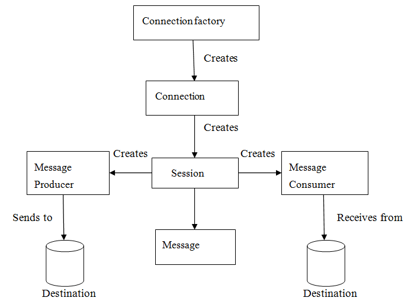

[TOC]

# Java EE 规范

## JMS

### 定义

JMS： Java Message Service 应用程序接口。 是一个 Java 平台关于面向消息中间件(MOM) 的 API。 用于两个应用程序之间， 或分布式系统中发送消息， 进行可靠的异步通信。 

### 优势

- 与平台无关性
- 异步。 客户端获取消息的时候， 不需要主动发送请求， 消息会自动发送给可用的客户端。
- 可靠。 JMS 保证消息有且仅发送一次， 避免因为重复发送消息而导致程序异常。

### 消息模型

两种通信模式：

- 点对点 (Point-to-Point Messaging Domain)
- 发布/订阅模式(Publish/Subscribe Messaging Domain)

**点对点**

定义： 应用程序由消息队列， 发送方， 接收方组成。 每个消息都被发送到一个特定的队列， 接收者队列中获取消息。 队列保留着消息， 直到他们被消费或超时。

特点：

- 每个消息只要一个消费者
- 发送者和接收者在时间上是没有时间的约束，也就是说发送者在发送完消息之后，不管接收者有没有接受消息，都不会影响发送方发送消息到消息队列中。
- 发送方不管是否在发送消息，接收方都可以从消息队列中去到消息（The receiver can fetch message whether it is running or not when the sender sends the message）
- 接收方在接收完消息之后，需要向消息队列应答成功

**发布/订阅**

定义： 在发布/订阅消息模型中，发布者发布一个消息，该消息通过topic传递给所有的客户端。该模式下，发布者与订阅者都是匿名的，即发布者与订阅者都不知道对方是谁。并且可以动态的发布与订阅Topic。Topic主要用于保存和传递消息，且会一直保存消息直到消息被传递给客户端。

特点：

- 一个消息可以传递个多个订阅者（即：一个消息可以有多个接受方）
- 发布者与订阅者具有时间约束，针对某个主题（Topic）的订阅者，它必须创建一个订阅者之后，才能消费发布者的消息，而且为了消费消息，订阅者必须保持运行的状态。
- 为了缓和这样严格的时间相关性，JMS允许订阅者创建一个可持久化的订阅。这样，即使订阅者没有被激活（运行），它也能接收到发布者的消息。

### JMS 接收消息

消息的产生和消息是异步的， 对消息消费来说， 可以通过以下两种方式：

- 同步 (Synchronous)： 订阅者/接收方通过调用 receive（）方法来接收消息。在receive（）方法中，线程会*<u>阻塞</u>*直到消息到达或者到指定时间后消息仍未到达。
- 异步 (Asynchronous)： 消息订阅者需*注册一个消息监听者*，类似于事件监听器，只要消息到达，JMS服务提供者会通过调用监听器的onMessage()递送消息。

### JMS 编程模型

- Connection Factory
- Destination
- Connection
- Session
- Producer
- Consumer
- MessageListener

