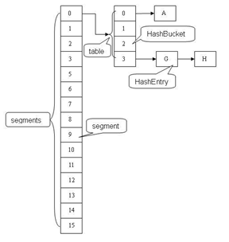
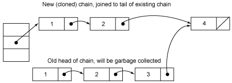
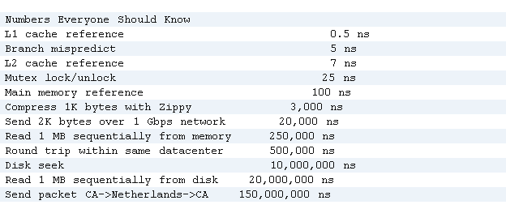

# Java Blogs

[源地址](http://www.cnblogs.com/ITtangtang/p/3948786.html)

## 参考并学习Java 开源项目

- [War Worlds](https://github.com/codeka/wwmmo): 策略类的游戏。 Java 服务端和 Android 客户端
- [OpenWorm](http://www.openworm.org/): 运行于浏览器中的小线虫的神经力学模型，其模拟后端都是用 Java 写的。
- [JRAW](https://github.com/thatJavaNerd/JRAW): Reddit API 的Java 包装器。
- [XChart](https://github.com/timmolter/XChart): 用于绘制数据的超轻量 Java 库。
- [libgdx](https://libgdx.badlogicgames.com/): 用于创建游戏的开源框架。
- [Particle Pong](https://github.com/justinmeister/PongWithLibgdx): 开源的乒乓类游戏。
- [bitcoinj](https://github.com/bitcoinj/bitcoinj):  Java 实现的比特币协议。
- [JStrava](https://github.com/dustedrob/JStrava): Strava API 的 Java 包装器。
- [JAdventure](https://github.com/Progether/JAdventure): 基于 Java 的文字冒险游戏。
- [Aurous](https://github.com/Codeusa/aurous-app): 能方便地从 Youtube 和其他来源的流建立庞大的播放列表和视频转换。(<span style="color: #f00"><u>目前地址已失效</u></span>)


## Java 集合 —— ConcurrentHashMap 原理分析

集合是编程中最常用的数据结构。 而谈到并发， 几乎总离不开集合这类高级数据结构的支持。 比如两个线程同时访问一个中间临界区(Queue)， 比如常会用缓存作为外部文件的副本(HashMap)。 这篇文件主要分析 3 种并发集合类型 (concurrent, copyonrignt, queue) 中的 **ConcurrentHashMap**。

通过分析 `HashTable` 就知道， *synchronized* 是针对整张 Hash 表的， 即每次锁住整张表让线程独占， `ConcurrentHashMap` 允许多个修改操作并发执行， 其关键在于使用了锁分离技术。 它使用了多个锁来控制对 hash 表的不同部分进行修改。 ConcurrentHashMap 内部使用段 (Segment) 来表示这些不同的部分， 每个段其实就是一个小的 hash table， 它们有自己的锁。只要多个修改操作发生在不同的段上， 它们就可以并发进行。

有些方法需要跨段， 比如 `size()` 和 `containsValue()`， 它们可能需要锁定整个表而不仅仅是某个段， 这需要按顺序锁定所有表， 操作完毕后， 又按顺序释放所有段的锁。这里“按顺序”是很重要的，否则极有可能出现死锁，在 ConcurrentHashMap 内部，段数组是 final 的，并且其成员变量实际上也是 final 的，但是，仅仅是将数组声明为final的并不保证数组成员也是 final 的，这需要实现上的保证。这可以确保不会出现死锁，因为获得锁的顺序是固定的。

### 结构解析

ConcurrentHashMap 和 Hashtable 主要区别就是围绕着锁的粒度以及如何锁,可以简单理解成把一个大的 HashTable 分解成多个，形成了锁分离。如图:



而 HashTable 的实现方式是**锁定整个 hash 表**

### 应用场景

ConcurrentHashMap 中主要实体类有三个： ConcurrentHashMap(整个 Hash 表), Segment(桶), HashEntru(节点). 对应上图可以看出之间的关系。

```java
/** 
* The segments, each of which is a specialized hash table 
*/  
final Segment<K,V>[] segments; 
```

***不变(Immutable) 和易变(Volatile)***

ConcurrentHashMap 完全允许多个读操作并发进行， 读操作并不需要加锁。 如果使用传统的技术， 如 HashMap 中的实现， 如果允许可以在 hash 链的中间添加或删除元素， 读操作不加锁将得到不一致的数据。 ConcurrentHashMap 实现技术是保证 HashEntry 几乎是不可变的。 HashEntry 代表每个 hash 链中的一个节点， 其结构如下：

```java
static final class HashEntry<K,V> {  
    final K key;  
    final int hash;  
    volatile V value;  
    final HashEntry<K,V> next;  
} 
```

可以看到除了 *value* 不是 final 的，其它值都是 final 的，这意味着不能从 hash 链的中间或尾部添加或删除节点，因为这需要修改 next 引用值，所有的节点的修改只能从头部开始。对于 put 操作，可以一律添加到 Hash 链的头部。但是对于 remove 操作，可能需要从中间删除一个节点，这就需要将要删除节点的前面所有节点整个复制一遍，最后一个节点指向要删除结点的下一个结点。这在讲解删除操作时还会详述。为了确保读操作能够看到最新的值，将 value 设置成volatile，这避免了加锁。

***其他***

为了加快定位段以及段中 hash 槽的速度，每个段 hash 槽的的个数都是2^n^，这使得通过位运算就可以定位段和段中 hash 槽的位置。当并发级别为默认值 **16** 时，也就是段的个数，hash 值的高 4 位决定分配在哪个段中。但是我们也不要忘记《算法导论》给我们的教训：hash 槽的的个数不应该是 2^n^，这可能导致 hash 槽分配不均，这需要对 hash 值重新再 hash 一次。（这段似乎有点多余了 ）

这是定位段的方法：

```java
final Segment<K,V> segmentFor(int hash) {  
    return segments[(hash >>> segmentShift) & segmentMask];  
} 
```

***数据结构***

关于 Hash 表的基础数据结构， 这里不想过多的探讨。 Hash 表的一个很重要方面就是如何解决 hash 冲突， ConcurrentHashMap 和 HashMap 使用相同的方式， 都是将 hash 值相同的结点放在一个 hash 链中。 与 HashMap 不同的是， ConcurrentHashMap 使用多个子 Hash 表， 也就是段(Segment)。 下面是 ConcurrentHashMap 的数据成员：

```java
public class ConcurrentHashMap<K, V> extends AbstractMap<K, V>  
        implements ConcurrentMap<K, V>, Serializable {  
    /** 
     * Mask value for indexing into segments. The upper bits of a 
     * key's hash code are used to choose the segment. 
     */  
    final int segmentMask;  
  
    /** 
     * Shift value for indexing within segments. 
     */  
    final int segmentShift;  
  
    /** 
     * The segments, each of which is a specialized hash table 
     */  
    final Segment<K,V>[] segments;  
}
```

所有的成员都是 final 的， 其中 segmentMask 和 segmentShift 主要是为了定位段， 参见上面的 segmentFor 方法。

每个 Segment 相当于一个子 Hash 表， 它的数据成员如下：

```java
static final class Segment<K,V> extends ReentrantLock implements Serializable {  
	private static final long serialVersionUID = 2249069246763182397L;  
    /** 
     * The number of elements in this segment's region. 
     */  
    transient volatile int count;  
 
    /** 
     * Number of updates that alter the size of the table. This is 
     * used during bulk-read methods to make sure they see a 
     * consistent snapshot: If modCounts change during a traversal 
     * of segments computing size or checking containsValue, then 
     * we might have an inconsistent view of state so (usually) 
     * must retry. 
     */  
    transient int modCount;  
  
    /** 
     * The table is rehashed when its size exceeds this threshold. 
     * (The value of this field is always <tt>(int)(capacity * 
     * loadFactor)</tt>.) 
     */  
    transient int threshold;  
  
    /** 
     * The per-segment table. 
     */  
    transient volatile HashEntry<K,V>[] table;  
 
    /** 
     * The load factor for the hash table.  Even though this value 
     * is same for all segments, it is replicated to avoid needing 
     * links to outer object. 
     * @serial 
     */  
    final float loadFactor;  
}
```

count 用来统计该段数据的个数， 它是 volatile， 它用来协调修改和读取操作， 以保证读取操作能够读取到几乎最新的修改。 协调方式是这样的， 每次修改操作做了结构上的改变， 如增加/删除节点(修改节点的值不算结构上的改变)， 都要写 count 值， 每次读取操作开始都要读取 count 的值。 这利用了 Java5 中对 volatile 的语义的增强， 对同一个 volatile 比阿娘的写和读存在 *hanppens-before* 关系。 *modCount* 统计段结构改变的次数， 主要是为了检测对多个段进行遍历过程中某个段是否发生改变， 在讲述跨段操作时会还会详述。threashold 用来表示需要进行 rehash 的界限值。table 数组存储段中节点，每个数组元素是个 hash 链，用 HashEntry 表示。table 也是 volatile，这使得能够读取到最新的 table 值而不需要同步。loadFactor 表示负载因子。

先来看下删除操作 remove(key)

```java
public V remove(Object key) {  
 hash = hash(key.hashCode());  
    return segmentFor(hash).remove(key, hash, null);  
}
```

整个操作是先定位到段，然后委托给段的 remove 操作。当多个删除操作并发进行时，只要它们所在的段不相同，它们就可以同时进行。下面是 Segment 的 remove 方法实现：

```java
V remove(Object key, int hash, Object value) {  
    lock();  
    try {  
        int c = count - 1;  
        HashEntry<K,V>[] tab = table;  
        int index = hash & (tab.length - 1);  
        HashEntry<K,V> first = tab[index];  
        HashEntry<K,V> e = first;  
        while (e != null && (e.hash != hash || !key.equals(e.key)))  
            e = e.next;  
 
         V oldValue = null;  
        if (e != null) {  
            V v = e.value;  
            if (value == null || value.equals(v)) {  
                oldValue = v;  
                // All entries following removed node can stay  
                // in list, but all preceding ones need to be  
                // cloned.  
                ++modCount;  
                HashEntry<K,V> newFirst = e.next;  
                *for (HashEntry<K,V> p = first; p != e; p = p.next)  
                    *newFirst = new HashEntry<K,V>(p.key, p.hash,  
                                                  newFirst, p.value);  
                tab[index] = newFirst;  
                count = c; // write-volatile  
            }  
        }  
        return oldValue;  
     } finally {  
         unlock();  
     }  
}
```

整个操作是在持有段锁的情况下执行的，空白行之前的行主要是定位到要删除的节点 e。接下来，如果不存在这个节点就直接返回null，否则就要将 e 前面的结点复制一遍，尾结点指向e的下一个结点。 e 后面的结点不需要复制，它们可以重用。

中间那个 for 循环是做什么用的呢？（*号标记）从代码来看，就是将定位之后的所有 entry 克隆并拼回前面去，但有必要吗？每次删除一个元素就要将那之前的元素克隆一遍？这点其实是由 entry 的不变性来决定的，仔细观察entry定义，发现除了 value，其他所有属性都是用 final 来修饰的，这意味着在第一次设置了 next 域之后便不能再改变它，取而代之的是将它之前的节点全都克隆一次。至于 entry 为什么要设置为不变性，这跟不变性的访问不需要同步从而节省时间有关

下面是个示意图

删除元素之前：



删除元素3之后：


第二个图其实有点问题，复制的结点中应该是值为2的结点在前面，值为1的结点在后面，也就是刚好和原来结点顺序相反，还好这不影响我们的讨论。

第二个图其实有点问题，复制的结点中应该是值为2的结点在前面，值为1的结点在后面，也就是刚好和原来结点顺序相反，还好这不影响我们的讨论。
整个remove实现并不复杂，但是需要注意如下几点。第一，当要删除的结点存在时，删除的最后一步操作要将 count 的值减一。这必须是最后一步操作，否则读取操作可能看不到之前对段所做的结构性修改。第二，remove 执行的开始就将table赋给一个局部变量 tab，这是因为table是 volatile变量，读写volatile变量的开销很大。编译器也不能对volatile变量的读写做任何优化，直接多次访问非volatile实例变量没有多大影响，编译器会做相应优化。

第二个图其实有点问题，复制的结点中应该是值为2的结点在前面，值为1的结点在后面，也就是刚好和原来结点顺序相反，还好这不影响我们的讨论。
整个remove实现并不复杂，但是需要注意如下几点。第一，当要删除的结点存在时，删除的最后一步操作要将count的值减一。这必须是最后一步操作，否则读取操作可能看不到之前对段所做的结构性修改。第二，remove执行的开始就将table赋给一个局部变量tab，这是因为table是 volatile变量，读写volatile变量的开销很大。编译器也不能对volatile变量的读写做任何优化，直接多次访问非volatile实例变量没有多大影响，编译器会做相应优化。
接下来看put操作，同样地put操作也是委托给段的put方法。下面是段的put方法：

```java
V put(K key, int hash, V value, boolean onlyIfAbsent) {  
    lock();  
    try {  
        int c = count;  
        if (c++ > threshold) // ensure capacity  
            rehash();  
        HashEntry<K,V>[] tab = table;  
        int index = hash & (tab.length - 1);  
        HashEntry<K,V> first = tab[index];  
        HashEntry<K,V> e = first;  
        while (e != null && (e.hash != hash || !key.equals(e.key)))  
            e = e.next;  
  
        V oldValue;  
        if (e != null) {  
            oldValue = e.value;  
            if (!onlyIfAbsent)  
                e.value = value;  
        }  
        else {  
            oldValue = null;  
            ++modCount;  
            tab[index] = new HashEntry<K,V>(key, hash, first, value);  
            count = c; // write-volatile  
        }  
        return oldValue;  
    } finally {  
        unlock();  
    }  
}
```

该方法也是在持有段锁(锁定整个segment)的情况下执行的，这当然是为了并发的安全，修改数据是不能并发进行的，必须得有个判断是否超限的语句以确保容量不足时能够rehash。接着是找是否存在同样一个key的结点，如果存在就直接替换这个结点的值。否则创建一个新的结点并添加到hash链的头部，这时一定要修改modCount和count的值，同样修改count的值一定要放在最后一步。put方法调用了rehash方法，reash方法实现得也很精巧，主要利用了table的大小为2^n，这里就不介绍了。而比较难懂的是这句int index = hash & (tab.length - 1)，原来segment里面才是真正的hashtable，即每个segment是一个传统意义上的hashtable,如上图，从两者的结构就可以看出区别，这里就是找出需要的entry在table的哪一个位置，之后得到的entry就是这个链的第一个节点，如果e!=null，说明找到了，这是就要替换节点的值（onlyIfAbsent == false），否则，我们需要new一个entry，它的后继是first，而让tab[index]指向它，什么意思呢？实际上就是将这个新entry插入到链头，剩下的就非常容易理解了

修改操作还有putAll和replace。putAll就是多次调用put方法，没什么好说的。replace甚至不用做结构上的更改，实现要比put和delete要简单得多，理解了put和delete，理解replace就不在话下了，这里也不介绍了。
**获取操作**
首先看下get操作，同样ConcurrentHashMap的get操作是直接委托给Segment的get方法，直接看Segment的get方法：

```java
V get(Object key, int hash) {  
    if (count != 0) { // read-volatile 当前桶的数据个数是否为0 
        HashEntry<K,V> e = getFirst(hash);  得到头节点
        while (e != null) {  
            if (e.hash == hash && key.equals(e.key)) {  
                V v = e.value;  
                if (v != null)  
                    return v;  
               return readValueUnderLock(e); // recheck  
            }  
            e = e.next;  
        }  
    }  
    return null;  
}
```

get操作不需要锁。第一步是访问count变量，这是一个volatile变量，由于所有的修改操作在进行结构修改时都会在最后一步写count 变量，通过这种机制保证get操作能够得到几乎最新的结构更新。对于非结构更新，也就是结点值的改变，由于HashEntry的value变量是 volatile的，也能保证读取到最新的值。接下来就是根据hash和key对hash链进行遍历找到要获取的结点，如果没有找到，直接访回null。对hash链进行遍历不需要加锁的原因在于链指针next是final的。但是头指针却不是final的，这是通过getFirst(hash)方法返回，也就是存在 table数组中的值。这使得getFirst(hash)可能返回过时的头结点，例如，当执行get方法时，刚执行完getFirst(hash)之后，另一个线程执行了删除操作并更新头结点，这就导致get方法中返回的头结点不是最新的。这是可以允许，通过对count变量的协调机制，get能读取到几乎最新的数据，虽然可能不是最新的。要得到最新的数据，只有采用完全的同步。

最后，如果找到了所求的结点，判断它的值如果非空就直接返回，否则在有锁的状态下再读一次。这似乎有些费解，理论上结点的值不可能为空，这是因为 put的时候就进行了判断，如果为空就要抛NullPointerException。空值的唯一源头就是HashEntry中的默认值，因为 HashEntry中的value不是final的，非同步读取有可能读取到空值。仔细看下put操作的语句：tab[index] = new HashEntry<K,V>(key, hash, first, value)，在这条语句中，HashEntry构造函数中对value的赋值以及对tab[index]的赋值可能被重新排序，这就可能导致结点的值为空。这里当v为空时，可能是一个线程正在改变节点，而之前的get操作都未进行锁定，根据bernstein条件，读后写或写后读都会引起数据的不一致，所以这里要对这个e重新上锁再读一遍，以保证得到的是正确值。


## Java IAQ：很少被回答的问题
Q：什么是很少被回答的问题？

一个问题如果被回答地很少，有可能是因为知道答案的人很少，亦或是因为问题本身模糊不清、微不足道（但对你来讲可能很关键）。我似乎发明了一个术语，但是它在一个信息量很大的叫做About.com Urban legends 网站里也被提到了。Java相关的常见问题非常之多，但接下来我要讲的是Java不常问到的问题（不常见问题列表就没那么多了，其中包括了一些对C语言的冷嘲热讽。）

Q：finally 语句内的代码一定会被执行，对吧？

嗯，大部分时候是的。但也存在一些特例，比如：不管choice的值是什么，下面代码finally中的语句就不会被执行。

    try {
        if (choice) 
            while (true) ;
        else
          System.exit(1);
    } finally {
        code.to.cleanup();
    }

Q：在类C的一个方法m中调用this.getClass()是不是永远返回C？

不。有时候对象x可以是一个c的子类c1，要么c1.m()这个方法不存在，要么x中某些方法调用了super.m()。无论上述那种情况，this.getClass()都会返回c1，而不是C.m()中的c。不过如果C是被final修饰的，那每次都会返回c是成立的。

Q：我自定义了一个equals方法，但是Hashtable忽略了它，为什么？

想要完全理解equals函数实际上是很难的。首先看下面几方面：

 1、你定义了一个错误的equals方法。比如你这样写：

     public class C  {
        public boolean equals(C that)  { 
            return id(this) == id(that); 
        }
    }

但为了让table.get(c)能正常工作，你需要为equals方法设置一个Object类型参数，而不是C类型的参数：

    public class C  {
        public boolean equals(Object that)  {
            return (that instanceof C) && id(this) == id((C)that);
        }
    }
为什么？Hashtable.get方法大概长这样：

    public class Hashtable  {
        public Object get(Object key)  {
            Object entry;
     
            //...
     
            if (entry.equals(key)) //...
        }
    }

现在，entry.equals(key) 触发的方法取决于实际运行时的对象引用entry，以及声明的编译时变量key的类型。所以，当你调用table.get(new C(…))时，this会在C类中寻找参数为Object的equals方法。如果恰巧你有一个参数定义为为C的equals方法，那并没有任何关系。它会忽略，并继续寻找函数签名为equals(Object)的函数，最终找到equals(Object)。如果你想重写一个方法，你需要将它们的参数类型也匹配上。有些情况下，你可能想要两种方法，这样可以在类型已知的情况下避免由类型转换带来的额外开销：

    public class C {
        public boolean equals(Object that)  {
            return (this == that) || ((that instanceof C) && this.equals((C)that));
        }
     
        public boolean equals(C that) {
            return id(this) == id(that); // Or whatever is appropriate for class C
        }
    }

2、你实现的equals方法并不是绝对等价的：equals方法必须是对称的、传递的和自反的。对称性是指a.equals(b)的值必须与b.equals(a)一致。（大多数人会把这一点搞混。）传递性是指如果a.equals(b)为真且b.equals(c)也为真，那么a.equals(c)必须为真。自反性是指a.equals(a)必须为真，并且这也是为什么要有上述（this == that）这个条件测试（这是比较好的做法，因为这会提高效率：***利用==测试要比跟踪一个对象进行测试快很多***，并且一定程度上屏蔽了循环指针链的递归问题）。

3、你忘记了hashCode方法。任何时候你定义了一个equals方法，那么就应该同时定义一个hashCode方法。你必须保证两个相等的对象有着同样的hashCode，并且如果你想追求更好的hashtable性能，应该尝试着把最不相等的对象设置成不同的hashCodes。***一些类将hashCodes进行了缓存***，所以它们仅被计算一次。如果是这样的话，你在equals方法中加一句if (this.hashSlot != that.hashSlot) return false，会节省不少时间。

4、你没有处理好继承。首先，考虑到如果来自两个不同类的对象可以相等的话。在你说“不！一定不会！”之前，想想下面这种情况：一个Rectangle类中有width和height两个字段，另一个Box类除了上述两个字段外还有一个depth字段。那么，如果depth==0，这时的Box是否与Rectangle等价呢？你也许会赞成这个观点。如果你所处理的类不是被final修饰的，那么它有可能成为其它类的父类，***此时作为一个良民，你会想要善待你的子类。***特别的情况下，你可能想允许C类的子类利用super调用C.equals()，就像这样：


## HttpClient

HttpClient相比传统JDK自带的URLConnection，增加了易用性和灵活性, 它不仅是客户端发送Http请求变得容易，而且也方便了开发人员测试接口（基于Http协议的），即提高了开发的效率，也方便提高代码的健壮性。具体区别如下：

- test

### 简介

HttpClient是Apache Jakarta Common下的子项目，用来提供高效的、最新的、功能丰富的支持HTTP协议的客户端编程工具包，并且它支持HTTP协议最新的版本和建议。HttpClient已经应用在很多的项目中，比如Apache Jakarta上很著名的另外两个开源项目Cactus和HTMLUnit都使用了HttpClient。[官方网址](http://hc.apache.org/)

### 特性

- 基于标准、纯净的java语言。实现了Http1.0和Http1.1
- 以可扩展的面向对象的结构实现了Http全部的方法（GET, POST, PUT, DELETE, HEAD, OPTIONS, and TRACE）
- 支持HTTPS协议
- 通过Http代理建立透明的连接
- 利用CONNECT方法通过Http代理建立隧道的https连接
- Basic, Digest, NTLMv1, NTLMv2, NTLM2 Session, SNPNEGO/Kerberos认证方案
- 插件式的自定义认证方案
- 便携可靠的套接字工厂使它更容易的使用第三方解决方案
- 连接管理器支持多线程应用。支持设置最大连接数，同时支持设置每个主机的最大连接数，发现并关闭过期的连接
- 自动处理Set-Cookie中的Cookie
- 插件式的自定义Cookie策略
- Request的输出流可以避免流中内容直接缓冲到socket服务器
- Response的输入流可以有效的从socket服务器直接读取相应内容
- 在http1.0和http1.1中利用KeepAlive保持持久连接
- 直接获取服务器发送的response code和 headers
- 设置连接超时的能力
- 实验性的支持http1.1 response caching
- 源代码基于Apache License 可免费获取

### 使用方法

使用HttpClient发送请求、接收响应很简单，一般需要如下几步即可

- 创建HttpClient对象；
- 创建请求方法的实例，并指定请求URL。如果需要发送GET请求，创建HttpGet对象；如果需要发送POST请求，创建HttpPost对象；
- 如果需要发送请求参数，可调用HttpGet、HttpPost共同的setParams(HetpParams params)方法来添加请求参数；对于HttpPost对象而言，也可调用setEntity(HttpEntity entity)方法来设置请求参数；
- 调用HttpClient对象的execute(HttpUriRequest request)发送请求，该方法返回一个HttpResponse；
- 调用HttpResponse的getAllHeaders()、getHeaders(String name)等方法可获取服务器的响应头；调用HttpResponse的getEntity()方法可获取HttpEntity对象，该对象包装了服务器的响应内容。程序可通过该对象获取服务器的响应内容；
- 释放连接。无论执行方法是否成功，都必须释放连接。

### 实例

```java
package com.test;

import java.io.File;
import java.io.FileInputStream;
import java.io.IOException;
import java.io.UnsupportedEncodingException;
import java.security.KeyManagementException;
import java.security.KeyStore;
import java.security.KeyStoreException;
import java.security.NoSuchAlgorithmException;
import java.security.cert.CertificateException;
import java.util.ArrayList;
import java.util.List;

import javax.net.ssl.SSLContext;

import org.apache.http.HttpEntity;
import org.apache.http.NameValuePair;
import org.apache.http.ParseException;
import org.apache.http.client.ClientProtocolException;
import org.apache.http.client.entity.UrlEncodedFormEntity;
import org.apache.http.client.methods.CloseableHttpResponse;
import org.apache.http.client.methods.HttpGet;
import org.apache.http.client.methods.HttpPost;
import org.apache.http.conn.ssl.SSLConnectionSocketFactory;
import org.apache.http.conn.ssl.SSLContexts;
import org.apache.http.conn.ssl.TrustSelfSignedStrategy;
import org.apache.http.entity.ContentType;
import org.apache.http.entity.mime.MultipartEntityBuilder;
import org.apache.http.entity.mime.content.FileBody;
import org.apache.http.entity.mime.content.StringBody;
import org.apache.http.impl.client.CloseableHttpClient;
import org.apache.http.impl.client.HttpClients;
import org.apache.http.message.BasicNameValuePair;
import org.apache.http.util.EntityUtils;
import org.junit.Test;

/**
 * 本实例是采用HttpClient4.3最新版本。该版本与之前的代码写法风格相差较大
 */
public class HttpClientTest {

	@Test
	public void jUnitTest() {
		get();
	}

	/**
	 * HttpClient连接SSL
	 */
	public void ssl() {
		CloseableHttpClient httpclient = null;
		try {
			KeyStore trustStore = KeyStore.getInstance(KeyStore.getDefaultType());
			FileInputStream instream = new FileInputStream(new File("d:\\tomcat.keystore"));
			try {
				// 加载keyStore d:\\tomcat.keystore  
				trustStore.load(instream, "123456".toCharArray());
			} catch (CertificateException e) {
				e.printStackTrace();
			} finally {
				try {
					instream.close();
				} catch (Exception ignore) {
				}
			}
			// 相信自己的CA和所有自签名的证书
			SSLContext sslcontext = SSLContexts.custom().loadTrustMaterial(trustStore, new TrustSelfSignedStrategy()).build();
			// 只允许使用TLSv1协议
			SSLConnectionSocketFactory sslsf = new SSLConnectionSocketFactory(sslcontext, new String[] { "TLSv1" }, null,
					SSLConnectionSocketFactory.BROWSER_COMPATIBLE_HOSTNAME_VERIFIER);
			httpclient = HttpClients.custom().setSSLSocketFactory(sslsf).build();
			// 创建http请求(get方式)
			HttpGet httpget = new HttpGet("https://localhost:8443/myDemo/Ajax/serivceJ.action");
			System.out.println("executing request" + httpget.getRequestLine());
			CloseableHttpResponse response = httpclient.execute(httpget);
			try {
				HttpEntity entity = response.getEntity();
				System.out.println("----------------------------------------");
				System.out.println(response.getStatusLine());
				if (entity != null) {
					System.out.println("Response content length: " + entity.getContentLength());
					System.out.println(EntityUtils.toString(entity));
					EntityUtils.consume(entity);
				}
			} finally {
				response.close();
			}
		} catch (ParseException e) {
			e.printStackTrace();
		} catch (IOException e) {
			e.printStackTrace();
		} catch (KeyManagementException e) {
			e.printStackTrace();
		} catch (NoSuchAlgorithmException e) {
			e.printStackTrace();
		} catch (KeyStoreException e) {
			e.printStackTrace();
		} finally {
			if (httpclient != null) {
				try {
					httpclient.close();
				} catch (IOException e) {
					e.printStackTrace();
				}
			}
		}
	}

	/**
	 * post方式提交表单（模拟用户登录请求）
	 */
	public void postForm() {
		// 创建默认的httpClient实例.  
		CloseableHttpClient httpclient = HttpClients.createDefault();
		// 创建httppost  
		HttpPost httppost = new HttpPost("http://localhost:8080/myDemo/Ajax/serivceJ.action");
		// 创建参数队列  
		List<namevaluepair> formparams = new ArrayList<namevaluepair>();
		formparams.add(new BasicNameValuePair("username", "admin"));
		formparams.add(new BasicNameValuePair("password", "123456"));
		UrlEncodedFormEntity uefEntity;
		try {
			uefEntity = new UrlEncodedFormEntity(formparams, "UTF-8");
			httppost.setEntity(uefEntity);
			System.out.println("executing request " + httppost.getURI());
			CloseableHttpResponse response = httpclient.execute(httppost);
			try {
				HttpEntity entity = response.getEntity();
				if (entity != null) {
					System.out.println("--------------------------------------");
					System.out.println("Response content: " + EntityUtils.toString(entity, "UTF-8"));
					System.out.println("--------------------------------------");
				}
			} finally {
				response.close();
			}
		} catch (ClientProtocolException e) {
			e.printStackTrace();
		} catch (UnsupportedEncodingException e1) {
			e1.printStackTrace();
		} catch (IOException e) {
			e.printStackTrace();
		} finally {
			// 关闭连接,释放资源  
			try {
				httpclient.close();
			} catch (IOException e) {
				e.printStackTrace();
			}
		}
	}

	/**
	 * 发送 post请求访问本地应用并根据传递参数不同返回不同结果
	 */
	public void post() {
		// 创建默认的httpClient实例.  
		CloseableHttpClient httpclient = HttpClients.createDefault();
		// 创建httppost  
		HttpPost httppost = new HttpPost("http://localhost:8080/myDemo/Ajax/serivceJ.action");
		// 创建参数队列  
		List<namevaluepair> formparams = new ArrayList<namevaluepair>();
		formparams.add(new BasicNameValuePair("type", "house"));
		UrlEncodedFormEntity uefEntity;
		try {
			uefEntity = new UrlEncodedFormEntity(formparams, "UTF-8");
			httppost.setEntity(uefEntity);
			System.out.println("executing request " + httppost.getURI());
			CloseableHttpResponse response = httpclient.execute(httppost);
			try {
				HttpEntity entity = response.getEntity();
				if (entity != null) {
					System.out.println("--------------------------------------");
					System.out.println("Response content: " + EntityUtils.toString(entity, "UTF-8"));
					System.out.println("--------------------------------------");
				}
			} finally {
				response.close();
			}
		} catch (ClientProtocolException e) {
			e.printStackTrace();
		} catch (UnsupportedEncodingException e1) {
			e1.printStackTrace();
		} catch (IOException e) {
			e.printStackTrace();
		} finally {
			// 关闭连接,释放资源  
			try {
				httpclient.close();
			} catch (IOException e) {
				e.printStackTrace();
			}
		}
	}

	/**
	 * 发送 get请求
	 */
	public void get() {
		CloseableHttpClient httpclient = HttpClients.createDefault();
		try {
			// 创建httpget.  
			HttpGet httpget = new HttpGet("http://www.baidu.com/");
			System.out.println("executing request " + httpget.getURI());
			// 执行get请求.  
			CloseableHttpResponse response = httpclient.execute(httpget);
			try {
				// 获取响应实体  
				HttpEntity entity = response.getEntity();
				System.out.println("--------------------------------------");
				// 打印响应状态  
				System.out.println(response.getStatusLine());
				if (entity != null) {
					// 打印响应内容长度  
					System.out.println("Response content length: " + entity.getContentLength());
					// 打印响应内容  
					System.out.println("Response content: " + EntityUtils.toString(entity));
				}
				System.out.println("------------------------------------");
			} finally {
				response.close();
			}
		} catch (ClientProtocolException e) {
			e.printStackTrace();
		} catch (ParseException e) {
			e.printStackTrace();
		} catch (IOException e) {
			e.printStackTrace();
		} finally {
			// 关闭连接,释放资源  
			try {
				httpclient.close();
			} catch (IOException e) {
				e.printStackTrace();
			}
		}
	}

	/**
	 * 上传文件
	 */
	public void upload() {
		CloseableHttpClient httpclient = HttpClients.createDefault();
		try {
			HttpPost httppost = new HttpPost("http://localhost:8080/myDemo/Ajax/serivceFile.action");

			FileBody bin = new FileBody(new File("F:\\image\\sendpix0.jpg"));
			StringBody comment = new StringBody("A binary file of some kind", ContentType.TEXT_PLAIN);

			HttpEntity reqEntity = MultipartEntityBuilder.create().addPart("bin", bin).addPart("comment", comment).build();

			httppost.setEntity(reqEntity);

			System.out.println("executing request " + httppost.getRequestLine());
			CloseableHttpResponse response = httpclient.execute(httppost);
			try {
				System.out.println("----------------------------------------");
				System.out.println(response.getStatusLine());
				HttpEntity resEntity = response.getEntity();
				if (resEntity != null) {
					System.out.println("Response content length: " + resEntity.getContentLength());
				}
				EntityUtils.consume(resEntity);
			} finally {
				response.close();
			}
		} catch (ClientProtocolException e) {
			e.printStackTrace();
		} catch (IOException e) {
			e.printStackTrace();
		} finally {
			try {
				httpclient.close();
			} catch (IOException e) {
				e.printStackTrace();
			}
		}
	}
}
```

## 使用 Java 开发高性能网站需要关注的那些事儿

**前提**：

并不是每个网站都像 facebook， 百度有上亿的用户访问流量， 有海量的数据需要存储， 需要使用到 mapreduce/并行计算， HBase/列存储这些技术不可。 技术手段始终是运营的支撑， 对于当前的运营环境适用就好， 没有必要非要赶个时髦， 一定要和某项流行的技术产生点关系才善罢甘休。

无论大型门户网站还是中小型垂直类型网站都会对稳定性、 性能和可伸缩性有所追求。

### JVM

JAVAEE 容器中运行的 JVM 配置参数的正确使用直接关系到整个系统的性能和处理能力， JVM 的调优主要是对内存管理方面的调优， 优化的方向分为以下 4 点：

- HeapSize： 堆大小， 也可以说 Java 虚拟机使用内存的策略
- GarbageCollector： 通过配置相关的参数进行 Java 中的垃圾收集器的 4 个算法（策略）进行使用
- StackSize： 栈是 JVM 的内存指令区， 每个线程都有他自己的 Stack， Stack 的大小限制着线程的数量
- DeBug/Log： 在 JVM 中还可以设置对 JVM 运行时的日志和 JVM 挂掉后的日志输出， 这点非常关键， 根据各类 JVM 的日志输出才能配置合适的参数。

可以参考官方的 2 篇文章， 可以对配置参数的其所以然有一个了解

- [Java HotSpot VM Options](http://www.oracle.com/technetwork/java/javase/tech/vmoptions-jsp-140102.html)
- [Trouble shotting Guide for Java SE 6 with HotSpot VM](http://www.oracle.com/technetwork/java/javase/index-137495.html)

### JDBC

在单机或者集群的环境下合理的使用 JDBC 中的配置参数对操作数据库也有很大的影响。 一些所谓高性能的 Java ORM 开源框架也就是打开了很多 JDBC 中的默认参数：

- 单机： autoReconnect, prepStmtCacheSize, cachePrepStmts, useNewIO, blobSendChunkSize 等
- 集群： roundRobinLoadBalance, failOverReadOnly, autoReconnectForPools, secondsBeforeRetryMaster

[JDBC 使用手册](http://dev.mysql.com/doc/refman/5.1/zh/connectors.html#cj-jdbc-reference)

### 数据库连接池（DataSource）

应用程序与数据库连接频繁的交互会给系统带来瓶颈和大量的开销会影响到系统的性能， JDBC 连接池负责分配、 管理和释放数据库连接， 它允许应用程序重复使用一个现有的数据库连接， 而在不是重新建立一个连接， 因此应用程序不需要频繁的与数据库开关连接， 并且可以释放空闲时间超过最大空闲时间的数据库连接来避免因为没有释放数据库连接而引起的数据库连接遗漏。 这项技术能明显提高对数据库操作的性能。

连接池的使用也是需要关闭， 因为在数据库连接池启动的使用会预先和数据库获得了响应的连接， 之后不再需要应用程序直接的和数据库打交道， 因为应用程序使用数据库连接池是一个 『借』 的概念， 应用程序从数据库连接池中获得资源是 『借出』， 还需要还回去， 否则会造成后面的请求一直等待， 造成资源阻塞。[参考资料](http://dev.mysql.com/doc/refman/5.1/zh/connectors.html#cj-connection-pooling)

### 数据存取

数据库服务器的优化和数据的存取， 什么类型的数据放在什么地方更好是值得去思考的问题， 将来的存储很可能是混用的， Cache， NOSQL， DFS， DataBase 在一个系统中都会有。 文件和图片的存储， 首先按照访问的热度分类， 或者按照文件的大小。 强关系类型并且需要事务支持的采用传统的数据库， 弱关系型不需要事务支持的可以考虑 NOSQL， 海量文件存储可以考虑一下支持网络存储的 DFS， 至于缓存要看单个数据存储的大小和读写的比例。

还有一点值得注意就是数据读写分离， 无论在 DataBase 还是 NOSQL 的环境中大部分都是读大于写， 因此在设计时还需要考虑不仅仅需要让数据的读分散在多台机器上， 还需要考虑多台及其之间的数据一致性， MySQL 的一主多从， 再加上 MySQL-Proxy 或者借用 JDBC 中的一些参数（roundRobinLoadBalance, failOverReadOnly, autoReconnectForPools, secondsBeforeRetryMaster）对后续应用工程需开发， 可以将读和写分离， 将大量读的压力分散在多台机器上， 并且还保证了数据的一致性。

### 缓存

在宏观上看缓存一般分为两种： 本地缓存和分布式缓存

- 本地缓存， 对于 Java 的本地缓存而言就是将数据放入静态 (static) 的数据集合中， 然后需要用的时候， 就从静态数据集合中拿出来， 对于高并发的环境建议使用 ConcurrentHashMap 或者 CopyOnWriteArrayList 作为本地缓存。 缓存的额使用更具体点就是对系统内存的使用， 使用多少内存的资源需要有一个适当比例， 如果超过适当的使用存储访问， 将会适得其反， 导致整个系统的运行效率低下。
- 分布式缓存， 一般用于分布式的环境， 将每台机器上的缓存进行集中化的存储， 并且不仅仅用于缓存的使用范畴， 还可以作为分布式系统数据同步/传输的一种手段， 一般被使用最多的就是 Mencached 和 Redis。

数据存储在不同的介质上读/写得到的效率是不同的， 在系统中如何善用缓存， 让你的数据更靠近 CPU， 如下图所示。



### 并发/多线程

在高并发环境下建议开发者使用 JDK 中自带的并发包(java.util.concurrent)， 在 JDK1.5 以后使用 java.util.concurrent 下的工具类可以简化多线程开发， 在 java.util.concurrent 的工具中主要分为以下几个主要部分：

- 线程池， 线程池的接口(Executor, ExecutorService) 与实现类(ThreadPoolExecutor, ScheduledThreadPoolExecutor)， 利用 jdk 自带的线程池框架可以管理任务的排队和安排， 并允许受控制的关闭。 因为运行一个线程需要消耗 CPU 资源， 而创建、结束一个线程也对系统 CPU 资源有开销， 使用线程池不仅仅可以有效的管理多线程的使用， 还是可以提高线程的运行效率。
- 本地队列， 提供了高效的、可伸缩的、线程安全的非阻塞 FIFO 队列。java.util.concurrent 中的五个实现都支持扩展的 BlockingQueue 接口，该接口定义了 put 和 take 的阻塞版本：LinkedBlockingQueue、ArrayBlockingQueue、SynchronousQueue、PriorityBlockingQueue 和 DelayQueue。这些不同的类覆盖了生产者-使用者、消息传递、并行任务执行和相关并发设计的大多数常见使用的上下文。
- 同步器，四个类可协助实现常见的专用同步语句。Semaphore 是一个经典的并发工具。CountDownLatch 是一个极其简单但又极其常用的实用工具，用于在保持给定数目的信号、事件或条件前阻塞执行。CyclicBarrier 是一个可重置的多路同步点，在某些并行编程风格中很有用。Exchanger 允许两个线程在 collection 点交换对象，它在多流水线设计中是有用的。
- 并发包 Collection，此包还提供了设计用于多线程上下文中的 Collection 实现：ConcurrentHashMap、ConcurrentSkipListMap、ConcurrentSkipListSet、CopyOnWriteArrayList 和 CopyOnWriteArraySet。当期望许多线程访问一个给定 collection 时，ConcurrentHashMap 通常优于同步的 HashMap，ConcurrentSkipListMap 通常优于同步的 TreeMap。当期望的读数和遍历远远大于列表的更新数时，CopyOnWriteArrayList 优于同步的 ArrayList。

### 队列

关于队列可以分为：本地的队列 和 分布式队列 2类

- 本地队列：一般常见的用于非及时性的数据批量写入，可以将获取的数据缓存在一个数组中等达到一定数量的时候在进行批量的一次写入，可以使用BlockingQueue或者List/Map来实现。

  相关资料：[Sun Java API](http://%20%20http//www.gznc.edu.cn/yxsz/jjglxy/book/Java_api/java/util/concurrent/BlockingQueue.html).

- 分布式队列：一般作为消息中间件，构建分布式环境下子系统与子系统之间通信的桥梁，JEE环境中使用最多的就是Apache的AvtiveMQ和Sun公司的OpenMQ。

轻量级的MQ中间件之前也向大家介绍过一些例如：Kestrel和Redis(Ref http://www.javabloger.com/article/mq-kestrel-redis-for-java.html)，最近又听说LinkedIn的搜索技术团队推出了一个MQ产品-kaukaf(Ref http://sna-projects.com/kafka )

### NIO

NIO是在JDK1.4后的版本中出现的，在Java 1.4之前，Jdk提供的都是面向流的I/O系统，例如读/写文件则是一次一个字节地处理数据，一个输入流产生一个字节的数据，一个输出流消费一个字节的数据， 面向流的I/O速度非常慢，并且一个数据包要么整个数据报已经收到，要么还没有。Java NIO非堵塞技术实际是采取Reactor模式，有内容进来会自动通知,不必死等、死循环，大大的提升了系统性能。在现实场景中NIO技术多数运用两个方面：

- 文件的读写操作
- 网络上数据流的操作

在NIO中有几个核心对象需要掌握：

- 选择器(Selector)
- 通道(Channel)
- 缓冲区(Buffer)

**注意**：

- 在Java NIO的技术范畴中内存映射文件是一种高效的做法，可以用于缓存中存储的冷/热数据分离，将缓存中的一部分冷数据进行这样的处理，这种做法上比常规的基于流或者基于通道的I/O快的多，通过使文件中的数据出现为内存数组的内容来完成的，将文件中实际读取或者写入的部分才会映射到内存中，并不是将整个文件读到内存中。
- 在Mysql的jdbc驱动中也可以使用NIO技术对数据库进行操作来提升系统的性能

### 长连接/Servlet3.0

这里说的长连接就是长轮询，以前浏览器(客户端)需要关注服务器端发生的数据变化需要不断的访问服务器，这样客户端的数量一多必然会给服务器端造成很大的压力，例如：论坛中的站内消息。现在Servlet3.0规范中提供了一个新的特性：异步IO通信；该特性会保持一个长连接。利用Servlet3异步请求的这项技术可以大大的缓解服务器端的压力。
Servlet3.0的原理就是将request的请求开启一个线程挂起，中间设置等待超时的时间，如果后台事件触发request请求，得到的结果返回给客户端的request请求，如果在设置等待超时的时间内没有任何事件发生也将请求返回给客户端，客户端将再次发起request请求，客户端与服务器端的交互可以与此往复。
就好比，你先过来跟我说如果有人找你，我就立马通知你你来见他，原先你需要不断的问我有没有要找你，而不管有没有人找你，你都需要不断的问我有没有人找你，这样的话不论问的人还是被问的人都会累死。

### 日志

Log4J是通常被人们使用的工具，系统在刚刚上线的时候日志一般都设置在INFO的级，真正上线后一般设置在ERROR级，但无论在任何时候，日志的输入内容都是需要关注的，开发人员一般可以依靠输出的日志查找出现的问题或者依靠输出的日志对系统的性能进行优化，日志也是系统运行状态的报告和排错的依据。
简单来说日志按照定义的不同策略和等级输出到不同的环境，那样便于我们分析和管理。相反你没有策略的输出，那么机器一多，时间一长，会有一大推乱糟糟的日志，会让你排错的时候无从下手，所以日志的输出策略是使用日志的关键点。[参考资料](http://logging.apache.org/log4j/1.2/manual.html)

### 打包/部署

在代码设计的时候最好能将不同类型的功能模块在IDE环境中粗粒度的分为不同的工程，便于打成不同jar包部署在不同的环境中。有这样的一个应用场景：需要每天定时远程从SP那边获得当天100条新闻和部分城市的天气预报，虽然每天的数据量不多，但是前端访问的并发量很大，显然需要在系统架构上做到读写分离。
如果把web工程和定时抓取的功能模块完全集中在一个工程里打包，将导致需要扩展的时候每台机器上既有web应用也有定时器，因为功能模块没有分开，每台机器上都有定时器工作将会造成数据库里面的数据重复。
如果开发的时候就将web和定时器分为2个工程，打包的时候就可以分开部署，10台web对应一台定期器，分解了前端请求的压力，数据的写入也不会重复。
这样做的另一个好处就是可以共用，在上述的场景中web和定时器都需要对数据库进行读取，那么web和定时器的工程里都有操作数据库的代码，在代码的逻辑上还是感觉乱乱的。如果再抽出一个DAL层的jar，web和定时器的应用模块开发者只需要引用DAL层的jar，开发相关的业务逻辑，面向接口编程，无需考虑具体的数据库操作，具体的对数据库操作由其他开发者完成，可以在开发任务分工上很明确，并且互不干涉。

### 框架

所谓流行的SSH(Struts/Spring/Hiberanet)轻量级框架,对于很多中小型项目而言一点都不轻量级，开发者不仅需要维护代码，还需要维护繁琐的xml配置文件，而且说不定某个配置文件写的不对就让整个都工程无法运行。无配置文件可以取代SSH(struts/Spring/Hiberanet)框架的产品真的太多了，我之前就向大家介绍过一些个产品([Ref](http://www.javabloger.com/article/spring3-dbutils-mrpersister-dbcp-oscache.html))。
这个我并不是一味的反对使用SSH(Struts/Spring/Hiberanet)框架，在我眼里SSH框架真的作用是做到了规范开发，而并不使用了SSH(Struts/Spring/Hiberanet)框架能提高多少性能。
SSH框架只是对于非常大的项目人数上百人的团队，还需要、继续增加团队规模的公司而言，是需要选择一些市面上大家都认可，并且熟悉的技术，SSH(Struts/Spring/Hiberanet)框架比较成熟所以是首先产品。