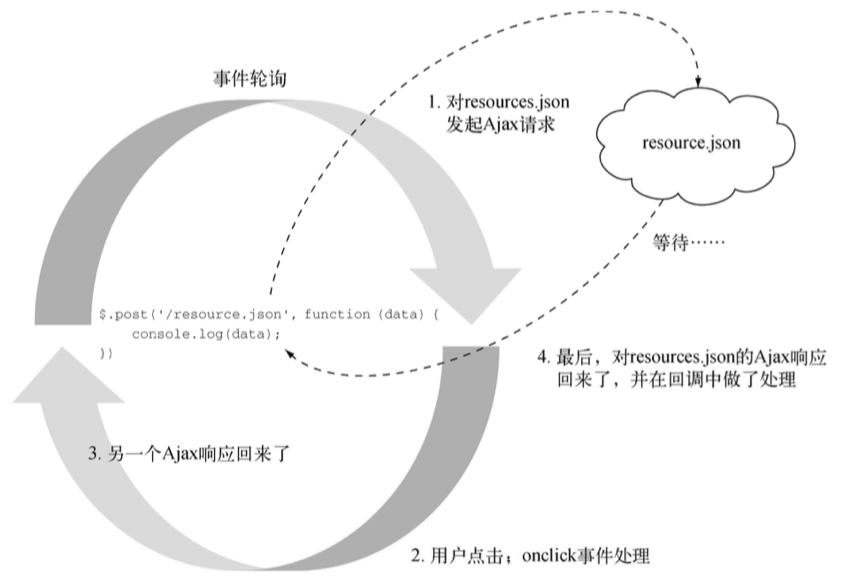
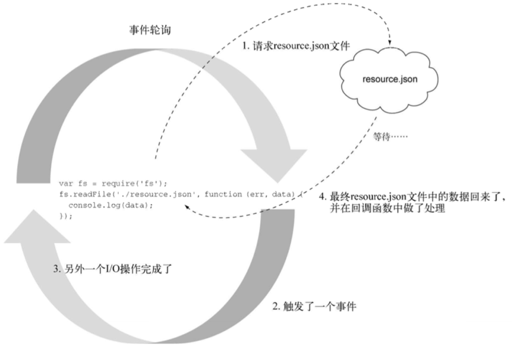
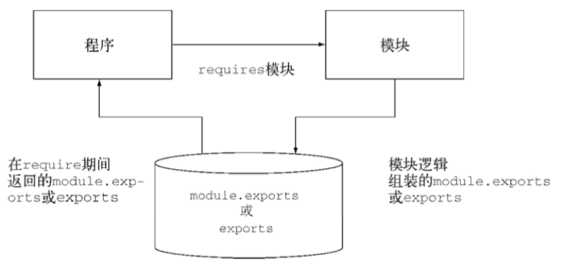

# Node


## Node 概述

Node 的定义： 一个搭建在 Chrome JavaScript 运行时尚的平台， 用于构建告诉、 可伸缩的网络程序。 Node.js 采用的事件驱动、 非阻塞 I/O 模型， 使它既轻量又高效， 并成为构建运行在分布式设备上的数据密集型实时程序的完美选择


### 构建于 JavaScript 之上

在服务器端编程， Node 使用的是为 Google Chrome 提供动力的 V8 虚拟机。 V8 让 Node 在性能上得到了巨大的提升， <u>因为它去掉了中间环节， 执行的不是字节码， 用的也不是解释器， 而是直接编译成了本地机器码</u>。 


### 异步和事件触发： 浏览器

Node 为服务端 JavaScript 提供了一个事件驱动的、 异步的平台。 它把 JavaScript 带到服务端中的方式跟浏览器把 JavaScript 带到客户端的方式几乎一模一样。

JavaScript 中的异步有以下 4 种实现方式：

- 回调函数
- 事件监听
- 发布/订阅
- Promises 对象

### 异常和事件触发： 服务器

如果程序在 I/O 上阻塞了， 当有更多请求过来时， 服务器会怎么处理呢？ 在这种情景中通常会用多线程的方式。 一种常见的实现<u>是给每个链接分配一个县城， 并为那些链接设置一个线程池。</u> 你可以把线程想象成一个计算工作区， 处理在这个工作区中完成指定的任务。 线程通常都是出于进程之内的， 并且会维护它自己的工作内存。 ==每个线程会处理一到多个服务器连接==。 尽管这听起来是个很自然的委派服务器劳动力的方式（最起码对那些曾经长期采用这种方式的开发人员来说是这样的）， 但程序内的线程管理会非常复杂。 此外， 当需要大量的线程处理很多并发的服务器连接时， 线程会消耗额外的操作系统资源。 线程需要 CPU 和额外的 RAM 来做上下文切换。

在 Node 中， I/O 几乎总是在主事件轮询之外进行， 使得服务器可以一直处于高效并且随时能够做出响应的状态。 这样进程就更加不会受 I/O 限制， 因为 I/O 延迟不会拖垮服务器， 或者像在阻塞方式下那样占用很多资源。 因此一些在服务器上曾经是重量级的操作， 在 Node 服务器上仍然可以是轻量级的。

这个混杂了时间驱动和异步的模型， 加上几乎随处可用的 JavaScript 语言， 帮我们打开了精彩纷呈的数据密集型实时程序的世界。

### DIRT 程序

Node 所针对的应用程序有一个专门的简称： DIRT (data-intensive real-time)。 它表示数据密集型实时程序。 因为 Node 自身在 I/O 上非常轻量， 它善于将数据从一个管道混排或代理到另一个管道上， 这能在处理大量请求时持有很多开放的链接， 并且只占用一小部分内存。 它的设计目标是保证响应能力， 跟浏览器一样。

对 Web 来说， 实时程序是个新生事物。

### 默认 DIRT

Node 从构建开始就有一个事件驱动和异步的模型。 JavaScript 从来没有过标准的 I/O 库。 Node 重新实现了宿主中那些常见的对象， 尽量让浏览器和服务器保持一致。 比如

- 计时器 API (比如 setTimeout)
- 控制台 API (比如 console.log)

Node 还有一组用来处理多种网络和文件 I/O 的核心模块， 其中包括用于 HTTP、 TLS、 HTTPS、 文件系统(POSIX)、 数据报(UDP)和NET(TCP)的模块。 这些核心模块刻意做的很小、 底层并且简单， 只包含要给基于 I/O 的程序用的组合部分。 第三方模块基于这些核心模块， 针对常见的问题进行了更高层的抽象。

> Node 是 JavaScript 程序的平台， 不要把它跟框架相混淆。 很多人都误把 Node 当做 JavaScript 上的 Rails 或 Django， 实际上它更底层。
>
> 而 Express 框架就是 Node 的一个非常流行的框架


#### 简单的异步程序

jQuery ajax：

```javascript
$.post('/resource.json', function(data) {
  console.log(data);
})
```

请求的过程如下图：



Node 实现：

```javascript
var fs = require('fs')
fs.readFile('./resource.json', function(er, data) {
  console.log(data);
});
```

请求的过程如下图：




#### Hello World HTTP 服务器

Node 常被用来构建服务器。 有了 Node， 创建各种服务器变得非常简单。 在 Node 中， 服务器和程序是*一样*的。

下面是个简单的 HTTP 服务器实现， 他会用 `"Hello World."` 响应所有请求：

```javascript
var http = require('http');

http.createServer(function(req, res) {
  res.writeHead(200, {'Content-Type': 'text/plain'});
  res.end('Hello World.\n');
}).listen(3000);

console.log('Server running at http://localhost:3000/');
```

下面是同一服务器的另一种写法， 这样看起来 request 事件更明显：

```javascript
var http = require('http');
var server = http.createServer();

server.on('request', function(req, res) {
  res.writeHead(200, {'Content-Type': 'text/plain'});
  res.end('Hello World.\n');
});
server.listen(3000);

console.log('Server runnign at http://localhost:3000/');
```


#### 流数据

Node 在数据流和数据流动上也很强大。 你可以把数据流看成特殊的数组， 只不过数组中的数据分散在空间上， 而数据流中的数据是*分散在时间上*的。 通过将数据一块一块地传送， 开发人员可以每收到一块数据就开始处理， 而不用等所有数据都到全了再做处理。 下面用数据流的方式来处理 *resouce.json*。

```javascript
var fs = require('fs');
var stream = fs.createReadStream('./resource.json');

stream.on('data', function(chunk) {
  console.log(chunk);
});

stream.on('end', function() {
  console.log('finished.');
});
```

只要有新的数据块准备好， 就会激发 *data* 事件， 当所有数据块都加载完之后， 会激发一个 *end* 事件。由于数据类型不同， 数据块的代销可能会发生变化。 有了对读取流的底层访问， 程序就可以边读取边处理， 这要比等所有数据都缓存到内存中再处理效率高得多。

Node 中也有可写数据流， 可往里写数据块。 当 HTTP 服务器上有请求过来时， 对其进行响应的 res 对象就是可写数据流的一种。

可读和可写数据流可以连接起来形成管道， 就像 shell 脚本中用的 `|` 操作符一样。 这是一种高效的数据处理方式， 只要有数据准备好就可以处理， 不用等着读取完整个资源再把它写出去。 

下面示例通过 HTTP 服务器， 把一张图片流写到客户端：

```javascript
var http = require('http');
var fs = require('fs');

http.createServer(function(req, res) {
  res.writeHead(200, {'Content-Type': 'image/png'});
  fs.createReadStream('./image.png').pipe(res);
}).listen(3000);

console.log('Server running at http://localhost:3000/');
```

在这行代码中， 数据从文件中读进来(`fs.createReadStream`)， 然后数据随着进来就被送到(`.pipe`)客户端(`res`)。 在数据流动时， 事件轮询还能处理其他事件。

Node 在多个平台上均默认提供 DIRT 方式， 包括各种 Windows 和类 UNIX 系统。 底层的 I/O 库(libuv) 特意屏蔽了宿主操作系统的差异性， 提供了统一的使用方式， 如果需要的话， 程序可以在多个设备上轻松移植和运行。


## 构建有多个房间的聊天室程序

### 程序需求及初始设置

- 提供静态文件（比如 HTML、 CSS和客户端 JavaScript） —— HTTP 模块
- 在服务器上处理与聊天相关的消息 —— WebSocket 模块
- 在用户的浏览器中处理与聊天相关的信息

## Node 编程基础

### Node 功能的组织及重用

Node 模块打包代码是为了重用， 但它们不会改变全局作用域。 如假设你正用 PHP 开发一个开源的 CMS， 并且想用一个没有使用命名空间的第三方 API 库。 这个库中可能有一个跟你的程序中同名的类， 除非你把自己程序中的类名或者苦苦中的类名给该了， 否则这个类可能会搞垮你的程序。

Node 模块晕你你从被引用文件中选择要暴露给程序的函数和变量。 如果模块返回的函数或变量不止一个， 那它可以通过设定 exports 对象的属性来指明它们。 但如果模块只返回一个函数或变量， 则可以设定 module.exports 属性。下图展示了这一工作机制。



Node 的模块系统避免了对全局作用域的污染， 从而也就避免了命名冲突， 并简化了代码的重用。 模块还可以发布到 npm 存储库中， 这是一个收集了已经可用并且要跟 Node 社区分享的 Node 模块的在线存储库， 使用这些模块没必要担心某个模块会覆盖其他模块的变量和函数。

#### 创建模块

模块既可能是一个文件， 也可能是包含一个或多个文件的目录。

