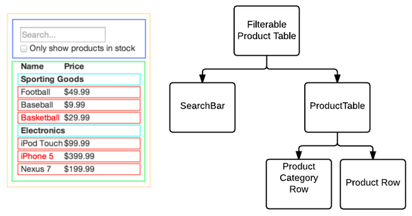
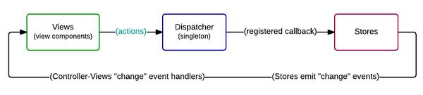
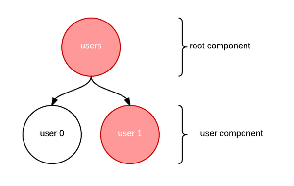

## React:

### 1. 探索 React： 组件间通信过程解析

近日，RisingStack CTO Péter Márton正在陆续发表《The React.js Way》系列博文，[第一篇](https://blog.risingstack.com/the-react-way-getting-started-tutorial/)文章以分享React.js的核心入门知识（[中文译文](http://wwsun.me/posts/react-getting-started.html)）为主，并讨论了虚拟DOM的概念，以及如何使用组件的思维方式来思考开发的基础上。接下来，需要将它们组合起来运用到实战中去， [第二篇](https://blog.risingstack.com/the-react-js-way-flux-architecture-with-immutable-js/)文章则以此为出发点，探讨了React的组件间是如何进行相互通信的。
#### 组件即是函数

对于一个独立组件而言，你可以把它看成是一个JavaScript函数。对于函数而言，当你通过传递参数调用函数时，函数会返回给你一个值。 相比之下，对于React组件而言，道理是相似的，你传递属性给组件，而组件则会返回一个被渲染好的DOM。通过传递不同的数据， 相应的你会得到不同的响应。这个过程也就使得React组件能够得到极大的复用，并且你可以很轻松的在应用中重用和组装这些组件。 这种思想实际来源于函数式编程，但其并不在本文的讨论范围中。如果你感兴趣的话，那我强烈建议你阅读Mikael Brevik的 《 [Functional UI and Components as Higher Order Functions](http://wwsun.me/posts/react-getting-started.html)》， 它可以帮助你更好的理解这个话题。
#### 自上而下渲染

目前为止，我们可以轻松地通过组装组件的方式来构建应用，但此之前，在组件中并没有包括数据。在[第一篇](http://wwsun.me/posts/react-getting-started.html)文章中，我们讨论过可以在组件层次中的根组件中通过将数据作为参数传递给组件，并且通过层层传递的方式将数据传递给下层组件，也就是说，你在顶层传递数据，它可以一层一层地往下传递， 这个过程，我们称之为自上而下的渲染。
    

从上层组件往下层组件传递数据其实很简单，但是，如果下层组件发生了某些变化，我们如何通知上层组件呢？例如，用户点击了某个按钮？ 我们需要某个东西来存放应用程序的状态数据，能够在状态发生变化的时候去通知所发生的变化。新的状态应该能够被传递给根节点 （最上层节点），然后应该再次发起自上而下的渲染，从而重新生成（渲染）DOM。为了解决这个问题，Facebook提出了Flux架构。
#### Flux架构

你可能已经听过什么是Flux，也了解它是一种类似于MVC的应用程序设计架构，因此本文不会过多的去探讨什么是Flux，感兴趣的话， 可以阅读《 [Flux Inspired libraires with React](http://blog.risingstack.com/flux-inspired-libraries-with-react/)》这篇文章。

> 构建用户界面的应用程序架构 —— [Facebook Flux](https://facebook.github.io/flux/)

简单总结下：Flux倡导的是单向数据流的原则，在这种架构下，通过Store存放应用程序的状态数据。当应用状态发生变化时，Store可以发出事件，通知应用的组件并进行组件的重新渲染。另外，Dispatcher起到中央hub的作用，它为组件（View）和Store构建起了桥梁。此外，你可以在组件上调用action，它会向Store发起事件。Store正是通过订阅这些事件，并根据事件的触发来改变应用程序的内部状态的。
    

#### PureRenderMixin

目前对于我们的应用而言，我们通过一个数据store来存放应用的实际状态。我们可以和这个store进行通信，将数据传递到我们的应用上， 当组件获取新的数据后，进而对视图进行重新渲染。这听起来很赞，但总感觉会经历很多次的渲染，的确是这样的！需要记住的是：组件的层次关系和自然而下的渲染，一切都会根据新的数据来进行响应，做出相应的变化。

在这之前的文章中，我们讨论过虚拟DOM通过一种更为优雅的方式降低了DOM操纵带来的性能损耗，但这并不意味着我们就不需要自己手动进行性能优化了。 对此，基于当前数据和新来的数据之间的差异，我们应该能够告诉组件对于新来的数据是否需要进行视图的重新渲染（如果数据没有发生变化，应该不再重新渲染）。在React的生命周期中，你可以借助shouldComponentUpdate来达成这一目的。

幸运的是，在React中有一种被称为PureRenderMixin的Mixin模式，它可以用来对新的属性和之前的属性进行对比，如果是数据没有发生变化，就不再重新渲染。在内部实现上，它也是基于shouldComponentUpdate 方法的。

这听起来很赞，但遗憾的是，PureRenderMixin并不能很好地进行对象的比较。它只会检查对象引用的相等性（===），也就是说， 对于有相同数据的不同对象而言它会返回false。
        
        boolean shouldComponentUpdate(object nextProps, object nextState)
    
如果shouldComponentUpdate返回的是false的话，render函数便会跳过，直到状态再次发生改变。（此外，componentWillUpdate 和componentDidUpdate也会被跳过）。对于上面所说的问题，我们可以简单的举个例子来说明，有代码如下：

        var a = { foo: 'bar' };  
        var b = { foo: 'bar' };

        a === b; // false  
可以看到，数据是相同的，但它们隶属于不同对象的引用，因此返回的是false，也因此组件仍然会进行重新渲染，显然这没有达到我们的目的。 如果我们想要达成设想的效果（即对于相同数据而言，组件不再重新渲染），我们就需要在原始的对象上进行数据的修改：

        var a = { foo: 'bar' };  
        var b = a;  
        b.foo = 'baz';  
        a === b; // true  
        
虽然实现一个能够进行深度对象比较的mixin来代替引用检查并不困难，但是，考虑到React调用shouldComponentUpdate方法非常频繁，并且对象的深度检查代价较高，所以React选择了这种对象引用比较的方案。

我非常建议你阅读Facebook官方的 [有关React应用高级性能的文档](https://facebook.github.io/react/docs/advanced-performance.html)。
#### 不变性 Immutability

如果我们的应用状态是一个单一的、大的、嵌套的对象（类似于Flux中的Store），那么上面提到的问题会逐渐升级。

所以当对象的内容没有发生变化时，或者有一个新的对象进来时，我们倾向于保持对象引用的不变。这个工作正是我们需要借助Facebook的Immutable.js来完成的。

> 不变性意味着数据一旦创建就不能被改变，这使得应用开发更为简单，避免保护性拷贝（defensive copy），并且使得在简单的应用逻辑中实现变化检查机制等。

下面通过一个例子来解释下上面的话。比如，有如下的代码片段：

如上，我们可以使用===来通过引用来比较对象，这意味着我们能够方便快速的进行对象比较，并且它能够和React中的PureRenderMixin 兼容。基于此，我们可以在整个应用构建中使用Immutable.js。也就是说，我们的Flux Store应该是一个具有不变性的对象，并且我们通过 将具有不变性的数据作为属性传递给我们的应用程序。

现在我们回到前面的代码片段来重新想象我们应用程序的组件结构，可以用下面这张图来表示：

如上，我们可以使用===来通过引用来比较对象，这意味着我们能够方便快速的进行对象比较，并且它能够和React中的PureRenderMixin 兼容。基于此，我们可以在整个应用构建中使用Immutable.js。也就是说，我们的Flux Store应该是一个具有不变性的对象，并且我们通过 将具有不变性的数据作为属性传递给我们的应用程序。

现在我们回到前面的代码片段来重新想象我们应用程序的组件结构，可以用下面这张图来表示：

如上，我们可以使用===来通过引用来比较对象，这意味着我们能够方便快速的进行对象比较，并且它能够和React中的PureRenderMixin 兼容。基于此，我们可以在整个应用构建中使用Immutable.js。也就是说，我们的Flux Store应该是一个具有不变性的对象，并且我们通过 将具有不变性的数据作为属性传递给我们的应用程序。

现在我们回到前面的代码片段来重新想象我们应用程序的组件结构，可以用下面这张图来表示：

        var stateV1 = Immutable.fromJS({  
            users: [
                 { name: 'Foo' },
                 { name: 'Bar' }
            ]
        });

        var stateV2 = stateV1.updateIn(['users', 1], function () {  
            return Immutable.fromJS({
                name: 'Barbar'
            });
        });

        stateV1 === stateV2; // false  
        stateV1.getIn(['users', 0]) === stateV2.getIn(['users', 0]); // true  
        stateV1.getIn(['users', 1]) === stateV2.getIn(['users', 1]); // false  
如上，我们可以使用===来通过引用比较对象，这意味着我们能够方便快速地进行对象比较，并且它能够和React中的PureRenderMixin 兼容。基于此，我们可以在整个应用构建中使用Immutable.js。也就是说，我们的Flux Store应该是一个具有不变性的对象，并且我们通过将具有不变性的数据作为属性传递给我们的应用程序。

现在我们回到前面的代码片段来重新想象我们应用程序的组件结构，可以用下面这张图来表示：

从上面的图形中你可以发现，在应用状态发生变化后，只有红色的部分会被重新渲染，因为其他部分的引用数据并没有发生变化。也就是说， 只有根组件和其中一部分的user组件会被重新渲染。

基于这种不变性，能够优化React组件的渲染路径，并通过这种方式来重新思考我们的应用构建和应用性能优化。此外，得益于虚拟DOM， 它能够让React应用比传统应用来得更加高效与快速。