# Dubbo

## 简介

Dubbo是Alibaba开源的分布式服务框架，它最大的特点是按照分层的方式来架构，使用这种方式可以使各个层之间解耦合（或者最大限度地松耦合）。从服务模型的角度来看，Dubbo采用的是一种非常简单的模型，要么是提供方提供服务，要么是消费方消费服务，所以基于这一点可以抽象出服务提供方（Provider）和服务消费方（Consumer）两个角色。关于注册中心、协议支持、服务监控等内容，详见后面描述。

Dubbo 的总体架构如下：


Dubbo 框架设计一共划分了 10 层， 而最上面的 Service 层是留给实际想要使用 Dubbo 开发分布式服务的开发者实现业务逻辑的接口层。 图中左边淡蓝背景的为服务消费方使用的接口，右边淡绿色背景的为服务提供方使用的接口， 位于中轴线上的为双方都用到的接口。 各个层次的设计要点：

- 服务接口层（Service）：该层是与实际业务逻辑相关的，根据服务提供方和服务消费方的业务设计对应的接口和实现。
- 配置层（Config）：对外配置接口，以ServiceConfig和ReferenceConfig为中心，可以直接new配置类，也可以通过spring解析配置生成配置类。
- 服务代理层（Proxy）：服务接口透明代理，生成服务的客户端Stub和服务器端Skeleton，以ServiceProxy为中心，扩展接口为ProxyFactory。
- 服务注册层（Registry）：封装服务地址的注册与发现，以服务URL为中心，扩展接口为RegistryFactory、Registry和RegistryService。可能没有服务注册中心，此时服务提供方直接暴露服务。
- 集群层（Cluster）：封装多个提供者的路由及负载均衡，并桥接注册中心，以Invoker为中心，扩展接口为Cluster、Directory、Router和LoadBalance。将多个服务提供方组合为一个服务提供方，实现对服务消费方来透明，只需要与一个服务提供方进行交互。
- 监控层（Monitor）：RPC调用次数和调用时间监控，以Statistics为中心，扩展接口为MonitorFactory、Monitor和MonitorService。
- 远程调用层（Protocol）：封将RPC调用，以Invocation和Result为中心，扩展接口为Protocol、Invoker和Exporter。Protocol是服务域，它是Invoker暴露和引用的主功能入口，它负责Invoker的生命周期管理。Invoker是实体域，它是Dubbo的核心模型，其它模型都向它靠扰，或转换成它，它代表一个可执行体，可向它发起invoke调用，它有可能是一个本地的实现，也可能是一个远程的实现，也可能一个集群实现。
- 信息交换层（Exchange）：封装请求响应模式，同步转异步，以Request和Response为中心，扩展接口为Exchanger、ExchangeChannel、ExchangeClient和ExchangeServer。
- 网络传输层（Transport）：抽象mina和netty为统一接口，以Message为中心，扩展接口为Channel、Transporter、Client、Server和Codec。
- 数据序列化层（Serialize）：可复用的一些工具，扩展接口为Serialization、 ObjectInput、ObjectOutput和ThreadPool。

从上图可以看出，Dubbo对于服务提供方和服务消费方，从框架的10层中分别提供了各自需要关心和扩展的接口，构建整个服务生态系统（服务提供方和服务消费方本身就是一个以服务为中心的）。 上述各层之间关系如下：

- 在RPC中，Protocol是核心层，也就是只要有Protocol + Invoker + Exporter就可以完成非透明的RPC调用，然后在Invoker的主过程上Filter拦截点。
- 图中的Consumer和Provider是抽象概念，只是想让看图者更直观的了解哪些类分属于客户端与服务器端，不用Client和Server的原因是Dubbo在很多场景下都使用Provider、Consumer、Registry、Monitor划分逻辑拓普节点，保持统一概念。
- 而Cluster是外围概念，所以Cluster的目的是将多个Invoker伪装成一个Invoker，这样其它人只要关注Protocol层Invoker即可，加上Cluster或者去掉Cluster对其它层都不会造成影响，因为只有一个提供者时，是不需要Cluster的。
- Proxy层封装了所有接口的透明化代理，而在其它层都以Invoker为中心，只有到了暴露给用户使用时，才用Proxy将Invoker转成接口，或将接口实现转成Invoker，也就是去掉Proxy层RPC是可以Run的，只是不那么透明，不那么看起来像调本地服务一样调远程服务。
- 而Remoting实现是Dubbo协议的实现，如果你选择RMI协议，整个Remoting都不会用上，Remoting内部再划为Transport传输层和Exchange信息交换层，Transport层只负责单向消息传输，是对Mina、Netty、Grizzly的抽象，它也可以扩展UDP传输，而Exchange层是在传输层之上封装了Request-Response语义。
- Registry和Monitor实际上不算一层，而是一个独立的节点，只是为了全局概览，用层的方式画在一起。

从上面的架构图中，我们可以了解到，Dubbo作为一个分布式服务框架，主要具有如下几个核心的要点：

- 服务定义

  服务是围绕服务提供方和服务消费方的，服务提供方实现服务，而服务消费方调用服务。

- 服务注册

  对于服务提供方，它需要发布服务，而且由于应用系统的复杂性，服务的数量、类型也不断膨胀；对于服务消费方，它最关心如何获取到它所需要的服务，而面对复杂的应用系统，需要管理大量的服务调用。而且，对于服务提供方和服务消费方来说，他们还有可能兼具这两种角色，即既需要提供服务，有需要消费服务。
  通过将服务统一管理起来，可以有效地优化内部应用对服务发布/使用的流程和管理。服务注册中心可以通过特定协议来完成服务对外的统一。Dubbo提供的注册中心有如下几种类型可供选择：

  - Multicast注册中心
  - Zookeeper注册中心
  - Redis注册中心
  - Simple注册中心

- 服务监控

  无论是服务提供方，还是服务消费方，他们都需要对服务调用的实际状态进行有效的监控，从而改进服务质量。

- 远程通信与信息交换

  远程通信需要指定通信双方所约定的协议，在保证通信双方理解协议语义的基础上，还要保证高效、稳定的消息传输。Dubbo继承了当前主流的网络通信框架，主要包括如下几个：

  - Mina
  - Netty
  - Grizzly

- 服务调用

  基于 RPC 层， 服务提供方和服务消费方之间的调用关系， 如下所示：

  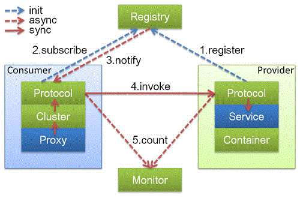

  上图中，蓝色的表示与业务有交互，绿色的表示只对Dubbo内部交互。上述图所描述的调用流程如下：

  1. 服务提供方发布服务到服务注册中心；
  2. 服务消费方从服务注册中心订阅服务；
  3. 服务消费方调用已经注册的可用服务

  接着，将上面抽象的调用流程图展开，详细如图所示：

  

- 注册/注销服务

  服务的注册与注销，是对服务提供方角色而言，那么注册服务与注销服务的时序图，如图所示：

  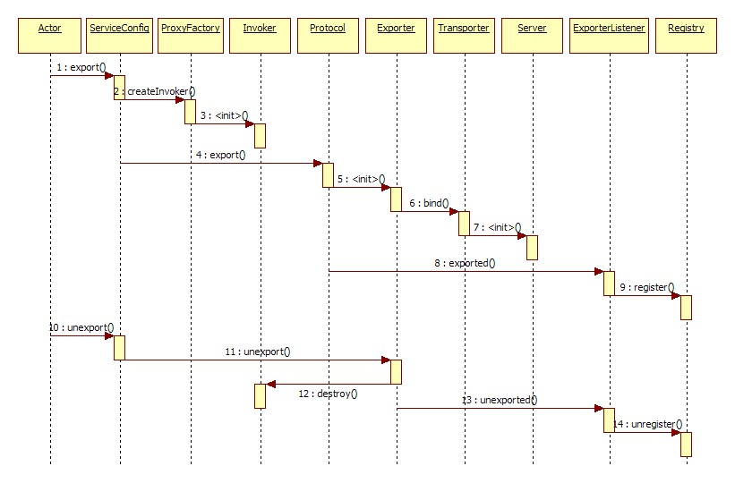

- 服务订阅/取消

  为了满足应用系统的需求，服务消费方的可能需要从服务注册中心订阅指定的有服务提供方发布的服务，在得到通知可以使用服务时，就可以直接调用服务。反过来，如果不需要某一个服务了，可以取消该服务。下面看一下对应的时序图，如图所示：

  

- 协议支持

  Dubbo支持多种协议，如下所示：

  - Dubbo协议
  - Hessian协议
  - HTTP协议
  - RMI协议
  - WebService协议
  - Thrift协议
  - Memcached协议
  - Redis协议

  在通信过程中，不同的服务等级一般对应着不同的服务质量，那么选择合适的协议便是一件非常重要的事情。你可以根据你应用的创建来选择。例如，使用RMI协议，一般会受到防火墙的限制，所以对于外部与内部进行通信的场景，就不要使用RMI协议，而是基于HTTP协议或者Hessian协议。

- 参考补充

  Dubbo以包结构来组织各个模块，各个模块及其关系，如图所示：

  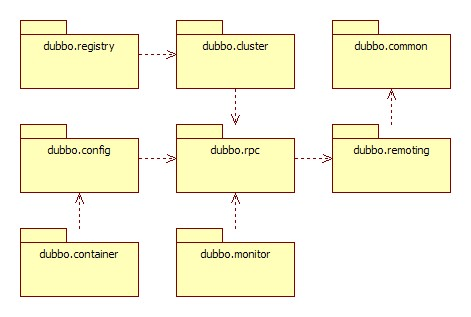

  可以通过Dubbo的代码（使用Maven管理）组织，与上面的模块进行比较。简单说明各个包的情况：

  - dubbo-common 公共逻辑模块，包括Util类和通用模型。
  - dubbo-remoting 远程通讯模块，相当于Dubbo协议的实现，如果RPC用RMI协议则不需要使用此包。
  - dubbo-rpc 远程调用模块，抽象各种协议，以及动态代理，只包含一对一的调用，不关心集群的管理。
  - dubbo-cluster 集群模块，将多个服务提供方伪装为一个提供方，包括：负载均衡、容错、路由等，集群的地址列表可以是静态配置的，也可以是由注册中心下发。
  - dubbo-registry 注册中心模块，基于注册中心下发地址的集群方式，以及对各种注册中心的抽象。
  - dubbo-monitor 监控模块，统计服务调用次数，调用时间的，调用链跟踪的服务。
  - dubbo-config 配置模块，是Dubbo对外的API，用户通过Config使用Dubbo，隐藏Dubbo所有细节。
  - dubbo-container 容器模块，是一个Standalone的容器，以简单的Main加载Spring启动，因为服务通常不需要Tomcat/JBoss等Web容器的特性，没必要用Web容器去加载服务。

# Dubbo 实现 RPC 调用使用

使用Dubbo进行远程调用实现服务交互，它支持多种协议，如Hessian、HTTP、RMI、Memcached、Redis、Thrift等等。由于Dubbo将这些协议的实现进行了封装了，无论是服务端（开发服务）还是客户端（调用服务），都不需要关心协议的细节，只需要在配置中指定使用的协议即可，从而保证了服务提供方与服务消费方之间的透明。另外，如果我们使用Dubbo的服务注册中心组件，这样服务提供方将服务发布到注册的中心，只是将服务的名称暴露给外部，而服务消费方只需要知道注册中心和服务提供方提供的服务名称，就能够透明地调用服务，后面我们会看到具体提供服务和消费服务的配置内容，使得双方之间交互的透明化。

## 示例1

### 示例场景

服务方提供一个搜索服务，对服务方来说，它基于SolrCloud构建了搜索服务，包含两个集群，ZooKeeper集群和Solr集群，然后在前端通过Nginx来进行反向代理，达到负载均衡的目的。服务消费方就是调用服务进行查询，给出查询条件（满足Solr的REST-like接口）。

### 应用设计

基于上面的示例场景，我们打算使用ZooKeeper集群作为服务注册中心。注册中心会暴露给服务提供方和服务消费方，所以注册服务的时候，服务先提供方只需要提供Nginx的地址给注册中心，但是注册中心并不会把这个地址暴露给服务消费方，如图所示：

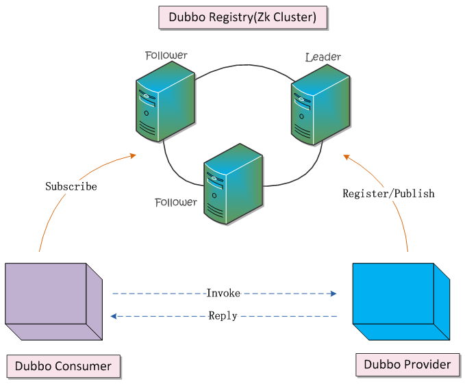

先定义一下， 通信双方需要使用的接口

```java
package org.shirdrn.platform.dubbo.service.rpc.api;

public interface SolrSearchService {

	String search(String collection, String q, ResponseType type, int start, int rows);
	
	public enum ResponseType {
		JSON,
		XML
	}	
}
```

基于上图中的设计，下面我们分别详细说明Provider和Consumer的设计及实现。

- Provider 服务设计

  Provider所发布的服务组件，包含了一个SolrCloud集群，在SolrCloud集群前端又加了一个反向代理层，使用Nginx来均衡负载。Provider的搜索服务系统，设计如下图所示：

  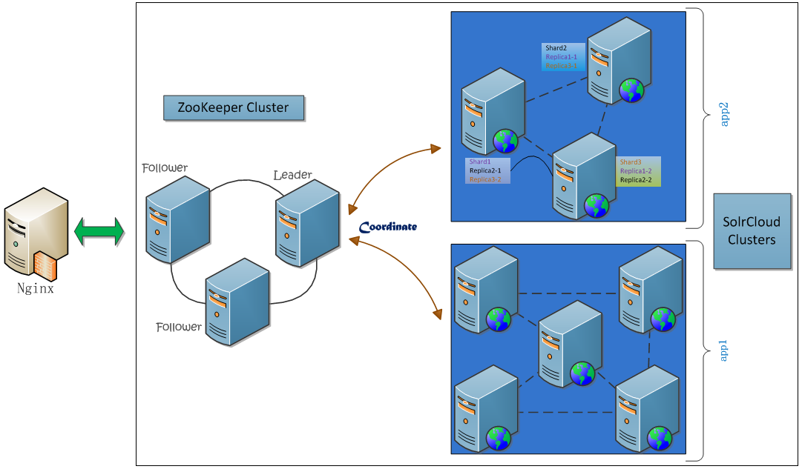

  上图中，实际Nginx中将请求直接转发内部的Web Servers上，在这个过程中，使用ZooKeeper来进行协调：从多个分片（Shard）服务器上并行搜索，最后合并结果。我们看一下Nginx配置的内容片段：

  ```nginx
  user  nginx;
  worker_processes  4;

  error_log  /var/log/nginx/error.log warn;
  pid        /var/run/nginx.pid;


  events {
      worker_connections  1024;
  }


  http {
      include       /etc/nginx/mime.types;
      default_type  application/octet-stream;

      log_format  main  '$remote_addr - $remote_user [$time_local] "$request" '
                        '$status $body_bytes_sent "$http_referer" '
                        '"$http_user_agent" "$http_x_forwarded_for"';

      access_log  /var/log/nginx/access.log  main;

      sendfile        on;
      #tcp_nopush     on;

      keepalive_timeout  65;

      #gzip  on;

  	upstream master {
  		server slave1:8888 weight=1;
  		server slave4:8888 weight=1;
  		server slave6:8888 weight=1;
  	}

  	server {
  		listen 80;
  		server_name master;
  		location / {
  			root /usr/share/nginx/html/solr-cloud;
  			index  index.html index.htm;
  			proxy_pass   http://master;
  			include /home/hadoop/servers/nginx/conf/proxy.conf;
  		}
  	}
  }
  ```

  一共配置了3台Solr服务器，因为SolrCloud集群中每一个节点都可以接收搜索请求，然后由整个集群去并行搜索。最后，我们要通过Dubbo服务框架来基于已有的系统来开发搜索服务，并通过Dubbo的注册中心来发布服务。

  首先需要实现服务接口，实现代码如下所示：

  ````java
  package org.shirdrn.platform.dubbo.service.rpc.server;

  import java.io.IOException;
  import java.util.HashMap;
  import java.util.Map;

  import org.apache.commons.logging.Log;
  import org.apache.commons.logging.LogFactory;
  import org.shirdrn.platform.dubbo.service.rpc.api.SolrSearchService;
  import org.shirdrn.platform.dubbo.service.rpc.utils.QueryPostClient;
  import org.springframework.context.support.ClassPathXmlApplicationContext;

  public class SolrSearchServer implements SolrSearchService {

  	private static final Log LOG = LogFactory.getLog(SolrSearchServer.class);
  	private String baseUrl;
  	private final QueryPostClient postClient;
  	private static final Map<ResponseType, FormatHandler> handlers = new HashMap<ResponseType, FormatHandler>(0);
  	static {
  		handlers.put(ResponseType.XML, new FormatHandler() {
  			public String format() {
  				return "&wt=xml";
  			}
  		});
  		handlers.put(ResponseType.JSON, new FormatHandler() {
  			public String format() {
  				return "&wt=json";
  			}
  		});
  	}
  	
  	public SolrSearchServer() {
  		super();
  		postClient = QueryPostClient.newIndexingClient(null);
  	}
  	
  	public void setBaseUrl(String baseUrl) {
  		this.baseUrl = baseUrl;
  	}

  	public String search(String collection, String q, ResponseType type,
  			int start, int rows) {
  		StringBuffer url = new StringBuffer();
  		url.append(baseUrl).append(collection).append("/select?").append(q);
  		url.append("&start=").append(start).append("&rows=").append(rows);
  		url.append(handlers.get(type).format());
  		LOG.info("[REQ] " + url.toString());
  		return postClient.request(url.toString());
  	}
  	
  	interface FormatHandler {
  		String format();
  	}
  	
  	public static void main(String[] args) throws IOException {
  		String config = SolrSearchServer.class.getPackage().getName().replace('.', '/') + "/search-provider.xml";
          ClassPathXmlApplicationContext context = new ClassPathXmlApplicationContext(config);
          context.start();
          System.in.read();
  	}

  }
  ````

  对应的Dubbo配置文件为search-provider.xml，内容如下所示：

  ```xml
  <?xml version="1.0" encoding="UTF-8"?>

  <beans xmlns="http://www.springframework.org/schema/beans"
  	xmlns:xsi="http://www.w3.org/2001/XMLSchema-instance" xmlns:dubbo="http://code.alibabatech.com/schema/dubbo"
  	xsi:schemaLocation="http://www.springframework.org/schema/beans http://www.springframework.org/schema/beans/spring-beans-2.5.xsd
  	http://code.alibabatech.com/schema/dubbo http://code.alibabatech.com/schema/dubbo/dubbo.xsd">

  	<dubbo:application name="search-provider" />
  	<dubbo:registry address="zookeeper://slave1:2188?backup=slave3:2188,slave4:2188" />
  	<dubbo:protocol name="dubbo" port="20880" />
  	<bean id="searchService" class="org.shirdrn.platform.dubbo.service.rpc.server.SolrSearchServer">
  		<property name="baseUrl" value="http://nginx-lbserver/solr-cloud/" />
  	</bean>
  	<dubbo:service interface="org.shirdrn.platform.dubbo.service.rpc.api.SolrSearchService" ref="searchService" />

  </beans>
  ```

  上面，Dubbo服务注册中心指定ZooKeeper的地址：[zookeeper://slave1:2188?backup=slave3:2188,slave4:2188](http://shiyanjun.cn/archives/2188)，使用Dubbo协议。配置服务接口的时候，可以按照Spring的Bean的配置方式来配置，注入需要的内容，我们这里指定了搜索集群的Nginx反向代理地址[http://nginx-lbserver/solr-cloud/](http://nginx-lbserver/solr-cloud/)。

- Consumer 调用服务设计

  这个就比较简单了，拷贝服务接口，同时要配置一下Dubbo的配置文件，写个简单的客户端调用就可以实现。客户端实现的Java代码如下所示：

  ```java
  package org.shirdrn.platform.dubbo.service.rpc.client;

  import java.util.concurrent.Callable;
  import java.util.concurrent.Future;

  import org.shirdrn.platform.dubbo.service.rpc.api.SolrSearchService;
  import org.shirdrn.platform.dubbo.service.rpc.api.SolrSearchService.ResponseType;
  import org.springframework.beans.BeansException;
  import org.springframework.context.support.AbstractXmlApplicationContext;
  import org.springframework.context.support.ClassPathXmlApplicationContext;

  import com.alibaba.dubbo.rpc.RpcContext;

  public class SearchConsumer {
  	
  	private final String collection;
  	private AbstractXmlApplicationContext context;
  	private SolrSearchService searchService;
  	
  	public SearchConsumer(String collection, Callable<AbstractXmlApplicationContext> call) {
  		super();
  		this.collection = collection;
  		try {
  			context = call.call();
  			context.start();
  			searchService = (SolrSearchService) context.getBean("searchService");
  		} catch (BeansException e) {
  			e.printStackTrace();
  		} catch (Exception e) {
  			e.printStackTrace();
  		}
  	}
  	
  	public Future<String> asyncCall(final String q, final ResponseType type, final int start, final int rows) {
  		Future<String> future = RpcContext.getContext().asyncCall(new Callable<String>() {
  			public String call() throws Exception {
  				return search(q, type, start, rows);
  			}
  		});
  		return future;
  	}
  	
  	public String syncCall(final String q, final ResponseType type, final int start, final int rows) {
  		return search(q, type, start, rows);
  	}

  	private String search(final String q, final ResponseType type, final int start, final int rows) {
  		return searchService.search(collection, q, type, start, rows);
  	}
  	
  	public static void main(String[] args) throws Exception {
  		final String collection = "tinycollection";
  		final String beanXML = "search-consumer.xml";
  		final String config = SearchConsumer.class.getPackage().getName().replace('.', '/') + "/" + beanXML;
  		SearchConsumer consumer = new SearchConsumer(collection, new Callable<AbstractXmlApplicationContext>() {
  			public AbstractXmlApplicationContext call() throws Exception {
  				final AbstractXmlApplicationContext context = new ClassPathXmlApplicationContext(config);
  				return context;
  			}
  		});
  		
  		String q = "q=上海&fl=*&fq=building_type:1";
  		int start = 0;
  		int rows = 10;
  		ResponseType type  = ResponseType.XML;
  		for (int k = 0; k < 10; k++) {
  			for (int i = 0; i < 10; i++) {
  				start = 1 * 10 * i;
  				if(i % 2 == 0) {
  					type = ResponseType.XML;
  				} else {
  					type = ResponseType.JSON;
  				}
  //				String result = consumer.syncCall(q, type, start, rows);
  //				System.out.println(result);
  				Future<String> future = consumer.asyncCall(q, type, start, rows);
  //				System.out.println(future.get());
  			}
  		}
  	}
  }
  ```

  查询的时候，需要提供查询字符串，符合Solr语法，例如“q=上海&fl=*&fq=building_type:1”。配置文件，我们使用search-consumer.xml，内容如下所示：

  ```xml
  <?xml version="1.0" encoding="UTF-8"?>

  <beans xmlns="http://www.springframework.org/schema/beans"
  	xmlns:xsi="http://www.w3.org/2001/XMLSchema-instance" xmlns:dubbo="http://code.alibabatech.com/schema/dubbo"
  	xsi:schemaLocation="http://www.springframework.org/schema/beans http://www.springframework.org/schema/beans/spring-beans-2.5.xsd
  	http://code.alibabatech.com/schema/dubbo http://code.alibabatech.com/schema/dubbo/dubbo.xsd">

  	<dubbo:application name="search-consumer" />
  	<dubbo:registry address="zookeeper://slave1:2188?backup=slave3:2188,slave4:2188" />
  	<dubbo:reference id="searchService" interface="org.shirdrn.platform.dubbo.service.rpc.api.SolrSearchService" />

  </beans>
  ```

### 运行说明

首先保证服务注册中心的ZooKeeper集群正常运行，然后启动SolrSearchServer，启动的时候直接将服务注册到ZooKeeper集群存储中，可以通过ZooKeeper的客户端脚本来查看注册的服务数据。一切正常以后，可以启动运行客户端SearchConsumer，调用SolrSearchServer所实现的远程搜索服务。


# 基于 Dubbo 的 Hessian 协议实现远程调用

Dubbo基于Hessian实现了自己Hessian协议，可以直接通过配置的Dubbo内置的其他协议，在服务消费方进行远程调用，也就是说，服务调用方需要使用Java语言来基于Dubbo调用提供方服务，限制了服务调用方。同时，使用Dubbo的Hessian协议实现提供方服务，而调用方可以使用标准的Hessian接口来调用，原生的Hessian协议已经支持多语言客户端调用，支持语言如下所示：

- Java：[http://hessian.caucho.com/#Java](http://hessian.caucho.com/#Java)
- Flash/Flex：[http://hessian.caucho.com/#FlashFlex](http://hessian.caucho.com/#FlashFlex)
- Python：[http://hessian.caucho.com/#Python](http://hessian.caucho.com/#Python)
- C++：[http://hessian.caucho.com/#C](http://hessian.caucho.com/#C)
- C#：[http://hessian.caucho.com/#NETC](http://hessian.caucho.com/#NETC)
- D：[http://hessian.caucho.com/#D](http://hessian.caucho.com/#D)
- Erlang：[http://hessian.caucho.com/#Erlang](http://hessian.caucho.com/#Erlang)
- PHP：[http://hessian.caucho.com/#PHP](http://hessian.caucho.com/#PHP)
- Ruby：[http://hessian.caucho.com/#Ruby](http://hessian.caucho.com/#Ruby)
- Objective-C：[http://hessian.caucho.com/#ObjectiveC](http://hessian.caucho.com/#ObjectiveC)

下面，我们的思路是，先基于Dubbo封装的Hessian协议，实现提供方服务和消费方调用服务，双方必须都使用Dubbo来开发；然后，基于Dubbo封装的Hessian协议实现提供方服务，然后服务消费方使用标准的Hessian接口来进行远程调用，分别使用Java和Python语言来实现。而且，我们实现的提供方服务通过Tomcat发布到服务注册中心。
首先，使用Java语言定义一个搜索服务的接口，代码如下所示：

```java
package org.shirdrn.platform.dubbo.service.rpc.api;

public interface SolrSearchService {
	String search(String collection, String q, String type, int start, int rows);
}
```

上面接口提供了搜索远程调用功能

## 基于 Dubbo 的 Hessian 协议实现提供方服务

提供方实现基于Dubbo封装的Hessian协议，实现接口SolrSearchService，实现代码如下所示：

```java
package org.shirdrn.platform.dubbo.service.rpc.server;

import java.io.IOException;
import java.util.HashMap;
import java.util.Map;

import org.apache.commons.logging.Log;
import org.apache.commons.logging.LogFactory;
import org.shirdrn.platform.dubbo.service.rpc.api.SolrSearchService;
import org.shirdrn.platform.dubbo.service.rpc.utils.QueryPostClient;
import org.springframework.context.support.ClassPathXmlApplicationContext;

public class SolrSearchServer implements SolrSearchService {

	private static final Log LOG = LogFactory.getLog(SolrSearchServer.class);
	private String baseUrl;
	private final QueryPostClient postClient;
	private static final Map<String, FormatHandler> handlers = new HashMap<String, FormatHandler>(0);
	static {
		handlers.put("xml", new FormatHandler() {
			public String format() {
				return "&wt=xml";
			}
		});
		handlers.put("json", new FormatHandler() {
			public String format() {
				return "&wt=json";
			}
		});
	}

	public SolrSearchServer() {
		super();
		postClient = QueryPostClient.newIndexingClient(null);
	}

	public void setBaseUrl(String baseUrl) {
		this.baseUrl = baseUrl;
	}

	public String search(String collection, String q, String type, int start, int rows) {
		StringBuffer url = new StringBuffer();
		url.append(baseUrl).append(collection).append("/select?").append(q);
		url.append("&start=").append(start).append("&rows=").append(rows);
		url.append(handlers.get(type.toLowerCase()).format());
		LOG.info("[REQ] " + url.toString());
		return postClient.request(url.toString());
	}

	interface FormatHandler {
		String format();
	}
}
```

因为考虑到后面要使用标准Hessian接口来调用，这里接口方法参数全部使用内置标准类型。然后，我们使用Dubbo的配置文件进行配置，文件search-provider.xml的内容如下所示：

```xml
<?xml version="1.0" encoding="UTF-8"?>

<beans xmlns="http://www.springframework.org/schema/beans"
	xmlns:xsi="http://www.w3.org/2001/XMLSchema-instance" xmlns:dubbo="http://code.alibabatech.com/schema/dubbo"
	xsi:schemaLocation="http://www.springframework.org/schema/beans http://www.springframework.org/schema/beans/spring-beans-2.5.xsd
     http://code.alibabatech.com/schema/dubbo http://code.alibabatech.com/schema/dubbo/dubbo.xsd">

	<dubbo:application name="search-provider" />
	<dubbo:registry
		address="zookeeper://slave1:2188?backup=slave3:2188,slave4:2188" />
	<dubbo:protocol name="hessian" port="8080" server="servlet" />
	<bean id="searchService"
		class="org.shirdrn.platform.dubbo.service.rpc.server.SolrSearchServer">
		<property name="baseUrl" value="http://nginx-lbserver/solr-cloud/" />
	</bean>
	<dubbo:service
		interface="org.shirdrn.platform.dubbo.service.rpc.api.SolrSearchService"
		ref="searchService" path="http_dubbo/search" />

</beans>
```

因为使用Tomcat发布提供方服务，所以我们需要实现Spring的org.springframework.web.context.ContextLoader来初始化应用上下文（基于Spring的IoC容器来管理服务对象）。实现类SearchContextLoader代码如下所示：

```java
package org.shirdrn.platform.dubbo.context;

import javax.servlet.ServletContextEvent;
import javax.servlet.ServletContextListener;

import org.shirdrn.platform.dubbo.service.rpc.server.SolrSearchServer;
import org.springframework.context.support.ClassPathXmlApplicationContext;
import org.springframework.web.context.ContextLoader;

public class SearchContextLoader extends ContextLoader implements ServletContextListener {

	@Override
	public void contextDestroyed(ServletContextEvent arg0) {
		// TODO Auto-generated method stub

	}

	@Override
	public void contextInitialized(ServletContextEvent arg0) {
		String config = arg0.getServletContext().getInitParameter("contextConfigLocation");
		ClassPathXmlApplicationContext context = new ClassPathXmlApplicationContext(config);
		context.start();
	}

}
```

最后，配置Web应用部署描述符文件，web.xml内容如下所示：

```xml
<?xml version="1.0" encoding="UTF-8"?>
<web-app id="WebApp_ID" version="2.4"
	xmlns="http://java.sun.com/xml/ns/j2ee" xmlns:xsi="http://www.w3.org/2001/XMLSchema-instance"
	xsi:schemaLocation="http://java.sun.com/xml/ns/j2ee http://java.sun.com/xml/ns/j2ee/web-app_2_4.xsd">
	<display-name>http_dubbo</display-name>

	<listener>
		<listener-class>org.shirdrn.platform.dubbo.context.SearchContextLoader</listener-class>
	</listener>
	<context-param>
		<param-name>contextConfigLocation</param-name>
		<param-value>classpath:search-provider.xml</param-value>
	</context-param>

	<servlet>
		<servlet-name>search</servlet-name>
		<servlet-class>com.alibaba.dubbo.remoting.http.servlet.DispatcherServlet</servlet-class>
		<init-param>
			<param-name>home-class</param-name>
			<param-value>org.shirdrn.platform.dubbo.service.rpc.server.SolrSearchServer</param-value>
		</init-param>
		<init-param>
			<param-name>home-api</param-name>
			<param-value>org.shirdrn.platform.dubbo.service.rpc.api.SolrSearchService</param-value>
		</init-param>
		<load-on-startup>1</load-on-startup>
	</servlet>
	<servlet-mapping>
		<servlet-name>search</servlet-name>
		<url-pattern>/search</url-pattern>
	</servlet-mapping>

	<welcome-file-list>
		<welcome-file>index.html</welcome-file>
		<welcome-file>index.htm</welcome-file>
		<welcome-file>index.jsp</welcome-file>
		<welcome-file>default.html</welcome-file>
		<welcome-file>default.htm</welcome-file>
		<welcome-file>default.jsp</welcome-file>
	</welcome-file-list>
</web-app>
```

启动Tomcat以后，就可以将提供方服务发布到服务注册中心，这里服务注册中心我们使用的是ZooKeeper集群，可以参考上面Dubbo配置文件search-provider.xml的配置内容。

下面，我们通过两种方式来调用已经注册到服务注册中心的服务。

- 基于 Dubbo 的 Hessian 的协议远程调用

  服务消费方，通过Dubbo配置文件来指定注册到注册中心的服务，配置文件search-consumer.xml的内容，如下所示：

  ```xml
  <?xml version="1.0" encoding="UTF-8"?>

  <beans xmlns="http://www.springframework.org/schema/beans"
  	xmlns:xsi="http://www.w3.org/2001/XMLSchema-instance" xmlns:dubbo="http://code.alibabatech.com/schema/dubbo"
  	xsi:schemaLocation="http://www.springframework.org/schema/beans http://www.springframework.org/schema/beans/spring-beans-2.5.xsd
       http://code.alibabatech.com/schema/dubbo http://code.alibabatech.com/schema/dubbo/dubbo.xsd">

  	<dubbo:application name="search-consumer" />
  	<dubbo:registry
  		address="zookeeper://slave1:2188?backup=slave3:2188,slave4:2188" />
  	<dubbo:reference id="searchService"
  		interface="org.shirdrn.platform.dubbo.service.rpc.api.SolrSearchService" />

  </beans>
  ```

  然后，使用Java实现远程调用，实现代码如下所示：

  ```java
  package org.shirdrn.platform.dubbo.service.rpc.client;

  import java.util.concurrent.Callable;
  import java.util.concurrent.Future;

  import org.shirdrn.platform.dubbo.service.rpc.api.SolrSearchService;
  import org.springframework.beans.BeansException;
  import org.springframework.context.support.AbstractXmlApplicationContext;
  import org.springframework.context.support.ClassPathXmlApplicationContext;

  import com.alibaba.dubbo.rpc.RpcContext;

  public class SearchConsumer {

  	private final String collection;
  	private AbstractXmlApplicationContext context;
  	private SolrSearchService searchService;

  	public SearchConsumer(String collection, Callable<AbstractXmlApplicationContext> call) {
  		super();
  		this.collection = collection;
  		try {
  			context = call.call();
  			context.start();
  			searchService = (SolrSearchService) context.getBean("searchService");
  		} catch (BeansException e) {
  			e.printStackTrace();
  		} catch (Exception e) {
  			e.printStackTrace();
  		}
  	}

  	public Future<String> asyncCall(final String q, final String type, final int start, final int rows) {
  		Future<String> future = RpcContext.getContext().asyncCall(new Callable<String>() {
  			public String call() throws Exception {
  				return search(q, type, start, rows);
  			}
  		});
  		return future;
  	}

  	public String syncCall(final String q, final String type, final int start, final int rows) {
  		return search(q, type, start, rows);
  	}

  	private String search(final String q, final String type, final int start, final int rows) {
  		return searchService.search(collection, q, type, start, rows);
  	}

  	public static void main(String[] args) throws Exception {
  		final String collection = "tinycollection";
  		final String beanXML = "search-consumer.xml";
  		final String config = SearchConsumer.class.getPackage().getName().replace('.', '/') + "/" + beanXML;
  		SearchConsumer consumer = new SearchConsumer(collection, new Callable<AbstractXmlApplicationContext>() {
  			public AbstractXmlApplicationContext call() throws Exception {
  				final AbstractXmlApplicationContext context = new ClassPathXmlApplicationContext(config);
  				return context;
  			}
  		});

  		String q = "q=上海&fl=*&fq=building_type:1";
  		int start = 0;
  		int rows = 10;
  		String type = "xml";
  		for (int k = 0; k < 10; k++) {
  			for (int i = 0; i < 10; i++) {
  				start = 1 * 10 * i;
  				if (i % 2 == 0) {
  					type = "xml";
  				} else {
  					type = "json";
  				}
  				String result = consumer.syncCall(q, type, start, rows);
  				System.out.println(result);
  				// Future<String> future = consumer.asyncCall(q, type, start,
  				// rows);
  				// System.out.println(future.get());
  			}
  		}
  	}

  }
  ```

  执行该调用实现，可以远程调用提供方发布的服务。
  这种方式限制了服务调用方也必须使用Dubbo来开发调用的代码，也就是限制了编程的语言，而无论是对于内部还是外部，各个团队之间必然存在语言的多样性，如果限制了编程语言，那么开发的服务也只能在内部使用。

- 基于标准 Hessian 协议接口的远程调用

  下面，使用标准Hessian接口来实现远程调用，这时就不需要关心服务提供方的所使用的开发语言，因为最终是通过HTTP的方式来访问。我们需要下载Hessian对应语言的调用实现库，才能更方便地编程。

  - 使用 Java 语言实现远程调用

    ```java
    package org.shirdrn.rpc.hessian;

    import org.shirdrn.platform.dubbo.service.rpc.api.SolrSearchService;

    import com.caucho.hessian.client.HessianProxyFactory;

    public class HessianConsumer {

    	public static void main(String[] args) throws Throwable {

    		String serviceUrl = "http://10.95.3.74:8080/http_dubbo/search";
    		HessianProxyFactory factory = new HessianProxyFactory();

    		SolrSearchService searchService = (SolrSearchService) factory.create(SolrSearchService.class, serviceUrl);

    		String q = "q=上海&fl=*&fq=building_type:1";
    		String collection = "tinycollection";
    		int start = 0;
    		int rows = 10;
    		String type = "xml";
    		String result = searchService.search(collection, q, type, start, rows);
    		System.out.println(result);
    	}
    }
    ```

    我们只需要知道提供服务暴露的URL和服务接口即可，这里URL为[http://10.95.3.74:8080/http_dubbo/search](http://10.95.3.74:8080/http_dubbo/search)，接口为org.shirdrn.platform.dubbo.service.rpc.api.SolrSearchService。运行上面程序，可以调用提供方发布的服务。

  - 使用 Python 语言实现远程调用

    使用Python客户端来进行远程调用，我们可以从[https://github.com/bgilmore/mustaine](https://github.com/bgilmore/mustaine)下载，然后安装Hessian的代理客户端Python实现库：

    ```shell
    git clone https://github.com/bgilmore/mustaine.git
    cd mustaine
    sudo python setup.py install
    ```

    然后就可以使用了， 使用 Python 进行远程调用的实现代码如下所示：

    ```python
    #!/usr/bin/python

    # coding=utf-8
    from mustaine.client import HessianProxy

    serviceUrl = 'http://10.95.3.74:8080/http_dubbo/search'
    q = 'q=*:*&fl=*&fq=building_type:1'
    start = 0
    rows = 10
    resType = 'xml'
    collection = 'tinycollection'

    if __name__ == '__main__':
         proxy = HessianProxy(serviceUrl)
         result = proxy.search(collection, q, resType, start, rows)
         print result
    ```

    运行上面程序，就可以看到远程调用的结果。


# 基于 Dubbo 框架构建分布式服务

Dubbo是Alibaba开源的分布式服务框架，我们可以非常容易地通过Dubbo来构建分布式服务，并根据自己实际业务应用场景来选择合适的集群容错模式，这个对于很多应用都是迫切希望的，只需要通过简单的配置就能够实现分布式服务调用，也就是说服务提供方（Provider）发布的服务可以天然就是集群服务，比如，在实时性要求很高的应用场景下，可能希望来自消费方（Consumer）的调用响应时间最短，只需要选择Dubbo的Forking Cluster模式配置，就可以对一个调用请求并行发送到多台对等的提供方（Provider）服务所在的节点上，只选择最快一个返回响应的，然后将调用结果返回给服务消费方（Consumer），显然这种方式是以冗余服务为基础的，需要消耗更多的资源，但是能够满足高实时应用的需求。

## Dobbo 服务集群容错

假设我们使用的是单机模式的Dubbo服务，如果在服务提供方（Provider）发布服务以后，服务消费方（Consumer）发出一次调用请求，恰好这次由于网络问题调用失败，那么我们可以配置服务消费方重试策略，可能消费方第二次重试调用是成功的（重试策略只需要配置即可，重试过程是透明的）；但是，如果服务提供方发布服务所在的节点发生故障，那么消费方再怎么重试调用都是失败的，所以我们需要采用集群容错模式，这样如果单个服务节点因故障无法提供服务，还可以根据配置的集群容错模式，调用其他可用的服务节点，这就提高了服务的可用性。
首先，根据Dubbo文档，我们引用文档提供的一个架构图以及各组件关系说明，如下所示：

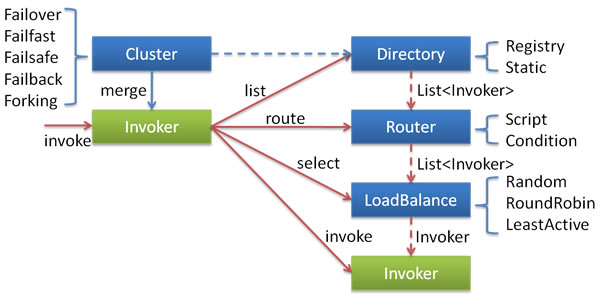

上述各个组件之间的关系说明如下：

- 这里的Invoker是Provider的一个可调用Service的抽象，Invoker封装了Provider地址及Service接口信息。
- Directory代表多个Invoker，可以把它看成List，但与List不同的是，它的值可能是动态变化的，比如注册中心推送变更。
- Cluster将Directory中的多个Invoker伪装成一个Invoker，对上层透明，伪装过程包含了容错逻辑，调用失败后，重试另一个。
- Router负责从多个Invoker中按路由规则选出子集，比如读写分离，应用隔离等。
- LoadBalance负责从多个Invoker中选出具体的一个用于本次调用，选的过程包含了负载均衡算法，调用失败后，需要重选。

Dubbo 内置支持如下 6 中集群模式：

- Failover Cluster 模式。

  配置值为failover。这种模式是Dubbo集群容错默认的模式选择，调用失败时，会自动切换，重新尝试调用其他节点上可用的服务。对于一些幂等性操作可以使用该模式，如读操作，因为每次调用的副作用是相同的，所以可以选择自动切换并重试调用，对调用者完全透明。可以看到，如果重试调用必然会带来响应端的延迟，如果出现大量的重试调用，可能说明我们的服务提供方发布的服务有问题，如网络延迟严重、硬件设备需要升级、程序算法非常耗时，等等，这就需要仔细检测排查了。
  例如，可以这样显式指定Failover模式，或者不配置则默认开启Failover模式，配置示例如下：

  ```xml
  <dubbo:service interface="org.shirdrn.dubbo.api.ChatRoomOnlineUserCounterService" version="1.0.0"
  2
       cluster="failover" retries="2" timeout="100" ref="chatRoomOnlineUserCounterService" protocol="dubbo" >
  3
       <dubbo:method name="queryRoomUserCount" timeout="80" retries="2" />
  4
  </dubbo:service>
  ```

  上述配置使用Failover Cluster模式，如果调用失败一次，可以再次重试2次调用，服务级别调用超时时间为100ms，调用方法queryRoomUserCount的超时时间为80ms，允许重试2次，最坏情况调用花费时间160ms。如果该服务接口org.shirdrn.dubbo.api.ChatRoomOnlineUserCounterService还有其他的方法可供调用，则其他方法没有显式配置则会继承使用dubbo:service配置的属性值。

- Failfast Cluster 模式

  配置值为failfast。这种模式称为快速失败模式，调用只执行一次，失败则立即报错。这种模式适用于非幂等性操作，每次调用的副作用是不同的，如写操作，比如交易系统我们要下订单，如果一次失败就应该让它失败，通常由服务消费方控制是否重新发起下订单操作请求（另一个新的订单）。

- Failsafe Cluster 模式

  配置值为failsafe。失败安全模式，如果调用失败， 则直接忽略失败的调用，而是要记录下失败的调用到日志文件，以便后续审计。

- Failback Cluster 模式

  配置值为failback。失败自动恢复，后台记录失败请求，定时重发。通常用于消息通知操作。

- Forking Cluster 模式

  配置值为forking。并行调用多个服务器，只要一个成功即返回。通常用于实时性要求较高的读操作，但需要浪费更多服务资源。

- Broadcast Cluster 模式

  配置值为broadcast。广播调用所有提供者，逐个调用，任意一台报错则报错（2.1.0开始支持）。通常用于通知所有提供者更新缓存或日志等本地资源信息。

上面的6种模式都可以应用于生产环境，我们可以根据实际应用场景选择合适的集群容错模式。如果我们觉得Dubbo内置提供的几种集群容错模式都不能满足应用需要，也可以定制实现自己的集群容错模式，因为Dubbo框架给我提供的扩展的接口，只需要实现接口com.alibaba.dubbo.rpc.cluster.Cluster即可，接口定义如下所示：

```java
@SPI(FailoverCluster.NAME)
public interface Cluster {

    /**
     * Merge the directory invokers to a virtual invoker.
     * @param <T>
     * @param directory
     * @return cluster invoker
     * @throws RpcException
     */
    @Adaptive
    <T> Invoker<T> join(Directory<T> directory) throws RpcException;

}
```

关于如何实现一个自定义的集群容错模式，可以参考Dubbo源码中内置支持的汲取你容错模式的实现，6种模式对应的实现类如下所示：

```java
com.alibaba.dubbo.rpc.cluster.support.FailoverCluster
com.alibaba.dubbo.rpc.cluster.support.FailfastCluster
com.alibaba.dubbo.rpc.cluster.support.FailsafeCluster
com.alibaba.dubbo.rpc.cluster.support.FailbackCluster
com.alibaba.dubbo.rpc.cluster.support.ForkingCluster
com.alibaba.dubbo.rpc.cluster.support.AvailableCluster
```

可能我们初次接触Dubbo时，不知道如何在实际开发过程中使用Dubbo的集群模式，后面我们会以Failover Cluster模式为例开发我们的分布式应用，再进行详细的介绍。

## Dubbo 服务负载均衡

Dubbo框架内置提供负载均衡的功能以及扩展接口，我们可以透明地扩展一个服务或服务集群，根据需要非常容易地增加/移除节点，提高服务的可伸缩性。Dubbo框架内置提供了4种负载均衡策略，如下所示：

- Random LoadBalance：随机策略，配置值为random。可以设置权重，有利于充分利用服务器的资源，高配的可以设置权重大一些，低配的可以稍微小一些
- RoundRobin LoadBalance：轮询策略，配置值为roundrobin。
- LeastActive LoadBalance：配置值为leastactive。根据请求调用的次数计数，处理请求更慢的节点会受到更少的请求
- ConsistentHash LoadBalance：一致性Hash策略，具体配置方法可以参考Dubbo文档。相同调用参数的请求会发送到同一个服务提供方节点上，如果某个节点发生故障无法提供服务，则会基于一致性Hash算法映射到虚拟节点上（其他服务提供方）

在实际使用中，只需要选择合适的负载均衡策略值，配置即可，下面是上述四种负载均衡策略配置的示例：

```xml
<dubbo:service interface="org.shirdrn.dubbo.api.ChatRoomOnlineUserCounterService" version="1.0.0"
     cluster="failover" retries="2" timeout="100" loadbalance="random"
     ref="chatRoomOnlineUserCounterService" protocol="dubbo" >
     <dubbo:method name="queryRoomUserCount" timeout="80" retries="2" loadbalance="leastactive" />
</dubbo:service>
```

上述配置，也体现了Dubbo配置的继承性特点，也就是dubbo:service元素配置了loadbalance=”random”，则该元素的子元素dubbo:method如果没有指定负载均衡策略，则默认为loadbalance=”random”，否则如果dubbo:method指定了loadbalance=”leastactive”，则使用子元素配置的负载均衡策略覆盖了父元素指定的策略（这里调用queryRoomUserCount方法使用leastactive负载均衡策略）。
当然，Dubbo框架也提供了实现自定义负载均衡策略的接口，可以实现com.alibaba.dubbo.rpc.cluster.LoadBalance接口，接口定义如下所示：

```java
/**
* LoadBalance. (SPI, Singleton, ThreadSafe)
*
* <a href="http://en.wikipedia.org/wiki/Load_balancing_(computing)">Load-Balancing</a>
*
* @see com.alibaba.dubbo.rpc.cluster.Cluster#join(Directory)
* @author qian.lei
* @author william.liangf
*/
@SPI(RandomLoadBalance.NAME)
public interface LoadBalance {

     /**
     * select one invoker in list.
     * @param invokers invokers.
     * @param url refer url
     * @param invocation invocation.
     * @return selected invoker.
     */
    @Adaptive("loadbalance")
     <T> Invoker<T> select(List<Invoker<T>> invokers, URL url, Invocation invocation) throws RpcException;

}
```

如何实现一个自定义负载均衡策略，可以参考Dubbo框架内置的实现，如下所示的3个实现类：

```java
com.alibaba.dubbo.rpc.cluster.loadbalance.RandomLoadBalance
com.alibaba.dubbo.rpc.cluster.loadbalance.RoundRobinLoadBalance
com.alibaba.dubbo.rpc.cluster.loadbalance.LeastActiveLoadBalance
```

## Dubbo 服务集群容错实践

手机应用是以聊天室为基础的，我们需要收集用户的操作行为，然后计算聊天室中在线人数，并实时在手机应用端显示人数，整个系统的架构如图所示：

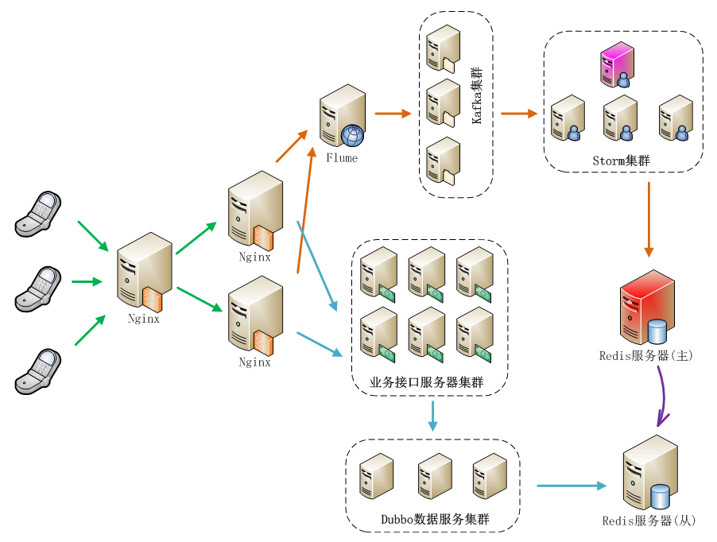

上图中，主要包括了两大主要流程：日志收集并实时处理流程、调用读取实时计算结果流程，我们使用基于Dubbo框架开发的服务来提供实时计算结果读取聊天人数的功能。上图中，实际上业务接口服务器集群也可以基于Dubbo框架构建服务，就看我们想要构建什么样的系统来满足我们的需要。如果不使用注册中心，服务消费方也能够直接调用服务提供方发布的服务，这样需要服务提供方将服务地址暴露给服务消费方，而且也无法使用监控中心的功能，这种方式成为直连。如果我们使用注册中心，服务提供方将服务发布到注册中心，而服务消费方可以通过注册中心订阅服务，接收服务提供方服务变更通知，这种方式可以隐藏服务提供方的细节，包括服务器地址等敏感信息，而服务消费方只能通过注册中心来获取到已注册的提供方服务，而不能直接跨过注册中心与服务提供方直接连接。这种方式的好处是还可以使用监控中心服务，能够对服务的调用情况进行监控分析，还能使用Dubbo服务管理中心，方便管理服务，我们在这里使用的是这种方式，也推荐使用这种方式。使用注册中心的Dubbo分布式服务相关组件结构，如下图所示：

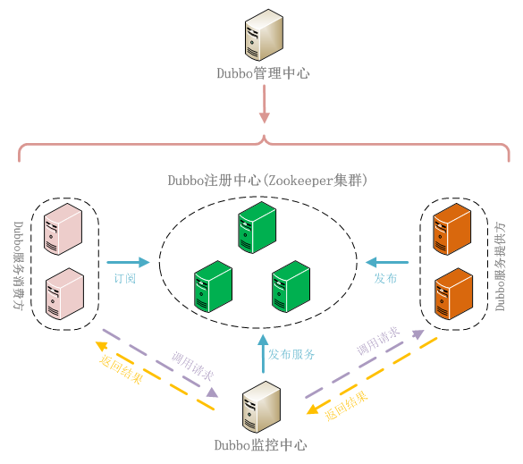

下面，开发部署我们的应用，通过如下4个步骤来完成：

- 服务接口定义

  服务接口将服务提供方（Provider）和服务消费方（Consumer）连接起来，服务提供方实现接口中定义的服务，即给出服务的实现，而服务消费方负责调用服务。我们接口中给出了2个方法，一个是实时查询获取当前聊天室内人数，另一个是查询一天中某个/某些聊天室中在线人数峰值，接口定义如下所示：

  ```java
  package org.shirdrn.dubbo.api;

  import java.util.List;

  public interface ChatRoomOnlineUserCounterService {

       String queryRoomUserCount(String rooms);
      
       List<String> getMaxOnlineUserCount(List<String> rooms, String date, String dateFormat);
  }
  ```

  接口是服务提供方和服务消费方公共遵守的协议，一般情况下是服务提供方将接口定义好后提供给服务消费方。

- 服务提供方

  服务提供方实现接口中定义的服务，其实现和普通的服务没什么区别，我们的实现类为ChatRoomOnlineUserCounterServiceImpl，代码如下所示：

  ```java
  package org.shirdrn.dubbo.provider.service;

  import java.util.List;

  import org.apache.commons.logging.Log;
  import org.apache.commons.logging.LogFactory;
  import org.shirdrn.dubbo.api.ChatRoomOnlineUserCounterService;
  import org.shirdrn.dubbo.common.utils.DateTimeUtils;

  import redis.clients.jedis.Jedis;
  import redis.clients.jedis.JedisPool;

  import com.alibaba.dubbo.common.utils.StringUtils;
  import com.google.common.base.Strings;
  import com.google.common.collect.Lists;

  public class ChatRoomOnlineUserCounterServiceImpl implements ChatRoomOnlineUserCounterService {

       private static final Log LOG = LogFactory.getLog(ChatRoomOnlineUserCounterServiceImpl.class);
       private JedisPool jedisPool;
       private static final String KEY_USER_COUNT = "chat::room::play::user::cnt";
       private static final String KEY_MAX_USER_COUNT_PREFIX = "chat::room::max::user::cnt::";
       private static final String DF_YYYYMMDD = "yyyyMMdd";

       public String queryRoomUserCount(String rooms) {
            LOG.info("Params[Server|Recv|REQ] rooms=" + rooms);
            StringBuffer builder = new StringBuffer();
            if(!Strings.isNullOrEmpty(rooms)) {
                 Jedis jedis = null;
                 try {
                      jedis = jedisPool.getResource();
                      String[] fields = rooms.split(",");
                      List<String> results = jedis.hmget(KEY_USER_COUNT, fields);
                      builder.append(StringUtils.join(results, ","));
                 } catch (Exception e) {
                      LOG.error("", e);
                 } finally {
                      if(jedis != null) {
                           jedis.close();
                      }
                 }
            }
            LOG.info("Result[Server|Recv|RES] " + builder.toString());
            return builder.toString();
       }
      
       @Override
       public List<String> getMaxOnlineUserCount(List<String> rooms, String date, String dateFormat) {
            // HGETALL chat::room::max::user::cnt::20150326
            LOG.info("Params[Server|Recv|REQ] rooms=" + rooms + ",date=" + date + ",dateFormat=" + dateFormat);
            String whichDate = DateTimeUtils.format(date, dateFormat, DF_YYYYMMDD);
            String key = KEY_MAX_USER_COUNT_PREFIX + whichDate;
            StringBuffer builder = new StringBuffer();
            if(rooms != null && !rooms.isEmpty()) {
                 Jedis jedis = null;
                 try {
                      jedis = jedisPool.getResource();
                      return jedis.hmget(key, rooms.toArray(new String[rooms.size()]));
                 } catch (Exception e) {
                      LOG.error("", e);
                 } finally {
                      if(jedis != null) {
                           jedis.close();
                      }
                 }
            }
            LOG.info("Result[Server|Recv|RES] " + builder.toString());
            return Lists.newArrayList();
       }
      
       public void setJedisPool(JedisPool jedisPool) {
            this.jedisPool = jedisPool;
       }

  }
  ```

  代码中通过读取Redis中数据来完成调用，逻辑比较简单。对应的Maven POM依赖配置，如下所示：

  ```xml
  <dependencies>
       <dependency>
            <groupId>org.shirdrn.dubbo</groupId>
            <artifactId>dubbo-api</artifactId>
            <version>0.0.1-SNAPSHOT</version>
       </dependency>
       <dependency>
            <groupId>org.shirdrn.dubbo</groupId>
            <artifactId>dubbo-commons</artifactId>
            <version>0.0.1-SNAPSHOT</version>
       </dependency>
       <dependency>
            <groupId>redis.clients</groupId>
            <artifactId>jedis</artifactId>
            <version>2.5.2</version>
       </dependency>
       <dependency>
            <groupId>org.apache.commons</groupId>
            <artifactId>commons-pool2</artifactId>
            <version>2.2</version>
       </dependency>
       <dependency>
            <groupId>org.jboss.netty</groupId>
            <artifactId>netty</artifactId>
            <version>3.2.7.Final</version>
       </dependency>
  </dependencies>
  ```

  有关对Dubbo框架的一些依赖，我们单独放到一个通用的Maven Module中（详见后面“附录：Dubbo使用Maven构建依赖配置”），这里不再多说。服务提供方实现，最关键的就是服务的配置，因为Dubbo基于Spring来管理配置和实例，所以通过配置可以指定服务是否是分布式服务，以及通过配置增加很多其它特性。我们的配置文件为provider-cluster.xml，内容如下所示：

  ```xml
  <?xml version="1.0" encoding="UTF-8"?>

  <beans xmlns="http://www.springframework.org/schema/beans"
       xmlns:xsi="http://www.w3.org/2001/XMLSchema-instance" xmlns:dubbo="http://code.alibabatech.com/schema/dubbo"
       xmlns:p="http://www.springframework.org/schema/p"
       xsi:schemaLocation="http://www.springframework.org/schema/beans http://www.springframework.org/schema/beans/spring-beans-3.0.xsd
       http://code.alibabatech.com/schema/dubbo http://code.alibabatech.com/schema/dubbo/dubbo.xsd">

       <bean class="org.springframework.beans.factory.config.PropertyPlaceholderConfigurer">
            <property name="systemPropertiesModeName" value="SYSTEM_PROPERTIES_MODE_OVERRIDE" />
            <property name="ignoreResourceNotFound" value="true" />
            <property name="locations">
                 <list>
                      <value>classpath*:jedis.properties</value>
                 </list>
            </property>
       </bean>
      
       <dubbo:application name="chatroom-cluster-provider" />
       <dubbo:registry address="zookeeper://zk1:2181?backup=zk2:2181,zk3:2181" />
      
       <dubbo:protocol name="dubbo" port="20880" />
      
       <dubbo:service interface="org.shirdrn.dubbo.api.ChatRoomOnlineUserCounterService" version="1.0.0"
            cluster="failover" retries="2" timeout="1000" loadbalance="random" actives="100" executes="200"
            ref="chatRoomOnlineUserCounterService" protocol="dubbo" >
            <dubbo:method name="queryRoomUserCount" timeout="500" retries="2" loadbalance="roundrobin" actives="50" />
       </dubbo:service>
      
       <bean id="chatRoomOnlineUserCounterService" class="org.shirdrn.dubbo.provider.service.ChatRoomOnlineUserCounterServiceImpl" >
            <property name="jedisPool" ref="jedisPool" />
       </bean>
      
       <bean id="jedisPool" class="redis.clients.jedis.JedisPool" destroy-method="destroy">
            <constructor-arg index="0">
                 <bean class="org.apache.commons.pool2.impl.GenericObjectPoolConfig">
                      <property name="maxTotal" value="${redis.pool.maxTotal}" />
                      <property name="maxIdle" value="${redis.pool.maxIdle}" />
                      <property name="minIdle" value="${redis.pool.minIdle}" />
                      <property name="maxWaitMillis" value="${redis.pool.maxWaitMillis}" />
                      <property name="testOnBorrow" value="${redis.pool.testOnBorrow}" />
                      <property name="testOnReturn" value="${redis.pool.testOnReturn}" />
                      <property name="testWhileIdle" value="true" />
                 </bean>
            </constructor-arg>
            <constructor-arg index="1" value="${redis.host}" />
            <constructor-arg index="2" value="${redis.port}" />
            <constructor-arg index="3" value="${redis.timeout}" />
       </bean>
  </beans>
  ```

  上面配置中，使用dubbo协议，集群容错模式为failover，服务级别负载均衡策略为random，方法级别负载均衡策略为roundrobin（它覆盖了服务级别的配置内容），其他一些配置内容可以参考Dubbo文档。我们这里是从Redis读取数据，所以使用了Redis连接池。
  启动服务示例代码如下所示：

  ```java
  package org.shirdrn.dubbo.provider;

  import org.shirdrn.dubbo.provider.common.DubboServer;

  public class ChatRoomClusterServer {
       public static void main(String[] args) throws Exception {
            DubboServer.startServer("classpath:provider-cluster.xml");
       }
  }
  ```

  上面调用了DubboServer类的静态方法startServer，如下所示：

  ```java
  public static void startServer(String config) {
       ClassPathXmlApplicationContext context = new ClassPathXmlApplicationContext(config);
       try {
            context.start();
            System.in.read();
       } catch (IOException e) {
            e.printStackTrace();
       } finally {
            context.close();
       }
  }
  ```

  方法中主要是初始化Spring IoC容器，全部对象都交由容器来管理。

- 服务消费方

  服务消费方就容易了，只需要知道注册中心地址，并引用服务提供方提供的接口，消费方调用服务实现如下所示：

  ```java
  package org.shirdrn.dubbo.consumer;

  import java.util.Arrays;
  import java.util.List;

  import org.apache.commons.logging.Log;
  import org.apache.commons.logging.LogFactory;
  import org.shirdrn.dubbo.api.ChatRoomOnlineUserCounterService;
  import org.springframework.context.support.AbstractXmlApplicationContext;
  import org.springframework.context.support.ClassPathXmlApplicationContext;

  public class ChatRoomDubboConsumer {

       private static final Log LOG = LogFactory.getLog(ChatRoomDubboConsumer.class);
      
       public static void main(String[] args) throws Exception {
            AbstractXmlApplicationContext context = new ClassPathXmlApplicationContext("classpath:consumer.xml");
            try {
                 context.start();
                 ChatRoomOnlineUserCounterService chatRoomOnlineUserCounterService = (ChatRoomOnlineUserCounterService) context.getBean("chatRoomOnlineUserCounterService");         
                 getMaxOnlineUserCount(chatRoomOnlineUserCounterService);              
                 getRealtimeOnlineUserCount(chatRoomOnlineUserCounterService);              
                 System.in.read();
            } finally {
                 context.close();
            }
           
       }

       private static void getMaxOnlineUserCount(ChatRoomOnlineUserCounterService liveRoomOnlineUserCountService) {
            List<String> maxUserCounts = liveRoomOnlineUserCountService.getMaxOnlineUserCount(
                      Arrays.asList(new String[] {"1482178010" , "1408492761", "1430546839", "1412517075", "1435861734"}), "20150327", "yyyyMMdd");
            LOG.info("After getMaxOnlineUserCount invoked: maxUserCounts= " + maxUserCounts);
       }

       private static void getRealtimeOnlineUserCount(ChatRoomOnlineUserCounterService liveRoomOnlineUserCountService)
                 throws InterruptedException {
            String rooms = "1482178010,1408492761,1430546839,1412517075,1435861734";
            String onlineUserCounts = liveRoomOnlineUserCountService.queryRoomUserCount(rooms);
            LOG.info("After queryRoomUserCount invoked: onlineUserCounts= " + onlineUserCounts);
       }
  }
  ```

  对应的配置文件为consumer.xml，内容如下所示：

  ```xml
  <?xml version="1.0" encoding="UTF-8"?>

  <beans xmlns="http://www.springframework.org/schema/beans"
       xmlns:xsi="http://www.w3.org/2001/XMLSchema-instance" xmlns:dubbo="http://code.alibabatech.com/schema/dubbo"
       xsi:schemaLocation="http://www.springframework.org/schema/beans http://www.springframework.org/schema/beans/spring-beans-3.0.xsd
       http://code.alibabatech.com/schema/dubbo http://code.alibabatech.com/schema/dubbo/dubbo.xsd">

       <dubbo:application name="chatroom-consumer" />
       <dubbo:registry address="zookeeper://zk1:2181?backup=zk2:2181,zk3:2181" />
      
       <dubbo:reference id="chatRoomOnlineUserCounterService" interface="org.shirdrn.dubbo.api.ChatRoomOnlineUserCounterService" version="1.0.0">
            <dubbo:method name="queryRoomUserCount" retries="2" />
       </dubbo:reference>

  </beans>
  ```

  也可以根据需要配置dubbo:reference相关的属性值，也可以配置dubbo:method指定调用的方法的配置信息，详细配置属性可以参考Dubbo官方文档。

- 部署与验证

  开发完成提供方服务后，在本地开发调试的时候可以怎么简单怎么做，如果是要部署到生产环境，则需要打包后进行部署，可以参考下面的Maven POM配置：

  ```xml
  <build>
       <plugins>
            <plugin>
                 <groupId>org.apache.maven.plugins</groupId>
                 <artifactId>maven-shade-plugin</artifactId>
                 <version>1.4</version>
                 <configuration>
                      <createDependencyReducedPom>true</createDependencyReducedPom>
                 </configuration>
                 <executions>
                      <execution>
                           <phase>package</phase>
                           <goals>
                                <goal>shade</goal>
                           </goals>
                           <configuration>
                                <transformers>
                                     <transformer implementation="org.apache.maven.plugins.shade.resource.ServicesResourceTransformer" />
                                     <transformer implementation="org.apache.maven.plugins.shade.resource.ManifestResourceTransformer">
                                          <mainClass>org.shirdrn.dubbo.provider.ChatRoomClusterServer</mainClass>
                                     </transformer>
                                </transformers>
                           </configuration>
                      </execution>
                 </executions>
            </plugin>
       </plugins>
  </build>
  ```

  这里也给出Maven POM依赖的简单配置：

  ```xml
  <dependencies>
       <dependency>
            <groupId>org.shirdrn.dubbo</groupId>
            <artifactId>dubbo-api</artifactId>
            <version>0.0.1-SNAPSHOT</version>
       </dependency>
  </dependencies>
  ```

  我们开发的服务应该是分布式的，首先是通过配置内容来决定，例如设置集群模式、设置负载均衡模式等，然后在部署的时候，可以在多个节点上同一个服务，这样多个服务都会注册到Dubbo注册中心，如果某个节点上的服务不可用了，可以根据我们配置的策略来选择其他节点上的可用服务，后面通过Dubbo服务管理中心和监控中心就能更加清楚明了。

## Dubbo 服务管理与监控

我们需要在安装好管理中心和监控中心以后，再将上面的开发的提供方服务部署到物理节点上，然后就能够通过管理中心和监控中心来查看对应的详细情况。

- Dubbo 服务管理中心

  安装Dubbo服务管理中心，需要选择一个Web容器，我们使用Tomcat服务器。首先下载Dubbo管理中心安装文件dubbo-admin-2.5.3.war，或者直接从源码构建得到该WAR文件。这里，我们已经构建好对应的WAR文件，然后进行安装，执行如下命令：

  ```shell
  cd apache-tomcat-6.0.35
  rm -rf webapps/ROOT
  unzip ~/dubbo-admin-2.5.3.war -d webapps/ROOT
  ```

  修改配置文件~/apache-tomcat-6.0.35/webapps/ROOT/WEB-INF/dubbo.properties，指定我们的注册中心地址以及登录密码，内容如下所示：

  ```properties
  dubbo.registry.address=zookeeper://zk1:2181?backup=zk2:2181,zk3:2181
  dubbo.admin.root.password=root
  dubbo.admin.guest.password=guest
  ```

  然后，根据需要修改~/apache-tomcat-6.0.35/conf/server.xml配置文件，主要是Tomcat HTTP 端口号（我这里使用8083端口），完成后可以直接启动Tomcat服务器:

  ```shell
  cd ~/apache-tomcat-6.0.35/
  bin/catalina.sh start
  ```

  然后访问地址[http://10.10.4.130:8083/](http://10.10.4.130:8083/)即可，根据配置文件指定的root用户密码，就可以登录Dubbo管理控制台。
  我们将上面开发的服务提供方服务，部署到2个独立的节点上（192.168.14.1和10.10.4.125），然后可以通过Dubbo管理中心查看对应服务的状况，如图所示：

  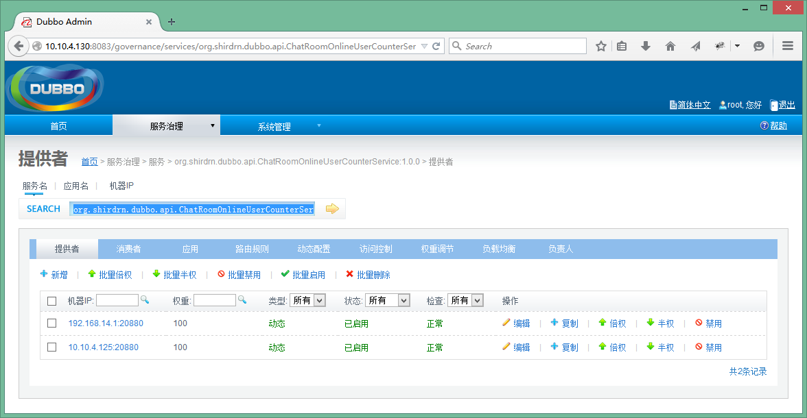

  上图中可以看出，该服务有两个独立的节点可以提供，因为配置的集群模式为failover，如果某个节点的服务发生故障无法使用，则会自动透明地重试另一个节点上的服务，这样就不至于出现拒绝服务的情况。如果想要查看提供方某个节点上的服务详情，可以点击对应的IP:Port链接，示例如图所示：

  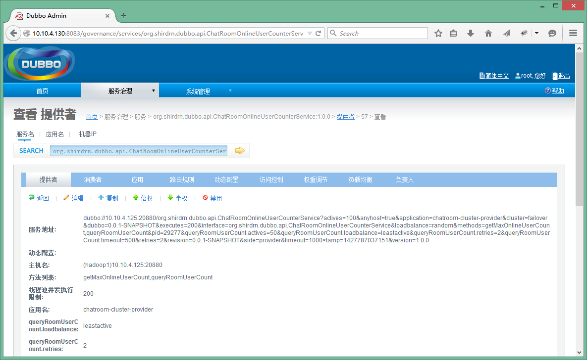

  上图可以看到服务地址：`dubbo://10.10.4.125:20880/org.shirdrn.dubbo.api.ChatRoomOnlineUserCounterService?actives=100&anyhost=true&application=chatroom-cluster-provider&cluster=failover&dubbo=0.0.1-SNAPSHOT&executes=200&interface=org.shirdrn.dubbo.api.ChatRoomOnlineUserCounterService&loadbalance=random&methods=getMaxOnlineUserCount,queryRoomUserCount&pid=30942&queryRoomUserCount.actives=50&queryRoomUserCount.loadbalance=leastactive&queryRoomUserCount.retries=2&queryRoomUserCount.timeout=500&retries=2&revision=0.0.1-SNAPSHOT&side=provider&timeout=1000×tamp=1427793652814&version=1.0.0`

  如果我们直接暴露该地址也是可以的，不过这种直连的方式对服务消费方不是透明的，如果以后IP地址更换，也会影响调用方，所以最好是通过注册中心来隐蔽服务地址。同一个服务所部署在的多个节点上，也就对应对应着多个服务地址。另外，也可以对已经发布的服务进行控制，如修改访问控制、负载均衡相关配置内容等，可以通过上图中“消费者”查看服务消费方调用服务的情况，如图所示：

  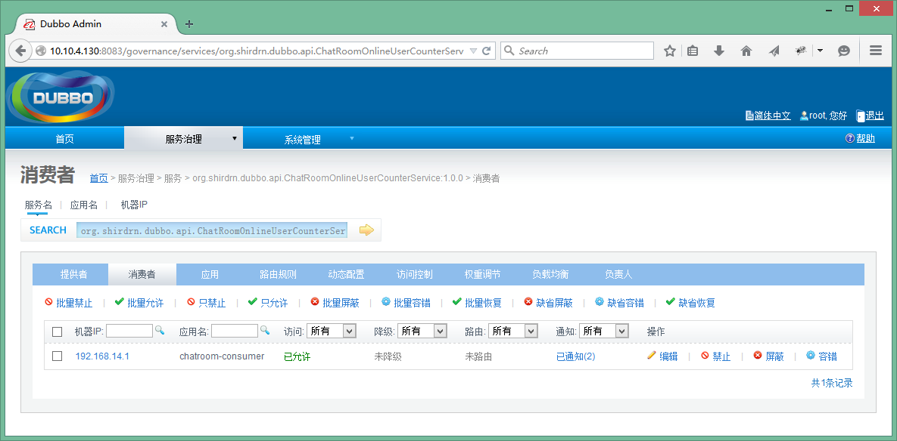

  也在管理控制台可以对消费方进行管理控制。

- Dubbo 监控中心

  Dubbo监控中心是以Dubbo服务的形式发布到注册中心，和普通的服务时一样的。例如，我这里下载了Dubbo自带的简易监控中心文件dubbo-monitor-simple-2.5.3-assembly.tar.gz，可以解压缩以后，修改配置文件~/dubbo-monitor-simple-2.5.3/conf/dubbo.properties的内容，如下所示：

  ```properties
  dubbo.container=log4j,spring,registry,jetty
  dubbo.application.name=simple-monitor
  dubbo.application.owner=
  dubbo.registry.address=zookeeper://zk1:2181?backup=zk2:2181,zk3:2181
  dubbo.protocol.port=7070
  dubbo.jetty.port=8087
  dubbo.jetty.directory=${user.home}/monitor
  dubbo.charts.directory=${dubbo.jetty.directory}/charts
  dubbo.statistics.directory=${user.home}/monitor/statistics
  dubbo.log4j.file=logs/dubbo-monitor-simple.log
  dubbo.log4j.level=WARN
  ```

  然后启动简易监控中心，执行如下命令：

  ```shell
  cd ~/dubbo-monitor-simple-2.5.3
  bin/start.sh
  ```

  这里使用了Jetty Web容器，访问地址[http://10.10.4.130:8087/](http://10.10.4.130:8087/)就可以查看监控中心，

  - Applications选项卡页面包含了服务提供方和消费方的基本信息。列出了所有提供方发布的服务、消费方调用、服务依赖关系等内容。
  - Services选项卡页面，包含了服务提供方提供的服务列表，
  - Providers链接就能看到服务提供方的基本信息，包括服务地址等
  - Consumers链接就能看到服务消费方的基本信息，包括服务地址等

  由于上面是Dubbo自带的一个简易监控中心，可能所展现的内容并不能满足我们的需要，所以可以根据需要开发自己的监控中心。Dubbo也提供了监控中心的扩展接口，如果想要实现自己的监控中心，可以实现接口com.alibaba.dubbo.monitor.MonitorFactory和com.alibaba.dubbo.monitor.Monitor，其中MonitorFactory接口定义如下所示：

  ```java
  /**
  * MonitorFactory. (SPI, Singleton, ThreadSafe)
  *
  * @author william.liangf
  */
  @SPI("dubbo")
  public interface MonitorFactory {
     
      /**
       * Create monitor.
       * @param url
       * @return monitor
       */
      @Adaptive("protocol")
      Monitor getMonitor(URL url);

  }
  ```

  Monitor接口定义如下所示

  ```java
  /**
  * Monitor. (SPI, Prototype, ThreadSafe)
  *
  * @see com.alibaba.dubbo.monitor.MonitorFactory#getMonitor(com.alibaba.dubbo.common.URL)
  * @author william.liangf
  */
  public interface Monitor extends Node, MonitorService {

  }
  ```

  具体定义内容可以查看MonitorService接口，不再累述。

## 总结

Dubbo还提供了其他很多高级特性，如路由规则、参数回调、服务分组、服务降级等等，而且很多特性在给出内置实现的基础上，还给出了扩展的接口，我们可以给出自定义的实现，非常方便而且强大。更多可以参考Dubbo官网用户手册和开发手册。


# 附录

## Dubbo 使用 Maven 构建依赖配置

```xml
<properties>
	<spring.version>3.2.8.RELEASE</spring.version>
	<project.build.sourceEncoding>UTF-8</project.build.sourceEncoding>
</properties>

<dependencies>
	<dependency>
		<groupId>com.alibaba</groupId>
		<artifactId>dubbo</artifactId>
		<version>2.5.3</version>
		<exclusions>
			<exclusion>
				<groupId>org.springframework</groupId>
				<artifactId>spring</artifactId>
			</exclusion>
			<exclusion>
				<groupId>org.apache.zookeeper</groupId>
				<artifactId>zookeeper</artifactId>
			</exclusion>
			<exclusion>
				<groupId>org.jboss.netty</groupId>
				<artifactId>netty</artifactId>
			</exclusion>
		</exclusions>
	</dependency>
	<dependency>
		<groupId>org.springframework</groupId>
		<artifactId>spring-core</artifactId>
		<version>${spring.version}</version>
	</dependency>
	<dependency>
		<groupId>org.springframework</groupId>
		<artifactId>spring-beans</artifactId>
		<version>${spring.version}</version>
	</dependency>
	<dependency>
		<groupId>org.springframework</groupId>
		<artifactId>spring-context</artifactId>
		<version>${spring.version}</version>
	</dependency>
	<dependency>
		<groupId>org.springframework</groupId>
		<artifactId>spring-context-support</artifactId>
		<version>${spring.version}</version>
	</dependency>
	<dependency>
		<groupId>org.springframework</groupId>
		<artifactId>spring-web</artifactId>
		<version>${spring.version}</version>
	</dependency>

	<dependency>
		<groupId>org.slf4j</groupId>
		<artifactId>slf4j-api</artifactId>
		<version>1.6.2</version>
	</dependency>
	<dependency>
		<groupId>log4j</groupId>
		<artifactId>log4j</artifactId>
		<version>1.2.16</version>
	</dependency>
	<dependency>
		<groupId>org.javassist</groupId>
		<artifactId>javassist</artifactId>
		<version>3.15.0-GA</version>
	</dependency>
	<dependency>
		<groupId>com.alibaba</groupId>
		<artifactId>hessian-lite</artifactId>
		<version>3.2.1-fixed-2</version>
	</dependency>
	<dependency>
		<groupId>com.alibaba</groupId>
		<artifactId>fastjson</artifactId>
		<version>1.1.8</version>
	</dependency>
	<dependency>
		<groupId>org.jvnet.sorcerer</groupId>
		<artifactId>sorcerer-javac</artifactId>
		<version>0.8</version>
	</dependency>
	<dependency>
		<groupId>org.apache.zookeeper</groupId>
		<artifactId>zookeeper</artifactId>
		<version>3.4.5</version>
	</dependency>
	<dependency>
		<groupId>com.github.sgroschupf</groupId>
		<artifactId>zkclient</artifactId>
		<version>0.1</version>
	</dependency>
	<dependency>
		<groupId>org.jboss.netty</groupId>
		<artifactId>netty</artifactId>
		<version>3.2.7.Final</version>
	</dependency>
</dependencies>
```


# 参考

- [https://github.com/alibaba/dubbo](https://github.com/alibaba/dubbo)
- [http://alibaba.github.io/dubbo-doc-static/Home-zh.htm](http://alibaba.github.io/dubbo-doc-static/Home-zh.htm)
- [http://alibaba.github.io/dubbo-doc-static/User+Guide-zh.htm](http://alibaba.github.io/dubbo-doc-static/User+Guide-zh.htm)
- [http://alibaba.github.io/dubbo-doc-static/Developer+Guide-zh.htm](http://alibaba.github.io/dubbo-doc-static/Developer+Guide-zh.htm)
- [http://alibaba.github.io/dubbo-doc-static/Administrator+Guide-zh.htm](http://alibaba.github.io/dubbo-doc-static/Administrator+Guide-zh.htm)
- [http://alibaba.github.io/dubbo-doc-static/FAQ-zh.htm](http://alibaba.github.io/dubbo-doc-static/FAQ-zh.htm)
- [http://hessian.caucho.com/#HessianImplementationsDownload](http://hessian.caucho.com/#HessianImplementationsDownload)
- [https://github.com/bgilmore/mustaine](https://github.com/bgilmore/mustaine)
- [http://coolshell.cn/articles/4787.html](http://coolshell.cn/articles/4787.html)