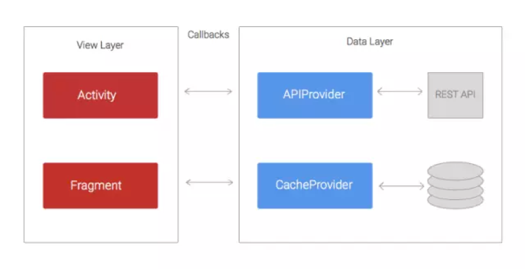
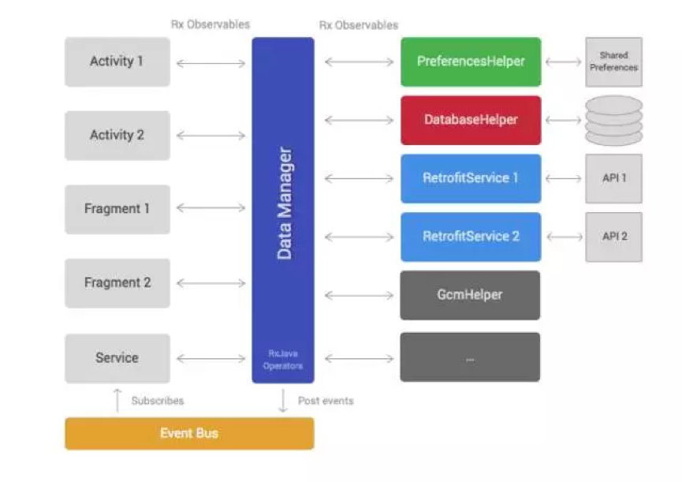
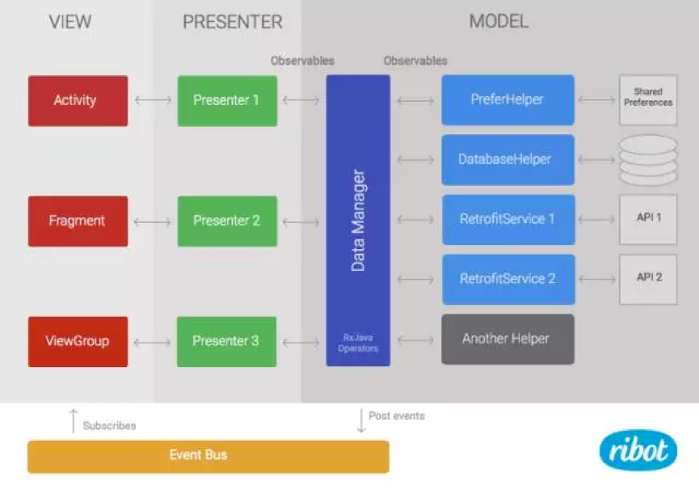

# Android 应用架构

Supoort Library, Play Services

## 曾经的架构



代码被划分为两层结构： *Data Layer(数据层)* 负责从 REST API 或者持久数据存储区检索和存储数据； *View Layer(视图层)* 的职责是处理并将数据展示在 UI 上。

**APIProvider** 提供了一些方法， 使 Activity 和 Fragement 能够很容易的实现与 REST API 的数据交互。 这些方法使用 URLConnection 和 AsyncTask 在一个单独的线程内执行网络请求， 然后通过回调将结果返回给 Activity。

按照同样的方式， **CacheProvider**所包含的方法负责从SharedPreferences和SQLite数据库检索和存储数据。同样使用回调的方式，将结果传回Activity。

存在的问题：

使用这种结构，最主要的问题在于View Layer持有太多的职责。想象一个简单且常见的场景，应用需要加载一个博客文章列表，然后缓存这些条目到SQLite数据库，最后将他们展示到ListView等列表视图上。Activity要做到以下几个步骤：

* 通过 APIProvider 调用 loadPosts 方法(回调)
* 等待APIProvider的回调结果，然后调用CacheProvider中的savePosts方法（回调）
* 等待CacheProvider的回调结果，然后将这些文章展示到ListView等列表视图上
* 分别处理APIProvider和CacheProvider回调中潜在的异常。

这是一个非常简单的例子，在实际开发环境中REST API返回的数据可能并不是View直接需要的。因此，Activity在进行展示之前不得不通过某种方式将数据进行转换或过滤。另一个常见的情况是，调用loadPosts( )所需要的参数，需要事先从其他地方获取到，比如，需要Play Services SDK提供一个Email地址参数。就像SDK通过异步回调的方式返回Email地址，这就意味着现在我们至少有三层嵌套的回调。如果继续添加复杂的业务逻辑，这种架构就会陷入众所周知的Callback Hell（回调地狱）。

***总结***

* Activitty和Fragment变得非常庞大并且难以维护。
* 太多的回调嵌套意味着丑陋的代码结构而且不易读懂和理解。如果在这个基础上做更改或者添加新特性会感到很痛苦。
* 单元测试变得非常有挑战性，如果有可能的话，因为很多逻辑都留在了Activity或者Fragment中，这样进行单元测试是很艰难的。

## RxJava驱动的新型架构

使用上文提到的组织架构差不多两年的时间。在那段时间内，我们做了一些改进，稍微缓解了上述问题。例如，我们添加了一些Helper Class（帮助类）用来减少Activity和Fragment中的代码，在APIProvider中使用了Volley。尽管做出了这些改变，我们应用程序的代码还是不能进行友好的测试，并且Callback Hell（回调地狱）的问题还是经常发生。

直到2014年我们开始了解RxJava。在尝试了几个示例项目之后，我们意识到她可能最终帮助我们解决掉嵌套回调的问题。如果你还不熟悉响应式编程，可以阅读本文（译者注：译文点这里那些年我们错过的响应式编程）。简而言之，RxJava允许通过异步流的方式处理数据，并且提供了很多操作符，你可以将这些操作符作用于流上从而实现转换，过滤或者合并数据等操作。

考虑到经历了前几年的痛苦，我们开始考虑，一个新的应用程序体系架构看起来会是怎样的。因此，我们想出了这个。



类似于第一种架构，这种体系架构同样被划分为Data Layer和View Layer。Data Layer持有DataManager和一系列的Helper classe 。View Layer由Android的Framework组件组成，例如，Fragment，Activity，ViewGroup等。

**Helper classes**（图标中的第三列）有着非常特殊的职责以及简洁的实现方式。例如，很多项目需要一些帮助类对REST API进行访问，从数据库读取数据，或者与三方SDK进行交互等。不同的应用拥有不同数量的帮助类，但也存在着一些共性：

* PreferencesHelper：从SharedPreferences读取和存储数据。
* DatabaseHelper：处理操作SQLite数据库。
* Retrofit services：执行访问REST API，我们现在使用Retrofit来代替Volley，因为它天生支持RxJava。而且也更好用。

帮助类里面的大多数public方法都会返回RxJava的Observable。

**DataManager**是整个架构中的大脑。它广泛的使用了RxJava的操作符用来合并，过滤和转换从帮助类中返回的数据。DataManager旨在减少Activity和Fragment的工作量，它们（译者注：指Activity和Fragment）要做的就是展示已经准备好的数据而不需要再进行转换了。

下面这段代码展示了一个DataManager方法可能的样子。这个简单的示例方法如下：

* 调用Retrofit service从REST API加载一个博客文章列表
* 使用DatabaseHelper保存文章到本地数据库，达到缓存的目的
* 筛选出今天发表的博客，因为那才是View Layer想要展示的。

```
public Observable loadTodayPosts() {
            return mRetrofitService.loadPosts()
                    .concatMap(new Func1, Observable>() {
                        @Override
                        public Observable call(List apiPosts) {
                            return mDatabaseHelper.savePosts(apiPosts);
                        }
                    })
                    .filter(new Func1() {
                        @Override
                        public Boolean call(Post post) {
                            return isToday(post.date);
                        }
                    });
    }
 ```
 
 在**View Layer**中诸如Activity或者Fragment等组件只需调用这个方法，然后订阅返回的Observable即可。一旦订阅完成，通过Observable发送的不同博客，就能够立即被添加进Adapter从而展示到RecyclerView或其他类似控件上。

这个架构的最后元素就是**Event Bus（事件总线）**。它允许我们在**Data Layer**中发送事件，以便**View Layer**中的多个组件都能够订阅到这些事件。比如DataManager中的退出登录方法可以发送一个事件，订阅这个事件的多个Activity在接收到该事件后就能够更改它们的UI视图，从而显示一个登出状态。   

***为什么这种架构更好？***

* RxJava的Observable和操作符避免了嵌套回调的出现。

* DataManager接管了以前View Layer的部分职责。因此，它使Activity和Fragment变得更轻量了。
* 将代码从Activity和Fragment转移到了DataManager和帮助类中，就意味着使写单元测试变得更简单。
* 明确的职责分离和DataManager作为唯一与Data Layer进行交互的点，使这个架构变得Test-Friendly。帮助类和DataManager能够很容易的被模拟出来。

***我们还存在什么问题？***

* 对于庞大和复杂的项目来讲，DataManager会变得非常的臃肿和难以维护。
* 尽管View Layer诸如Activity和Fragment等组件变得更轻量，它们让然要处理大量的逻辑，如管理RxJava的订阅，解析错误等方面。

## 集成MVP

在过去的一年中，几个架构设计模式，如MVP或者MVVM在Android社区内已经越来越受欢迎了。通过在示例工程和文章中进行探索后，我们发现MVP，可能给我们现有的架构带来非常价值的改进。因为当前我们的架构已经被划分为两个层（视图层和数据层），添加MVP会更自然些。我们只需要添加一个新的presenter层，然后将View中的部分代码转移到presenter就行了。



留下的**Data Layer**保持不变，只不过为了与这种模式保持一致性，它现在被叫做Model。

Presenter负责从Model中加载数据，然后当数据准备好之后调用View中相对应的方法。还负责订阅DataManager返回的Observable。所以，他们还需要处理schedulers和subscriptions。此外，它们还能分析错误代码或者在需要的情况下为数据流提供额外的操作。例如，如果我们需要过滤一些数据而且这个相同的过滤器是不可能被重用在其他地方的，这样的话在Presenter中实现比在DataManager中或许更有意义。

下面你将看到在Presenter中一个public方法将是什么样子。这段代码订阅我们在前一节中定义的dataManager.loadTodayPosts( )所返回的Observable。

```
public void loadTodayPosts() {
    mMvpView.showProgressIndicator(true);
    mSubscription = mDataManager.loadTodayPosts().toList()
            .observeOn(AndroidSchedulers.mainThread())
            .subscribeOn(Schedulers.io())
            .subscribe(new Subscriber>() {
                @Override
                public void onCompleted() {
                    mMvpView.showProgressIndicator(false);
                }
 
                @Override
                public void onError(Throwable e) {
                    mMvpView.showProgressIndicator(false);
                    mMvpView.showError();
                }
 
                @Override
                public void onNext(List postsList) {
                    mMvpView.showPosts(postsList);
                }
            });
    }
```

mMvpView是与Presenter一起协助的View组件。通常情况下是一个Activity，Fragment或者ViewGroup的实例。

像之前的架构，View Layer持有标准的Framework组件，如ViewGroup，Fragment或者Activity。最主要的不同在于这些组件不再直接订阅Observable。取而代之的是通过实现MvpView接口，然后提供一些列简洁的方法函数，比如showError( )或者showProgressIndicator( )。这个View组件也负责处理用户交互，如点击事件和调用相应Presenter中的正确方法。例如，我有一个按钮用来加载博客列表，Activity将会在点击事件的监听中调用presenter.loadTodayPosts( )

> 如果你想看到一个完整的运用MVP基本架构的工作示例，可以从Github检出我们的Android Boilerplate project。也可以从这里阅读关于它的更多信息Ribot的架构指导

***为什么这种架构更好？***

* Activity和Fragment变得非常轻量。他们唯一的职责就是建立/更新UI和处理用户事件。因此，他们变得更容易维护。
* 现在我们通过模拟View Layer可以很容易的编写出单元测试。之前这些代码是View Layer的一部分，所以我们很难对它进行单元测试。整个架构变得测试友好。
* 如果DataManager变得臃肿，我们可以通过转移一些代码到Presenter来缓解这个问题。

***我们依然存在哪些问题？***

当代码库变得非常庞大和复杂时，单一的DataManager依然是一个问题。虽然我们还没有走到这一步，但这是一个真正值得注意的问题，我们已经意识到了这一点，它可能发生。

值得一提的是它并不是一个完美的架构。事实上，不要天真的认为这是一个独特且完美的方案，能够解决你所有的问题。Android生态系统将保持快速发展的步伐，我们必须继续探索。不断地阅读和尝试，这样我们才能找到更好的方法来继续构建优秀的Android应用程序。
