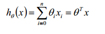
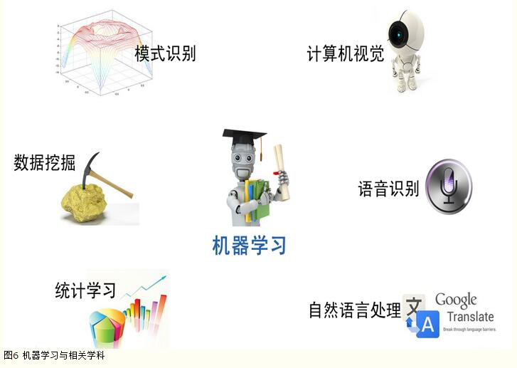
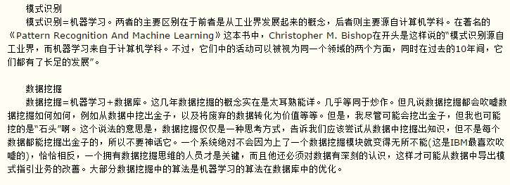
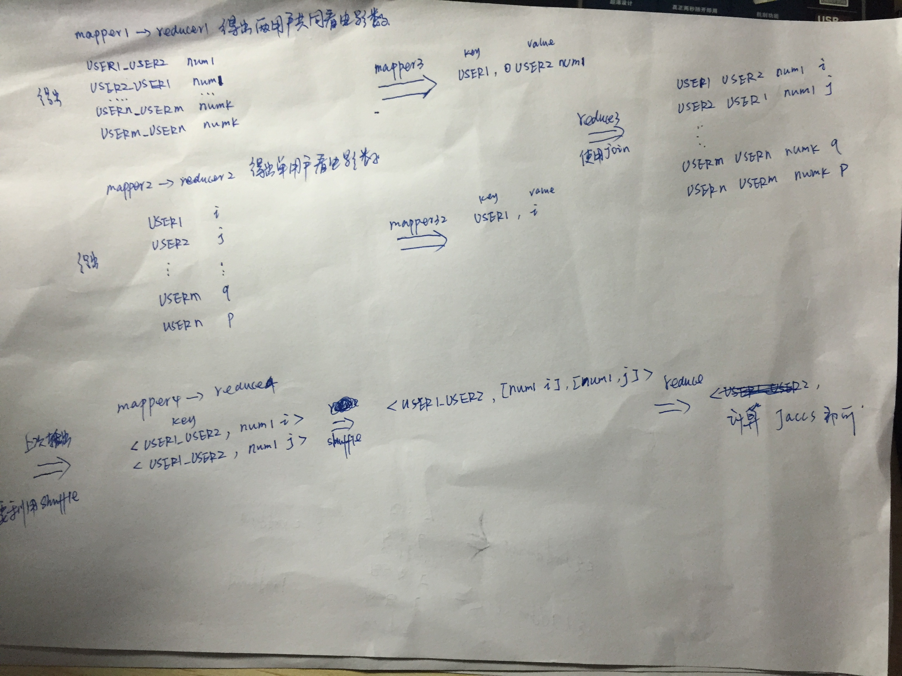
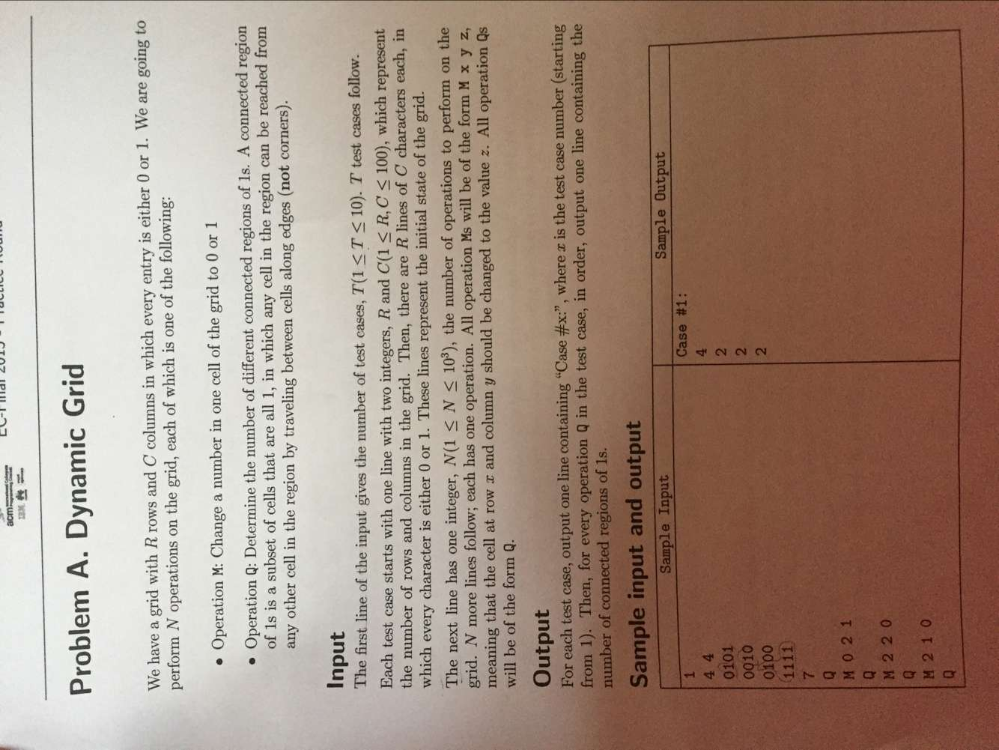
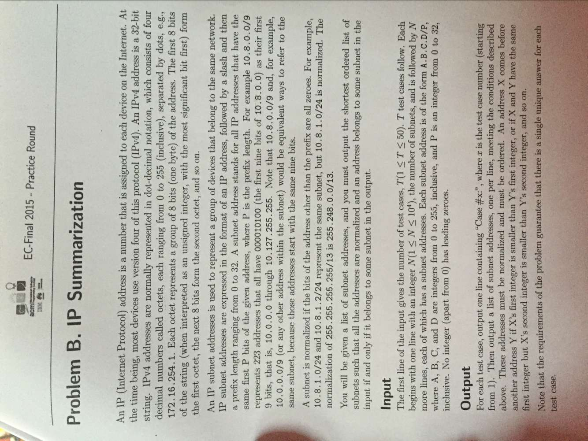
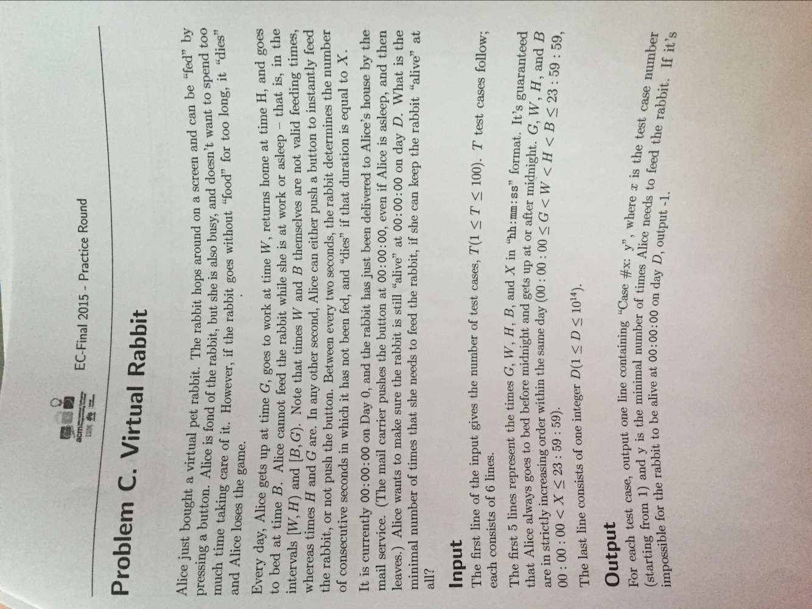
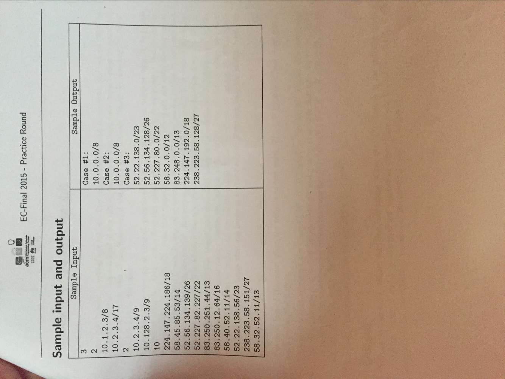

# NowCoder

很多殊途同归的结论。那个时候，简直就是拍案叫绝啊。如：

* 全概率公式和矩阵乘法
* 主成分分析PCA与谱聚类
* 最大熵模型和极大似然估计
* Logistic回归和条件随机场CRF
* EM算法和LDA的gibbs采样。

如果对x直接做回归，就是假定了x“正常状态”的分布在拟合超平面的两侧，得到的就是线性回归；如果将x变成1/(1+e^(-x))，然后进入极大似然估计，就是Logistic回归了。

