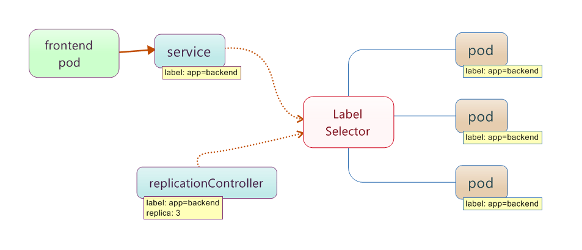
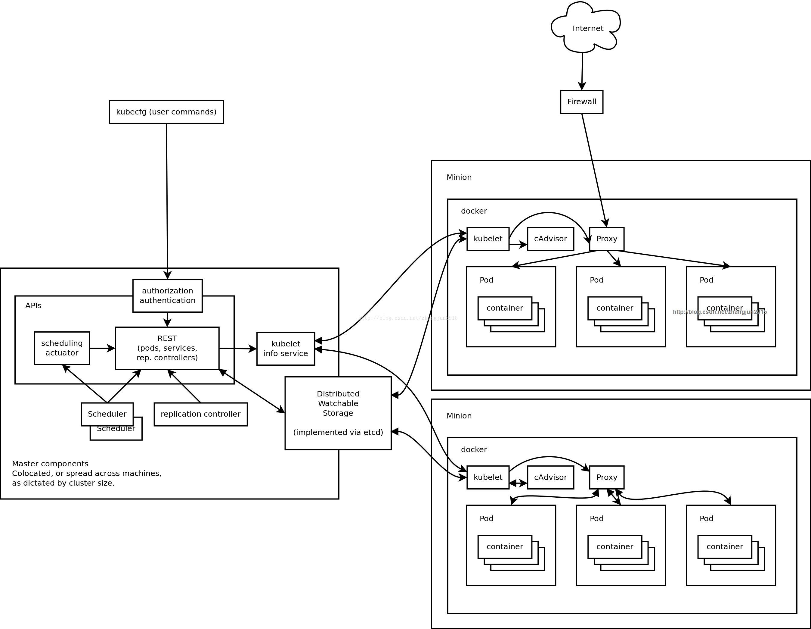
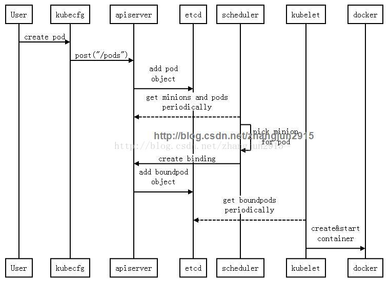
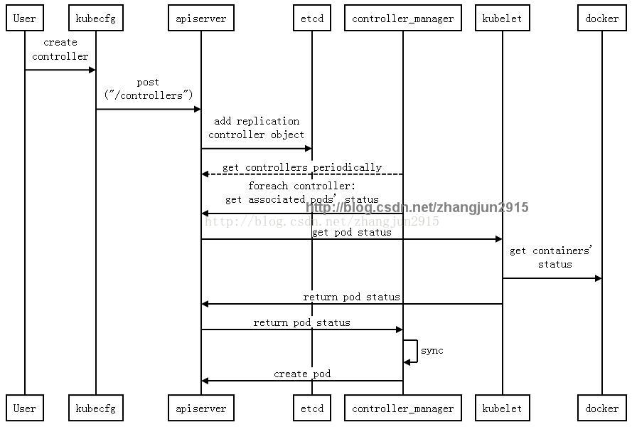
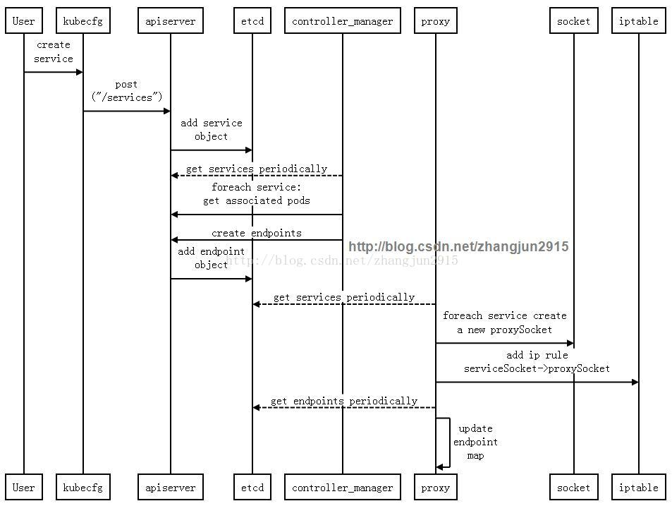

# Kubernetes

[TOC]

ref:http://www.csdn.net/article/2014-10-31/2822393

## 简介

基本上可以从如下三个维度来认识 Kubernetes。


## 操作对象

Kubernetes 以 RESTFul 形式开放接口， 用户可操作的 REST 对象有三个: 

- pod： 是 Kubernetes 最基本的部署调度单元， 可以包含 container， 逻辑上表示某种应用的一个实例。 比如一个 web 站点应用由前段、 后端及数据库构建而成， 这三个组件将运行在各自的容器中， 那么我们可以创建包含三个 container 的 pod。
- service： 是 pod 的路由代理抽象， 用于解决 pod 之间的服务发现问题。 因为 pod 的运行状态可动态变化（比如切换机器了， 缩容过程中被终止了等）， 所以访问端不能以写死 IP 的方式去访问该 pod 提供的服务。 service 的引入旨在保证 pod 的动态变化对访问端透明， 访问端只需要知道 service 的地址， 由 service 来提供代理。
- replicationController： 是 pod 的复制抽象， 用于解决 pod 的扩容缩容问题。 通常， 分布式应用为了性能或高可用性的考虑， 需要复制多份资源， 并且根据负载情况动态伸缩。 通过 replicationController， 我们可以指定一个应用需要几分复制， Kubernetes 将为每份复制创建一个 pod， 并且保证实际运行 pod 数量总是与该复制数量相等（例如， 当前某个 pod 宕机时， 自动创建新的 pod 来替换）。

可以看到，service 和 replicationController 只是建立在 pod 之上的抽象，最终是要作用于 pod 的，那么它们如何跟pod联系起来呢？这就要引入 label 的概念： label 其实很好理解，就是为 pod 加上可用于搜索或关联的一组 key/value 标签，而 service 和 replicationController 正是通过 label 来与 pod 关联的。如下图所示，有三个 pod 都有 label 为 "app=backend" ，创建 service 和 replicationController 时可以指定同样的 label:"app=backend"，再通过 label selector 机制，就将它们与这三个 pod 关联起来了。例如，当有其他 frontend pod 访问该 service 时，自动会转发到其中的一个 backend pod。



## 功能组件

如下图所示是官方文档里的集群架构图，一个典型的master/slave模型。



master运行三个组件：

- **apiserver**：作为kubernetes系统的入口，封装了核心对象的增删改查操作，以RESTFul接口方式提供给外部客户和内部组件调用。它维护的REST对象将持久化到etcd（一个分布式强一致性的key/value存储）。


- **scheduler**：负责集群的资源调度，为新建的pod分配机器。这部分工作分出来变成一个组件，意味着可以很方便地替换成其他的调度器。


- **controller-manager**：负责执行各种控制器，目前有两类：
- - endpoint-controller：定期关联service和pod(关联信息由endpoint对象维护)，保证service到pod的映射总是最新的。
  - replication-controller：定期关联replicationController和pod，保证replicationController定义的复制数量与实际运行pod的数量总是一致的。

slave(称作minion)运行两个组件：

- **kubelet**：负责管控docker容器，如启动/停止、监控运行状态等。它会定期从etcd获取分配到本机的pod，并根据pod信息启动或停止相应的容器。同时，它也会接收apiserver的HTTP请求，汇报pod的运行状态。


- **proxy**：负责为pod提供代理。它会定期从etcd获取所有的service，并根据service信息创建代理。当某个客户pod要访问其他pod时，访问请求会经过本机proxy做转发。

## 工作流

上文已经提到了Kubernetes中最基本的三个操作对象：pod, replicationController及service。下面分别从它们的对象创建出发，通过时序图来描述Kubernetes各个组件之间的交互及其工作流。







## 使用示例

### 搭建环境

- 我们需要Kuberntes各组件的二进制可执行文件。有以下两种方式获取：
  - 下载源代码自己编译：

    ```shell
    git clone https://github.com/GoogleCloudPlatform/kubernetes.git
    cd kubernetes/build
    ./release.sh
    ```

  - 直接下载已经编译打包好的 tar 文件

    ```shell
    wget https://storage.googleapis.com/kubernetes/binaries.tar.gz  
    ```

  自己编译源码需要先安装好golang，编译完之后在kubernetes/_output/release-tars文件夹下可以得到打包文件。直接下载的方式不需要安装其他软件，但可能得不到最新的版本。

- 我们还需要etcd的二进制可执行文件，通过如下方式获取：

  ```shell
  wget https://github.com/coreos/etcd/releases/download/v0.4.6/etcd-v0.4.6-linux-amd64.tar.gz
  tar xvf etcd-v0.4.6-linux-amd64.tar.gz
  ```

- 就可以启动各个组件了：

  - etcd

    ```shell
    cd etcd-v0.4.6-linux-amd64
    ./etcd
    ```

  - apiserver

    ```shell
    ./apiserver \
    -address=127.0.0.1 \
    -port=8080 \
    -portal_net="172.0.0.0/16" \
    -etcd_servers=http://127.0.0.1:4001 \
    -machines=127.0.0.1 \
    -v=3 \
    -logtostderr=false \
    -log_dir=./log
    ```

  - scheduler

    ```shell
    ./scheduler -master 127.0.0.1:8080 \
    -v=3 \
    -logtostderr=false \
    -log_dir=./log
    ```

  - controller-manager

    ```shell
    ./controller-manager -master 127.0.0.1:8080 \
    -v=3 \
    -logtostderr=false \
    -log_dir=./log
    ```

  - kubelet

    ```shell
    ./kubelet \
    -address=127.0.0.1 \
    -port=10250 \
    -hostname_override=127.0.0.1 \
    -etcd_servers=http://127.0.0.1:4001 \
    -v=3 \
    -logtostderr=false \
    -log_dir=./log
    ```

### 创建 pod

搭好了运行环境后，就可以提交pod了。按照以下步骤执行：

- 编写pod描述文件，保存为redis.json：

  ```json
  {
    "id": "redis",
    "desiredState": {
      "manifest": {
        "version": "v1beta1",
        "id": "redis",
        "containers": [{
          "name": "redis",
          "image": "dockerfile/redis",
          "imagePullPolicy": "PullIfNotPresent",
          "ports": [{
            "containerPort": 6379,
            "hostPort": 6379
          }]
        }]
      }
    },
    "labels": {
      "name": "redis"
    }
  }
  ```

- 通过命令行工具 kubecfg 提交

  ```shell
  ./kubecfg -c redis.json create /pods  
  ```

- 通过 kubecfg 查看 pod 状态

  ```shell
  # ./kubecfg list /pods
  ID                  Image(s)            Host                Labels              Status
  ----------          ----------          ----------          ----------          ----------
  redis               dockerfile/redis    127.0.0.1/          name=redis          Running
  ```

- Status是Running表示pod已经在容器里运行起来了，可以用"docker ps"命令来查看容器信息:

  ```shell
  # docker ps
  CONTAINER ID        IMAGE                     COMMAND                CREATED             STATUS              PORTS                    NAMES
  ae83d1e4b1ec        dockerfile/redis:latest   "redis-server /etc/r   19 seconds ago      Up 19 seconds                                k8s_redis.caa18858_redis.default.etcd_1414684622_1b43fe35
  ```

### 创建 replicationController

- 编写 replicationController 描述文件

  ```json
  {
      "id": "redisController",
      "apiVersion": "v1beta1",
      "kind": "ReplicationController",
      "desiredState": {
        "replicas": 1,
        "replicaSelector": {"name": "redis"},
        "podTemplate": {
          "desiredState": {
             "manifest": {
               "version": "v1beta1",
               "id": "redisController",
               "containers": [{
                 "name": "redis",
                 "image": "dockerfile/redis",
                 "imagePullPolicy": "PullIfNotPresent",
                 "ports": [{
                     "containerPort": 6379,
                     "hostPort": 6379
                 }]
               }]
             }
           },
           "labels": {"name": "redis"}
          }},
      "labels": {"name": "redis"}
    }
  ```

- 通过命令行工具 kubecfg 检查

  ```shell
  ./kubecfg -c redisController.json create /replicationControllers   
  ```

- 通过 kubecfg 查看 replicationController 状态

  ```shell
  # ./kubecfg list /replicationControllers
  ID                  Image(s)            Selector            Replicas
  ----------          ----------          ----------          ----------
  redisController     dockerfile/redis    name=redis          1
  ```

同时，1个pod也将被自动创建出来，即使我们故意删除该pod，replicationController也将保证创建1个新pod。