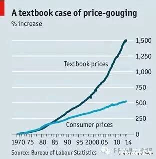
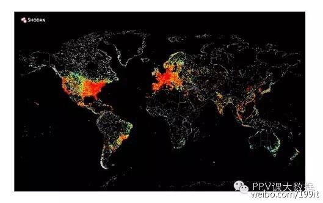

## 科学计算

### 1. 如何真正学习数据科学
对于数据科学领域来说，现在是一个令人振奋的时期。它是新兴的研究领域，但是却在飞速的发展。如今数据科学领域需要大量的数据科学家，而他们在硅谷年人均收入则超过10万美元。哪里有优厚的薪酬，哪里就会有相当多的人会尽可能的拿到这样的薪酬。而数据科学技能的不足意味着很多人都要学习或者尝试着学习数据科学。

学习数据科学的第一步通常都是问问自己：我要怎样学习数据科学？这个问题的回复是我们要上一系列的课程和阅读一些书籍，并且我们需要先从线性代数或统计学开始学习。一年前，在学习过程中我也有过类似的经历。当时我不懂编程，但是我知道我想要从事数据领域。

我难以解释在只给了一个很大的没有任何说明的资源库目录下极其不明确的方向情况下怎样学习数据科学的，好比我的老师直接给我一叠相关的教材并说“把这些书全部读完”。在上学期间我曾为此而苦恼过。如果我是以这样的方式来学习数据科学，我肯定不久就会放弃。

有些人认为读一些相关书籍是最好的学习方式，而我则认为尝试建模和实践里面的东西是最好的学习方式。此时，这学习的过程鼓舞着我，同时我也清楚自己为什么要学。总之，最好的学习方式就是当你在学习它的时候，你可以立即使用有效的技能。从我和初学者这些年的交谈中，我知道很多这些想法的分享。

这就是我为什么不建议你在入门的时候学习线性代数或统计学了。如果你想要学好数据科学，你首先就应该要学会如何热爱数据，对怎样理解它深感兴趣。

通过阅读一下内容让你明白应该如何熟练掌握数据科学。

一个你可在数据科学领域进行的可视化操作例子（来源经济刊物）。

#### 1、学会如何爱上数据

几乎没有人会谈到学习的动机。数据科学是一门宽泛且模糊的领域，这让你感到无从下手，真的很难。没有学习它的动机，你会在学习过程中半途而废，并开始认为你学不下去了，其实错不在你-与教学相关。

你需要一些东西能激发你不断学习的欲望，甚至在午夜时分，你开始认为这些公式看起来都觉得模糊的时候，你此时在思考如果这些公式能让我在夜晚的时候通过我的神经网络系统琢磨出其中的名堂。

此时你需要一些东西可以让你找到线性代数、统计学和神经网络系统之间的联系，而且可以让你不再犹豫我下一步我该学些什么。

而我学习数据科学的切入点是如何分析股市行情，尽管在那时我还不清楚它是什么。一些我曾编写过如何预测股市行情的程序代码是没有涉及统计学的。但我清楚我目前所做的努力还不够，仍需要日以夜际的完善其功能。

当时我在为了不断的完善我的编程能力而废寝忘食。我对股票市场为之着迷。我在学着如何热爱数据。也正因如此，我不断的被激励着去学习任何能让我程序更好的知识。

我知道，不是所有人都对股市行情的预测为之着迷，但是需找一些你想要学习的知识是相当重要的。

在此，我们可以试着了解一些关于你的城市中新奇而有趣的问题、在网上映射所有设备、发现每一位NBA球员所打的位置、在地图上显示每年难民的分布情况，甚至其它一些相关的东西。数据科学伟大之处就是你可以在工作的过程中找到无限的乐趣，它们都是提出问题并获得解决问题的过程。

你可在此随心所欲的做一切你想做的事，而且保证不受周围环境的干扰。

互联网上所有设备的地图

#### 2、 在实践的过程中学习

学习一些与神经网络系统、图像识别以及其尖端科技相关的内容是很重要的。然而很多数据科学知识并不涉及以下内容：

90%的工作将会是数据清洗。
深入了解几个算法远胜于对很多算法只懂一点点。
如果你熟练的掌握线性回归分析，k均值聚类分析，以及逻辑回归分析，能够解释和理解结果，且利用它们来很好的完成你需要做的项目，与你只知道任何单个算法，且不知道用它们对比，你会觉的将更有能力。

很多时候，你所使用的算法，它会变成函数库的一种形式（你几乎不需要写你的SVM-这需要耗费你相当长的时间）。
综上所述，学习数据科学的最好方式就是学习如何完成一个项目。通过完成一个项目，你会获得一些立即实用且有效的技能。你也有一个不错的方式构建工程组。

开启项目之旅需要你找到一个喜欢的数据集，从数据集里解决一些感兴趣的问题，并重复上述步骤。

这里有一些相关链接可以让你找到能运用到你做项目的数据集。

100+ 有趣的统计数据集

数据集子板

机器学习数据库

另一种方法（也就是我所使用的方法）就是需找一个深层次的问题，预测股市行情，并把它们分解成若干个小问题。我首先连接到雅虎的经济API（应用程序接口），并获取每日价格数据。然后我在此基础上创建一些指标，用于显示过去几天的平均价格，同时一次来预测未来的走势（这里没有用到真实的算法，仅方法分析而已）。然后效果并不是很明显，因此我要学习一些统计学的内容，然后使用线性回归分析。然后我再连接到其他API应用程序接口，并爬取每一分钟的数据，把它们存储到SQL数据库中。然后不断重复操作，直到选出一个合适的算法。

关于这些最棒的事情是学习的内容。我并不仅是学习SQL的相关句法，同时还应用他们来储存价格数据，并且所学习到的内容是单纯学习SQL语句的10倍。学习这些知识而不去运用的话你会很难熟练掌握这些知识，而且你也没有做足准备来完成一个真正意义上的数据科学工作。

这些家伙尝试预测股票行情，显然需要一些数据科学。

#### 3、学会与他人交流心得

数据科学家经常需要把他们分析出来的结果展示给其他人看。而这样的工作技能可以在一定程度上区分是一个一般数据科学家还是一个伟大数据科学家。

交流心得的一部分在于需要我们理解一个项目的主题及其理论，而另一部分则是明白如何清晰的整理结果。这最后一小部分则是能清楚地解释你分析出来的结果。

也许做到有效且到位的传达一个复杂而抽象的概念是非常困难的，但是你可以尝试以下几点：

- 创建一个博客。把你的数据分析结果写到你的博客上。
- 尝试去教你那些不懂技术的朋友以及家人一些数据科学的相关概念。你会惊讶的发现你在赐教的过程中能大大的帮助你理解这些概念。
- 尝试在聚会中说出一些与其相关的内容。
- 尝试用Github管理你所有的分析。
- 尝试活跃在Quora,DataTau，以及机器学习子书签社区。

####4、从同行学习

你可以在与别人的合作中学到非常多的知识。在数据科学领域，团队合作完成项目相当重要。

这里有一些不错的想法：

- 可以在用户间的聚会中找一些能与你共事的人。
- 可对开源包作以份贡献。
- 可以给一些曾经写过一些有趣的数据分析博客的并能与你合作的人发消息。
- 可以尝试在keggle，一个机器学习竞赛平台上参与其中，并且看一下你是否能从中找到一个可以和你组队的人。

#### 5、不断的增加工作的难度

你是否会感觉到你在完成一个项目时会感到如此的安逸和放松？这是否会是你最后一次使用一个星期前更新的概念？是时候要做一些有难度的项目了。数据科学犹如你要攀登一座陡峭的山峰，如果你停止前进，你会很容易失败。

如果你觉得你现阶段过得如此安逸，这里有几个建议：

尝试使用一个更大的数据集，学习和使用Spark。

- 看一下你是否能使用一个运行时间更少的算法。
- 想想如何把你的算法扩展到多处理器？你可以做到吗？
- 多掌握一些你所常用的算法的相关理论。它会改变你的假设吗？
- 尝试教导新手做一些你在做的事情。