[TOC]

# GTD

## GTD 流程图

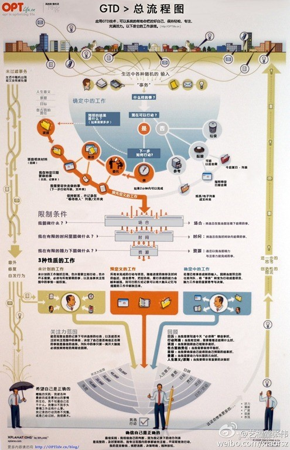

每个环节都是不同的情景， 需要借助不同的工具。 生活就是不断地折腾， 只要我们活着， 就会不断有想法要去做些什么事情， 无论是自己想做的还是别人希望你做的。 只要你产生这样的想法了， 而又觉得可以去做的话， 那就把它记下来。

对照着流程图看， 对于各种事物， 决定是否可做的时候， 简单一点完全用脑子就可以搞定了。 再复杂的情况， 拿张纸写写画画， 或者辅助思维导图。 但是关键一点是， 这个过程是在分析， 任何其实工具只是辅助分析的工具， 就好比草稿纸， 我们要的是最终的分析结果， 结果出来后， 草稿纸就可以扔了。 即分析的过程有辅助分析的工具， 不要把辅助分析的工具归到 GTD 工具里。 

接下来两条路。 如果做， 少于 2 分钟， 那就马上做。 不能马上做的， 记下来， 以后再做。 而这一过程的实现也根本不需要所谓有 GTD 工具， 用脑子就可以搞定。

**原来我们所需要的 GTD 工具， 只是一个 Todo List 和一个日历**。 当明白 GTD 主要在于用脑子思考和分析， GTD 工具只是辅助记忆和提醒时， 一切都明朗起来了。 无非就是需要一个提醒我接下来需要做什么事的 TODO List， 以及一个记录及提醒我特定时间或日期需要做什么事的日历。

## 核心步骤

GTD 的核心理念概括就是 **『通过记录的方式把头脑中的各种事情移出来， 然后整理安排自己去执行』**。 GTD 的核心步骤为五步： 收集、 处理、 计划、 执行、 回顾

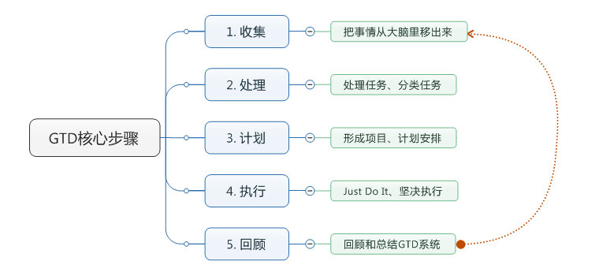

- 收集 —— 收集记录

  人的大脑能存储很多东西， 但有限， 不要相信某事情发生后过了一段时间你还能记得， 释放大脑的储存负载， 让大脑着重于思考， 平时有什么信息、 任务和灵感要在忘记之前用工具记录下来， 是用来的工具要尽可能的方便， 易用， 便捷。

- 处理 —— 处理分类

  只有急事处理信息， 对信息急事做出决定和归纳成类， 你才能避免信息的堆积和碎片化， 处理信息时采用**二分钟法则**和**四象限法则**。 二分钟法则就是如果一件事情两分钟内能解决， 无论是何种事情， 马上着手解决掉， 如果不能再进行分类。 分类是采用四象限法则， 四象限法则是把工作按照重要和紧急两个不同的程度划分成四个『象限』： 既紧急又重要、 重要但不紧急、 紧急但不重要、 既不紧急又不重要。

  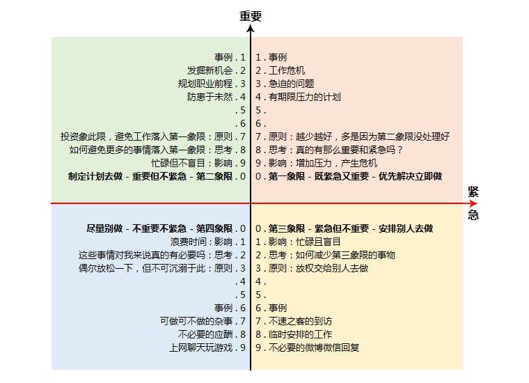

- 计划 —— 计划安排

  除了既有的日程安排外，可以设定每日，每周，每月，每年你需要完成的重大事件，把他们排进日程表。每天要做的事件采用[三只青蛙理论](http://www.fortunechina.com/column/c/2014-01/24/content_192062.htm)，前天晚上睡觉前设定第二天最重要的三件事，起床后就可以开始着手这三件事了（同理可用于每月的“三只青蛙”, 每季度的“三只青蛙”，每年的“三只青蛙”）。每周要做的事采用[习惯21天效应](http://www.mifengtd.cn/articles/culture-a-habit-in-a-month.html)，一件事只要坚持21天就能习惯成自然，成为一种习惯。每月要做的事采用日历行程表的方法，将每月要做的事排进日程表。每年要做的事采用**愿望清单法**，让自己每年都有收获和进步。

  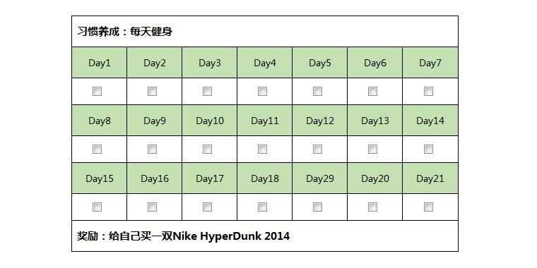

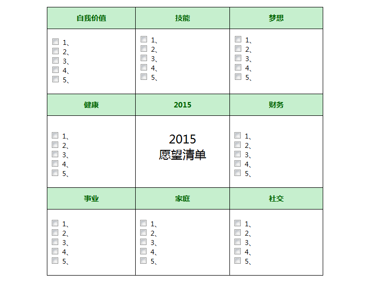

- 执行 —— 坚决执行

  执行是Getting Things Done最关键的一步，也是成功与否的关键，要言行一致，制定了计划就一定得做到，这能很好地提升你的自我认同感。执行时你应当在不分心的情境下，一次只执行一件事，既不要多线工作，也不要让你的工作突然中断。采用[番茄工作法](http://baike.baidu.com/view/5259318.htm)，将番茄时间设为25分钟，专注工作，中途不做任何与该任务无关的事，直到番茄时钟响起，然后短暂休息5分钟继续番茄时钟，每4个番茄时段可多休息一会儿。番茄工作法极大地提高了工作的效率，还会有意想不到的成就感。

  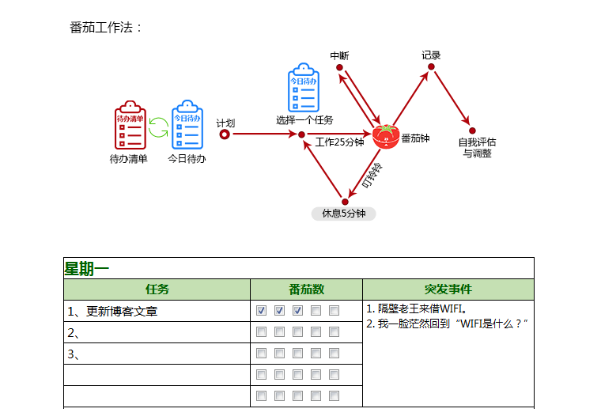

- 回顾 —— 回顾检查

  目前我采用的是**每周回顾**，采用[PDCA循环法](http://baike.baidu.com/view/280963.htm)对长期目标、中期目标和短期目标进行回顾，对工作和其它事情进行回顾，看看哪里做的不好，需要改进，重新做出调整计划。这样能使得计划更有效地进行，更加合乎工作程序的逻辑。

  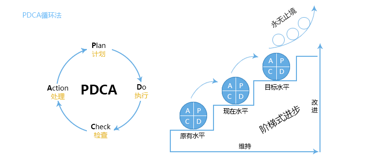

ZTD(Zen to Done) 新增核心步骤：

- 信任的系统 —— 建立简单的列表， 并每日查看

  ZTD（简单做）建议你尽可能的维持列表简单化。不要增加复杂的系统，也不要持续尝试新工具，以免时间上的浪费。尽可能的使用简单的清单方式，因为你注重的是如何执行的任务，而非玩弄你的GTD系统或者GTD工具。[**阅读全文**](http://www.mifengtd.cn/articles/ztd-habit-5-effective-gtd-tools.html)

- 管理 —— 一个储存所有信息的地方

  把所有接收的信息都放入你的收集箱中，处理你的收集箱，执行任务，完成任务。在这个系统里，你永远都不应该有疑问自己下一步该做什么。而且也使你更能专心注重于工作，也避免的拖延的。[**阅读全文**](http://www.mifengtd.cn/articles/ztd-habit-6-everything-in-order.html)

- 简化 —— 减少你的任务清单， 只留下最必要的

  将你的任务列表简化到最少，只剩下最重要的任务，这样你就不需要那些复杂的计划体系了。由于GTD并不对任务进行的优先级划分，所有的任务都被添加到一份清单中，于是这份清单就变得越来越长，而你就不得不每天都疲倦地忙碌于任务完成之中。取而代之的，ZTD要求你不断地简化自己的任务清单，确定你的任务只是最重要的。[**阅读全文**](http://www.mifengtd.cn/articles/ztd-habit-8-eliminate-all-but-the-absolute-essential-tasks.html)

- 常规 —— 设定每周、 每日例程

  设定每周、每日例程可以使你的工作和个人生活得到极大的简化。更重要的是，使你掌控自己的生活，而非让任务处在搁浅之中。没有日程，我们就不太容易对新进入的信息说不。因为我们总是被那些希望占用我们时间的人、吸引注意力的网站所拖住，这不是一件好事（除非你不想做完重要的事情），所以你需要掌控自己的生活，设定日程，并且跟着它走。[**阅读全文**](http://www.mifengtd.cn/articles/ztd-habit-9-optimize-your-productivity-with-daily-weekly-routines.html)

- 激情 —— 做你充满梦想的事情

  当你真正地想去做一件事，无论多么辛苦，你都会去努力的完成。你会付出更多的努力，抽出更多的时间，耽搁的时间也减少了。所以，培养这个习惯正是为了持续搜寻使你保持热情的事情，使你精神饱满，动力十足。[**阅读全文**](http://www.mifengtd.cn/articles/ztd-habit-10-do-something-you-are-passionate-about.html)

## 时间管理

- 早睡早起

  [Sleep Cycle](http://www.sleepcycle.com/)是一款可以很好的记录你的睡眠质量，甚至可以改善你的睡眠质量的APP, 其原理是监测你的睡眠深度，然后在浅睡眠阶段温柔地把你唤醒，让你如同自然醒般的舒适，醒后大脑能保持高效率运转。

  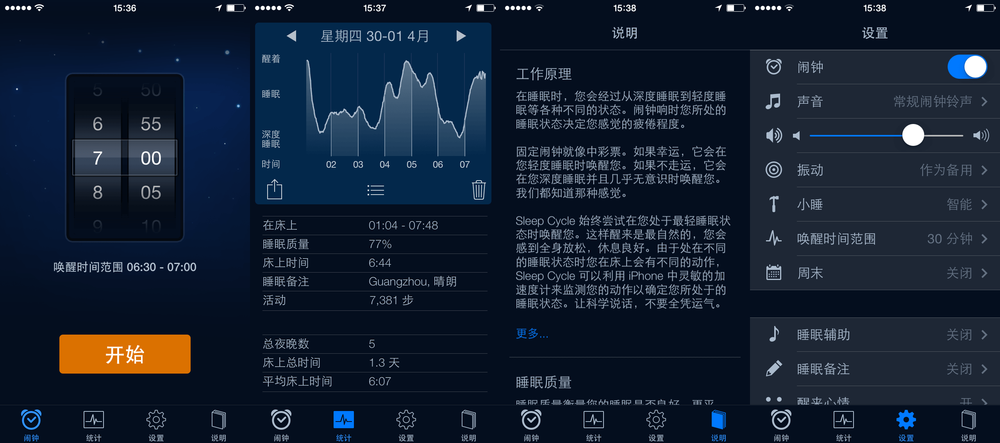

  不要总是想着再小睡一会儿 (其实就是赖床)，那只会让你更加想睡，更加没法起床，咬咬牙告诉自己只要两分钟，两分钟我就能清醒了。就像一句话说的，你总想做一个优秀的人，做一些惊天动地的事，可是你连早点起床都做不到。如果是工作的原因没办法早睡早起，那也要让自己的作息时间规律起来，没办法做早睡早起的大公鸡，那就做晚睡晚起的猫头鹰。

- 更简洁的 To-do List

  [To-do List](http://www.mifengtd.cn/articles/building-a-smarter-to-do-list-part-1-43folders.html)对于时间管理的作用不言而喻，它能够让你明确接下来要做什么，先做什么，什么最重要，让你的工作更顺畅、有条理、更有紧迫感。比如，临睡前列出明天[最重要的三件事](http://www.mifengtd.cn/articles/double_productivity_this_week.html)，起床后就可以开始着手这三件事了。

  [Clear](http://realmacsoftware.com/clear/)是一款方便快捷的轻量级To-do List应用，令人上耳目一新的设计和交互方式，只为用户提供待办事项列表，没有任何复杂的功能，可以各种手势对Clear进行操作，学习成本低，上手极快。

  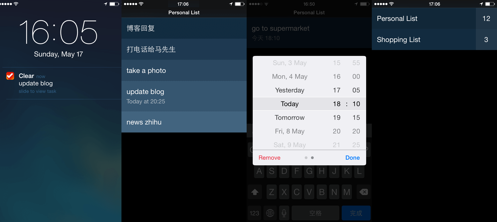

  我的使用经验是: Clear主要用于偶然灵感的记录，简单的文字记录，短期事件的提醒(1-3天)，还有就是购物清单，记录的原则是不要让Clear列表清单过于碎片化，判断是否能加入Clear列表采取两分钟原则，两分钟内能解决的事情，无论是何种事情，马上着手解决掉，如果不能再加入Clear列表。

- 日历行程表终结者

  备忘录、日历和提醒事项是构成手机日历行程表的核心要素，备忘录主要用于记录文字或者用作粘贴板存放一些需要经常复制使用的东西。日历是以时间顺序为线索，将所有事件组织起来。提醒事项则一般是应该尽快完成的事情。提醒事项与日历中的添加事件很相似，最大的不同就是事件的组织形式，日历以时间顺序为线索，而提醒事项可以对事件性质进行分类，如可以分成工作、生活、学习等。所有有日期要求的事件，写入日历，没有具体日期要求的又是两分钟做不完的事件，写入提醒事项。会干扰你当天的工作重点的事件，写入日历，不会干扰你当天的工作重点的，属于未进行划分的工作，写入提醒事项。日历的事件尽可能要少，一旦设置就要认真按时完成，提醒事项一旦设置就要尽快完成, as soon as possible.

  [AwesomeNote](http://www.bridworks.com/anote/eng/)是一款创新的笔记和待办事项管理应用，也是奶酪认为在iOS上最好的笔记应用，精美的界面，层次分明的文件夹分类，最重要的原因是它能同步原生日历和原生提醒，还能同步到Evernote (印象笔记)，这使得AwesomeNote能够在手机端和电脑端同时使用，这很重要。

  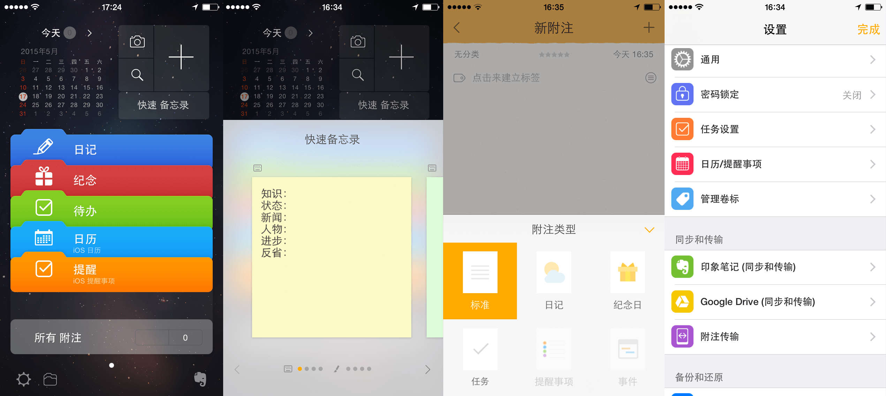

  我的使用经验是: 日历和提醒事项使用手机原生工具，然后同步到AwesomeNote中，用Clear做短期计划，用AwesomeNote做记事本、有规律的循环事件、中期长期计划，包括：

  - 日记 —— (标注格式为日记) 每天写的日记，我用的方法是问答式记录：今天学到了什么知识，是什么样的状态，有什么新闻，遇到了什么人，有什么进步和值得反省的事。旅行日记通常图片会比较多，我的选择是用百度网盘来保存。
  - 纪念 —— (标注格式为纪念日) 家人朋友的生日和重要的纪念日，设定在该日期的前一天提醒你，然后送上你的祝福和惊喜吧。
  - 待办 —— (标注格式为任务) 需要做计划去办的中期和长期事项，比如年度愿望清单，瘦身计划等。
  - 原生日历 —— 日历的事件尽可能要少，一旦设置就要认真按时完成。
  - 原生提醒事项 —— Clear用于短期（1-3天内）的事件提醒，原生提醒事项用于每月有规律的事件提醒。

- 优秀是一种习惯

  古希腊哲学学亚里士多德说过 “[优秀是一种习惯](http://www.mifengtd.cn/articles/7-habits-of-highly-ineffective-people.html)”，一些优秀的人之所以能够创造出令人瞩目的成就，是因为他们在日常生活、工作和学习中养成了各种各样良好的习惯。优秀是一种气质、优秀是一种状态、优秀更是一种习惯。一个人的习惯往往就是一个人性格的缩影, 我们的一言一行都是日积月累养成的习惯。如果说优秀是一种习惯，那么懒惰和平庸也是一种习惯。

  [Habit List](http://habitlist.com/)是一款极简设计风格的习惯养成应用，界面精美，操作简单，直观的统计功能，还有灵活的周期设置功能，唯一的就是缺点是没办法跨平台使用。

  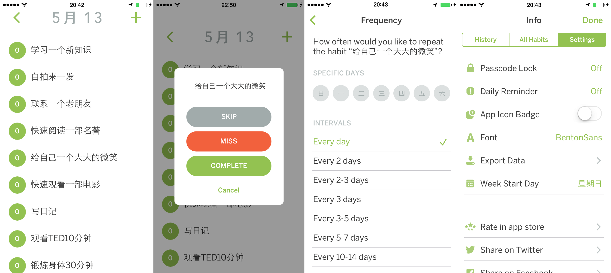

  好习惯的培养和坏习惯的改正都不会是轻而易举的，习惯养成需要循序渐进，由浅入深，由近及远，需要宁少勿多、宁简勿繁、宁易勿难。先找一个比较容易做到的，做起来有兴趣的，很快就能尝到甜头的，而且能不断受到自己和周围人激励的习惯开始，一个习惯如果坚持了21天就给自己一个奖励吧，如果没有坚持下来那就给自己一个小小的惩罚吧。

- 番茄能治拖延症

  明明知道那件事必须要做了，可就是迟迟不能开始，再给两分钟培养培养工作情绪，然后拖拖拉拉了半小时，工作时随手刷刷朋友圈，结果把手上的工作给放下了，这就是 “如果还有明天，你的工作是永远没法做完”的原因。番茄工作法是简单易行的时间管理方法，在一个个短短的25分钟内，收获的不仅仅是效率，还会有意想不到的成就感。

  [pomotodo](https://pomotodo.com/)是一款结合了番茄工作法和To-do List的在线工具，多平台支持，可惜暂时没有Firefox拓展，是用电脑工作时番茄工作法的绝佳选择。操作方法很简单，首先规划好今天要完成的几个任务，选择其中的一个任务，设定番茄钟直到番茄钟响起（25分到），休息5分钟后（喝水、活动、回QQ，看手机信息都行），开始下一个番茄钟，每四个番茄钟后，休息25分钟。中断如果遇到非得马上做不可的事，那么停止这个番茄钟并宣告它作废，完成这件事情之后再重新开始同一个番茄钟，如果是不是必须马上去做的事，在列表里标记下来就可以了。

  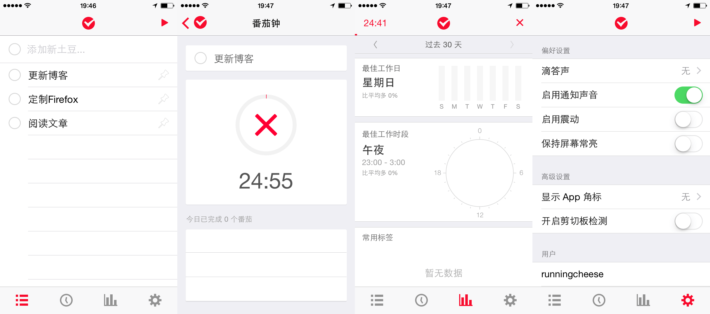

  [Forest](http://sspai.com/26582)是一款创新性的应用，它创新性地将番茄工作法与种树的小游戏结合，当我们需要专注投入一件事情时，用Forest种下一棵树，其间Forest会默默倒计时监督用户不要碰手机，只有在不退出应用的情况下树才能成活，退出则会直接导致树木枯死，以勉励用户中途不要碰手机，旨在帮助用户戒掉“依赖手机”的坏毛病。

  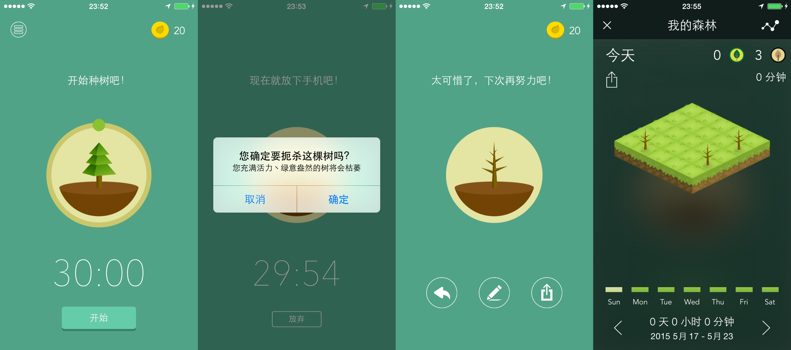

## Tools

- Software
  - Thinking Rock
  - mGSD
- APP
- Online Tools
  - RTM
  - todlodo
  - Doit.im
  - GTD 笔记本
- Others