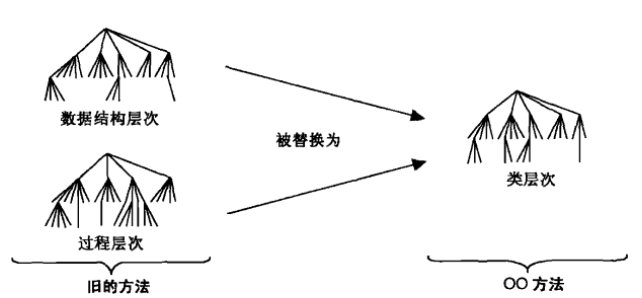

[TOC]

# UML 面向对象建模与设计

## 第 0 部分 简介

### 第 1 章 简介

面向对象建模与设计是使用现实世界的概念模型来思考问题的一种方法。 其基本结构是对象， 对象既包含数据结构， 又包含行为。

#### 1.1 什么是面向对象

表面来看， 面向对象 (OO) 这个术语的意思是， 把软件组织成一系列离散的、 合并了数据结构和行为的对象。

OO 方法的特征：

* 标识 (identity)

  数据被量化成称为 **对象(object)** 的离散的、 可辨识的实体。 每个对象都有它自己的内部标识。 即即使所有属性值都相同，两个对象也是有差别的。

  在编程语言中， 每个对象都有一个唯一的句柄， 借助这个句柄就可以饮用对象。 不同语言实现句柄的方式不同， 如地址、 数组下标或人为编号。 这样的对象引用是一致并且独立于对象内容的， 允许创建混合的对象集合， 如同时包含文件和子目录的文件系统目录。

* 分类 (classification): 

  有着相同数据结构 (属性) 和行为 (操作) 的对象被分组为一个**类 (class)**。类是一种抽象， 描述对于一项应用来说很重要的属性， 并且忽略其余属性。 类的选择是随意的， 视应用而定。

  每个类都描述了由个个对象组成的无限集合。 每个对象都是该类的一个**实例 (instance)**。 对于每种属性， 对象都有其自己的取值， 但会和此类的其他实例共享属性名和操作。 对象包含了到其自身类的隐含引用， 它 *知道自己是什么东西* 。

* 继承 (inheritance): 

多个类基于一种分层关系， 共享类间属性和操作（合称特征）。 **父类(superclass)** 拥有**子类 (subclass)** 提炼和详细说明的通用信息。 每个子类包含 (或称继承) 其父类全部的特征， 再加上它自己所特有的特征。 子类不需要重复其父类的特征。 

* 多态 (polymorphism): 

  对于不同的类来说， 相同的操作会有不同的动作。 如国际象棋游戏中， 兵和后的移动操作是不同的。 *操作*是对象执行或被执行的一个过程或转换。 由特定类实现的操作被称为*方法(method)*。 因为 OO 操作符是多态的， 所以它可能会有多种实现方法， 对于不同对象的类来说， 每一个都会有一种实现方法。

    在现实世界中， 操作只不过是不同的对象之间相似行为的一种抽象。 每种对象 『知道如何』 执行它自己的操作。 然而， 在 OO 编程语言中， 基于操作名和被操作对象的类， 语言会自动选择正确的方法来实现操作。 操作的用户不需要知道有多少中方式实现了给定的多态操作。 无须改动现有代码， 开发者可以增加心累， 只要他们为每一种可行操作提供方法即可。

#### 1.2 什么是 OO 开发

OO 开发是基于现实世界以及程序中的抽象为基础来思考软件的方式。 在此种背景下， **开发(Development)**指的是软件生命周期， 即分析、 设计和实现。 OO 开发的本质是识别和组织应用领域中的概念， 而不是以一种编程语言最终表示这些概念。 因为某些问题内在的复杂性， 软件开发中困难的部分是对其*本质*的操作， 而不是将它映射成某种语言的这些*次要方面*。

##### 1.2.1 对概念而非实现建模

真正的收效来源于解决前端的概念性问题， 而不是后端的实现细节。 OO 开发方法鼓励软件开发者在软件生命周期内应用其概念来工作和思考。 只有较好地识别、 组织和理解了应用领域的内在概念， 才会有效地表达出数据结构和函数的细节。

OO 开发是一种思维方式， 而不是一种编程技术技术。 它的最大好处在于， 帮助规划人员、 开发者和客户清晰地表达抽象的概念， 并将这些概念互相传达。 它可以充当规约、 分析、 文档、 接口以及编程的一种媒介。

##### 1.2.2 OO 方法论

我们提出一种 OO 开发过程和一种图形化表示法来表示 OO 的概念。 这个过程先是构建一种应用模型， 然后再设计中增加细节。 从分析到设计再到实现使用的是相同的无缝表示法， 这样某一个开发阶段增加的信息就不会在下一阶段中丢失或转化。 这种方法论包括下面几个阶段。

* **系统构思**。 软件开发始于业务分析人员或用户构思一项应用， 并制定临时性需求。

* **分析**。 通过创建模型， 分析人员仔细审查并严格地重新描述系统构思阶段的需求。 分析模型是一种简明准确的抽象， 它描述目标系统要做哪些事情， 而不是要如何来做这些事情。分析模型不应该包含任何实现决策。

  分析模型有两个部分： **领域模型(domain model)**， 描述系统内部反映的现实世界的对象； **应用模型(application model)**， 描述用户可见的应用系统本身的组成部分。 例如， 对于股票经纪人系统来说， 领域对象包括股票、 债券、 交易和佣金， 应用对象会控制交易的执行过程， 并给出结果。 一些应用专家虽然本身不是程序员， 但他们能够理解并评议好的模型。

* **系统设计**。 开发团队设计出一种高层的策略 —— **系统架构(system architecture)**， 用于解决应用程序的问题。 他们也制定政策， 默认为后面更加详细的设计内容。 系统设计人员必须要确定优化哪些性能特性， 选择何种策略来解决问题， 完成哪些临时性的资源分配。

* **类的设计**。 根据系统设计策略， 类的设计者给分析模型添加细节。 类的设计者使用相同的 OO 概念和表示法阐述领域对象和应用对象， 尽管它们存在于不同的概念层面上。 类设计的焦点在于实现每个类的数据结构和算法。

* **实现**。 实现人员将类的设计阶段开发的类及其关系转换到某种编程语言、 数据库或者硬件上。 程序设计应该是简单直接的， 因为所有困难的决策都已经完成。 在实现阶段， 遵循良好的软件工程实践是很重要的， 这样， 设计的可追溯性就非常清晰， 系统将保持灵活性和可扩展性。

从分析到设计再到实现， OO 概念会应用到系统开发的整个生命周期中。 你可在各个阶段使用相同的类， 不用改变符号记法， 只在后续阶段增添细节。

注意， 我们并不推荐瀑布式开发过程， 即先捕获需求， 再分析， 然后设计， 最后实现。 对于系统的某个部分来说， 开发者必须按顺序执行每个阶段， 但其实他们不需要并行地开发系统的每个组成部分。 我们提倡**迭代**过程 —— 历经几个阶段开发部分系统， 然后增加功能。

有一些类虽然不是分析的一部分， 但却会在设计和实现阶段引入。 如树、 散列表、 链表等数据结构在现实世界中几乎找不到， 对用户来说也看不见摸不着。 设计者引入它们是为了支持特殊的算法。 这些数据结构对象存在于计算机当中， 并不能被直接观察到。

我们也没有把测试看成一个独立的步骤。 测试固然重要， 但它必须是生命周期内整个质量控制的一部分。 开发者必须依据现实情况检查分析模型。 除了测试实现的正确性之外， 他们也必须验证设计模型不会出现各类错误。 把质量控制囿于每个步骤， 代价会更大， 而效率反而更低。

##### 1.2.3 三种模型

使用三种模型从不同的视角来描述系统：

* **类模型(class model)** 描述了系统内部对象及其关系的静态结构。类模型界定了软件开发的上下文 —— 论域(universe of discourse)。 类模型包括类图。 *类图(class diagram)* 的节点是类， 弧表示类间的关系。
* **状态模型(state model)**描述了对象随着时间发生变化的那些放慢。 状态模型使用状态图确定并实现控制。 *状态图(state diagram)* 的结点是状态， 弧是由事件引发的状态间的转移。
* **交互模型(interaction model)**描述系统中的对象如何写作以完成更为宽泛的任务。 交互模型自用力开始， 用例随后会用顺序图和活动图详细描述。 *用例(use case)*关注系统的功能， 及系统为用户做了哪些事情 。 *顺序图(sequence diagram)*显示交互的对象以及发生交互的时间顺序。 *活动图(activity diagram)*描述重要的额处理步骤。

这三个模型描述了一套完整的系统的相互独立的部分， 但它们又是交叉相连的。 类模型是最基本的， 因为在描述何时以及如何发生变化之前， 要先描述是哪些内容正在发生变化或转变。

#### 1.3 OO 主题

##### 1.3.1 抽象

**抽象(abstraction)**使我们可以专注于应用程序最本质的那些方面， 同时忽略细节。 这意味着在确定如何实现功能之前， 要先关注对象是什么， 做了什么。 使用抽象机制， 可以有充足的时间去自由地制定决策， 避免过早做出不成熟的细节承诺。 对于 OO 开发来说， 抽象的能力可能是最重要的一项技能。

##### 1.3.2 封装

**封装(encapsulation)**将对象的外部因素（可以被其他对象访问）与内部实现细节（其他对象不可见）分离开来。 封装避免程序的各个组成部分过于互相依赖， 否则很小的变化也会引起巨大的连锁反应。 可以改变对象的实现， 而不影响使用它的应用程序。 也可以改变对象的实现以改进其性能， 调试错误， 完善代码或支持一直。 封装不是 OO 特有的， 但它能将数据结构和行为组织在一个实体中， 因此比以前的语言更整洁、 更有力。

##### 1.3.3 组合数据和行为

操作的调用者不需要考虑有多少种实现存在。 多态操作符通过类层次结构来确定使用哪种实现， 而不需要否负责调用的代码来承担这些工作。 每个对象基于自己的类隐含地确定要使用哪个过程。 这样维护会更加容易， 因为在增加新类的时候， 调用代码不需要修改。 在 OO 系统中， 数据结构层次与操作继承层次匹配。

##### 1.3.4 共享

OO 技术有利于在不同层次上共享。 继承数据结构和行为使得子类可以共享通用袋。 通过继承完成共享是 OO 语言的一个主要优点。 比节省代码量更重要的是概念上更清晰， 认识到不同的操作实际上都在做相同的事情， 这样就减少了必须理解和分析的不同情形。

OO 开发不仅使我们可以在应用程序中共享信息， 而且还让我们有机会在未来的项目中复用设计和代码。 OO 开发提供了抽象、 封装和继承等工具， 来创建可服用的组件库。 但是， 复用往往被过度地强调为选用 OO 技术的理由。 其实， 复用不会想当然地发生， 开发者必须思考眼前应用之外的事情， 投入额外的经历， 才能获得更通用的设计。

##### 1.3.5 强调对象的本质

OO 技术强调对象是什么， 而不是如何使用它。 对象的用户依赖于应用的细节， 经常需要在开发过程中随机应变。 随着需求的演化， 对象的特性会比使用它的方式更加稳定， 因此， 构建在对象结构上的软件系统最终也会比较稳定。 与功能分解方法相比， OO 开发更注重数据结构， 而较少关注过程结构。 这样来看， OO 开发与数据库设计中用到的信息建模技术非常相似， 只是 OO 开发增加了一个概念 —— 与类相关的行为。

##### 1.3.6 协同

协同 OO 语言的四大特性（标识、 分类、 多态和继承）

#### 总结

第 1 章中的关键概念

| 抽象(abstraction)    | 封装(encapsulation)       | 面向对象(object-oriented, OO) |
| ------------------ | ----------------------- | ------------------------- |
| 分析(analysis)       | 标识(identity)            | 多态(polymorphism)          |
| 类设计(class design)  | 实现(implementation)      | 状态模型(state model)         |
| 类模型(class model)   | 继承(inheritance)         | 系统设计(system design)       |
| 分类(classification) | 交互模型(interaction model) |                           |

## 第一部分 建模的概念

### 第 2 章 建模是一种设计技术

**模型**是某个事物的抽象， 其目的是在构建这个事物之前先来理解它。

#### 2.1 建模

设计人员在具体构造之前都会出于不同的目的而构建多种模型， 模型有以下好几种用途。

- **在构建物理实体之前先测试**。
- **与客户交流**。 架构师和产品设计师构建模型来为客户演示。 实体模型(mock-up)是模仿系统中部分或全部外部特征的演示产品
- **可视化**。 
- **降低复杂度**

综合上述用途， 建模最主要的目的可能还是为了处理过于复杂而难以直接理解的系统。 人类的大脑每次只能处理有限的信息。 模型将每次要处理的少量重要概念分离出来， 从而降低了复杂度。

#### 2.2 抽象

##### Sequence Diagram

**含义**

顺序图是用来描述对象自身及对象间信息传递顺序的视图。

**要素**

顺序图的五要素是： 活动者， 对象， 生命线， 控制焦点， 消息。

**活动者(Actor)**

活动者发出情况或者接收系统的服务

**对象(Object)**

对象是特定行为与属性的集合。

对象的表示方式有三种：

* 包括对象名和类名， 如 objectName: className
* 只有类名， 即表示他是一个匿名对象， 如 : className
* 只有对象名， 如 objectName

**生命线(Lifeline)**

生命线用于描述对象的存在周期， 对象下方的虚线就是该对象的生命线。

**控制焦点(Force of Control)**

控制焦点是指活动者或对象处于执行状态的时间段。

**消息(Message)**

消息用于描述对象间交互的方式及内容。

消息分为四种： 同步消息、 异步消息、 返回消息、 自关联信息

* *同步消息*： 一个对象向另一个对象发出同步消息后， 将处于阻塞状态， 一直等到另一个对象的响应。（实心箭头）
* *异步消息*： 一个对象向另一个对象发出异步消息后， 这个对象可以进行其他的操作， 不需要等到另一个对象的响应。 （线段箭头）
* *返回消息*： 同步消息的返回消息。 （虚线箭身， 线段箭头，<<return content>>）
* *自关联消息*： 用来描述对象内部函数的互相调用。

**复合片段(Combined Fragments)**

* 条件判断： 用于描述代码中 if...else.. 这种结构， 标记为 `alt`
* 可选： 是一种特殊的 「条件判断」， 它只有一个 if， 没有 else if 或 else， 标记为 `opt`
* 循环： 是指代码中的 for、 while 之类的语句块。 标记为 `loop`
* 同步： 用于描述多线程的情况， 标记为 `par`

**顺序图的引用**

在一个顺序图中，  可以引用另一个顺序， 其引用方式类似于复合片段， 标签为 `ref`

**画顺序图的步骤**

* 确定交互的范围
* 确定参与交互的活动者与对象
* 确定活动者、 对象的生命周期
* 确定交互中产生的消息
* 细化消息的内容