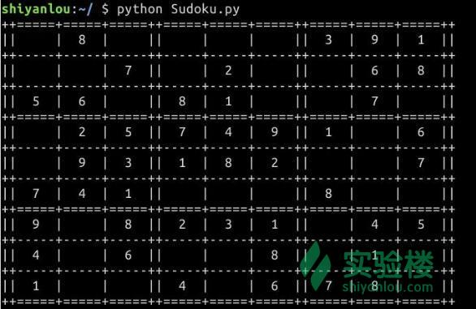

[TOC]

# Python

## 数独计算器

### 核心算法

数独sudoku”来自日文，但概念源自“拉丁方块”，是十八世纪瑞士数学家欧拉发明的。游戏规则很简单： 在九个九宫格里，填入1到9的数字，让每个数字在每个行、列及九宫格里都只出现一次。谜题中会预先填入 若干数字，其它宫位则留白，玩家得依谜题中的数字分布状况，逻辑推敲出剩下的空格里是什么数字。

这种风靡日本及欧美的“数独sudoku”，据说原创者是18世纪的瑞士人，但没有得到应有的关注，直到20多年 前，美国人重新挖掘它的魅力，接着日本杂志出版商在八○年代末期在一本美国杂志上看到这个游戏，带回日本后，增加它的游戏难度，并命名为“数独sudoku”，“数独”谜戏就此诞生，并逐渐受到日本人的注意、沉迷，日本坊间书局还出版了许多“数独”的书。纽西兰裔英籍退休法官韦恩．古德（Wayne Gould）一九九七年旅游日本时，买了一本数独游戏书，从此就迷上了，进而研究出计算机程序，之后开始供稿给全球十几家报社，立即受到读者的热烈回响，邀他供稿的媒体还正不断增加中；据说，“数独”还成为英国报纸销售量的法宝，连美国纽约时报也无法阻挡它的魅力，开始定期登载。1994年5月30日起，台湾的中国时报也取得古德的授权 ，每天都刊出一则数独谜题，让这个新玩意第一次出现在台湾的大众媒体上，也是全球第一家引入数独游戏的中文报纸。

方格里摆几个数字，乍看之下好像没什么。但数独好玩之处，就在其中推推敲敲的过程，以及解答出来的成就感。自从台湾引进数独后，玩过的人都说好玩，除非根本没玩过，否则没有听过玩过之后觉得不好玩的。由于规则简单，却变化无穷，在推敲之中完全不必用到数学计算，只需运用逻辑推理能力，所以无论老少中青男女 ，人人都可以玩。而且容易入手、容易入迷，一玩就上瘾。只需九个九宫格，及1到9不重复的阿拉伯数字，也超越了文字的障碍，因此自从出现后，从东方到西方，风靡亿万人。有些人认为玩数独是他们缓解工作压力的最佳方式；有些人认为玩数独可以保持头脑灵活，尤其适合老年人；也有些老师和父母觉得玩数独需要耐心、 专心和推理能力，所以拿数独当题目出给学生练习，用来训练小孩子。最近英国政府出资的“教师”杂志甚至建议把“数独”引进课堂，因为数独不仅有趣好玩，还可以增进玩者的推理与逻辑机能，所以可以作为学生锻炼脑力的教材喔！

**填制规则**：数独的游戏规则很简单： 在九个九宫格里， 填入 1 到 9 的数字， 让每个数字在每个行、 列及九宫格里都只出现一次就可以过关

**解谜技巧**：数独的解谜技巧， 可分为直观法及候选数法两种

### 生成数独

#### 实验介绍

**实验简介**

利用Python的itertools和random库通过50行代码完成一个 九宫格（9×9）的数独游戏题目的生成。

**课程知识点**

- Python基本知识
- Python中高效迭代的方法
- Python中浅复制和深复制的区别
- Python中print.format的用法

**效果演示**

完成本次实验之后，可以在命令行里打印出我们的数独小游戏



#### 实验步骤

学习过Python基础课程的同学，是不是已经对Python的基础知识都熟练掌握了呢？我们能够用Python写出一些基本的语句，然而Python的强大之处并不在于自身语法的优越，而在于能够利用多种多样的内部包和外部包，进行高效的开发。所以我们经常能够看到Python能够以短短几行就达到别的编程语言几十行才能达到的效果。 下面我们就使用Python实现一个数独游戏，关于数独游戏这里不做更多介绍，大家可以参见：[数独游戏](http://www.llang.net/sudoku/)。

**创建 python 文件 sudoku.py**

首先导入需要的包,random包用于生成随机数，itertools包用于快速迭代，copy.deepcopy则是用来进行深复制的。

```python
import random
import itertools
from copy import deepcopy
```

在写代码之前我们先理一理思路。

1. 首先我们需要创建出一个符合数独游戏规则的9 * 9的二维列表。
2. 在列表中填入符合游戏规则数字，直至将列表填满。
3. 按照难度系数“抠”掉一些数字，最终打印。

按照以上思路来完成代码实现.

**初始化数独二维列表**

```python
def make_board(m = 3):  
# 默认数独的每一个区块是3 * 3的
    numbers = list(range(1, m**2 + 1))  
    #这里我们创建了一个含有所有可能出现数的列表（1~9）

    board = None 
    # board是我们的数独二维列表
    while board is None:
        board = attempt_board(m,numbers) #attempt_board()函数将在第二部分完成
    return board
```

**向列表中填充数字**

在介绍我们的重点attempt_board()函数之前，我想先介绍一下itertools.product()函数。先看一下关于product的例子

```python
>>> from itertools import product
>>>
>>> print list(product([1,2,3],[3,4]))
[(1, 3), (1, 4), (2, 3), (2, 4), (3, 3), (3, 4)]
>>>
>>> print list(product([1,2,3],repeat = 2))
[(1, 1), (1, 2), (1, 3), (2, 1), (2, 2), (2, 3), (3, 1), (3, 2), (3, 3)]
```

由此我们可以看到我们引入itertools.product()函数能够把之前需要两层以上迭代才能完成的工作用一层迭代就完成，提高我们写代码的效率。

在第一部分初始化二维列表的过程中，attempt_board()函数是我们初始化数独列表的函数。在这个函数中，我们一次又一次得尝试把numbers[]列表中的数字填入数独二维列表，如果填入的数不满足数独的要求，我们返回None，重新开始填入数字。如果填入的所有数字都满足要求，我们返回这个数独二维列表board。

```python
def attempt_board(m,numbers):
    n = m ** 2

    board = [[None for _ in range(n)] for _ in range(n)]

    for i, j in itertools.product(range(n), repeat=2):
        # i,j分别代表的是我们的行和列
        # i0和j0代表的是board[i][j]所在的区块的起始位置
        i0, j0 = i - i % m, j - j % m  

        random.shuffle(numbers)
        for x in numbers:
            #分别检查行，列，区块
            if (x not in board[i]                     
                and all(row[j] != x for row in board) 
                and all(x not in row[j0:j0+m]
                        for row in board[i0:i])):     

                #如果检查没有问题，就开始赋值
                board[i][j] = x
                break
        #注意这个else的位置，是for...else...的语法结构
        else:
            return None
    return board
```

**打印数独列表**

在介绍我们的打印函数之前，先介绍一下我们即将要完成的函数中要用到的 copy.deepcopy() 函数。

```python
>>> a = list(range(5))
>>> print a
[0, 1, 2, 3, 4]
>>> b = a
>>> a[3] = 7
>>>
>>> print b
[0, 1, 2, 7, 4]
```

Python 中的对象之间赋值时是按引用传递的，如果需要拷贝对象，需要使用标准库中的copy模块。

```python
>>> a = list(range(5))
>>> print a
[0, 1, 2, 3, 4]
>>> import copy
>>> b = copy.deepcopy(a)
>>> a[3] = 7
>>> print b
[0, 1, 2, 3, 4]
```

这次的赋值不再单单传递了一个 变量a 的引用，而是实实在在的为 变量b 分配了内存空间。

有了这个基础我们就可以写我们打印数独列表的函数了。

```python
#打印我们的数独列表
def print_board(board,m = 3):
    numbers = list(range(1, m**2 + 1))

    #每一行随机把5个数字变成None
    omit = 5   #omit变量掌控着每一行被抹去的数字个数
    challange = deepcopy(board)
    for i, j in itertools.product(range(omit), range(m ** 2)):
        x = random.choice(numbers) - 1
        challange[x][j] = None

    #打印出整个数独列表
    spacer = "++-----+-----+-----++-----+-----+-----++-----+-----+-----++"
    print (spacer.replace('-','='))
    for i, line in enumerate(challange):
        print("||  {}  |  {}  |  {}  ||  {}  |  {}  |  {}  ||  {}  |  {}  |  {}  ||"
              .format(*(cell or ' ' for cell in line)))
        if (i + 1) % 3 == 0: print(spacer.replace('-', '='))
        else: print(spacer)
    return challange
```

最后记得返回 challange 变量，即返回我们的数独“题目”。我们的下一个实验就是需要来解这个challange

这里用到了print.format()函数，举例说明：

```python
>>> print '{} and {}'.format('spam', 'eggs')
spam and eggs
```

但是在代码中我们运用了更加高级的技巧

```python
print("||  {}  |  {}  |  {}  ||  {}  |  {}  |  {}  ||  {}  |  {}  |  {}  ||"
              .format(*(cell or ' ' for cell in line)))
```

每一个 "{}" 都对应了一个 cell 变量。而format()函数中的 * 号，则是将所有的 cell 的不同值放入一个元组 tuple 之中，方便format函数调用。

到现在为止我们算是在50行之内就完成了打印数独列表的工作。但是如果我们想看一下答案，也就是初始的没有抹去数字的数独列表怎么办？记得我们之前深复制的board变量吗？我们可以直接打印board函数来获知正确的答案。

```python
def print_answers(board):
    spacer = "++-----+-----+-----++-----+-----+-----++-----+-----+-----++"
    print (spacer.replace('-','='))
    for i, line in enumerate(board):
        print("||  {}  |  {}  |  {}  ||  {}  |  {}  |  {}  ||  {}  |  {}  |  {}  ||"
              .format(*(cell or ' ' for cell in line)))
        if (i + 1) % 3 == 0: print(spacer.replace('-', '='))
        else: print(spacer)
```

**实验结果**

我们写完了这三个函数，基本框架就已经完成了，最后补上对这三个函数的调用

```
Board = make_board()
print_board(Board)

```

然后在命令行中执行命令

```
python sudoku.py

```

可以看到如下的效果：


感觉还不错！你能不能解出自己生成的数独呢？下节实验中我们将会教大家如何去求解数独。

如果你感觉生成的数独题目都太简单，你还可以在print_board()函数中修改omit变量来控制数独题目的难度。

### 回溯法解决数独问题

#### 实验介绍

在上一个实验中我们成功得在命令行中打印出了我们自己的数独游戏。我们当然不会满足于仅仅打印出数独表格，我们的目标是解决数独问题，下次看到不会的数独再也不会苦恼了。解决数独的方法有很多种，如果感兴趣可以看一看[玩数独的套路](https://www.zhihu.com/question/22904542)。

今天我们将使用递归程序去解决数独问题，递归的方法虽然不一定是最高效的，却能够最简洁的给我们展示求解的方法。

**实验简介**

根据九宫格（9×9）数独题目盘面上的已知数字，利用递归程序推算出所有剩余空格的数字，并满足每一行、每一列、每一个区块(3 * 3)内的数字均含1-9，并且不重复。

**课程知识**

- 递归基本知识
- 解决数独问题的算法
- 算法的实现

**效果演示**

完成本次实验之后，可以在命令行里打印出数组的解


对比一下我们之前的问题


#### 实验步骤

** 基本思路**

首先先简要介绍一下递归

> 程序调用自身的编程技巧称为递归 (recursion)。
>
> **递归的三大定律**
>
> - 递归算法必须有个基本结束条件
> - 递归算法必须改变自己的状态并向基本结束条件演进
> - 递归算法必须递归地调用自身

在本次实验当中，基本结束条件就是整个数组都被填满。我们需要一个is_full()函数来判定。而改变自己的状态则是向空格中填入满足规则的数字。

同样的，我们在开始写之前需要理清思路。递归可以从简单的实例入手。我们可以先假设我们的数独非常简单，只有三个空格需要我们去填，而且还是在一行的。 

我们先考虑从左往右数第一个空格。我们首先想的是，这个空我们能够填哪些数字？受限于数独的规则，每个空格只能够填空格所处行、列和区块中没有出现的数字。这时候我们需要写一个cal_candidate()函数来计算这个空格中能填入的数字的列表candidate[]。

我们继续我们的设想。我们希望我们简单的例子能够覆盖绝大多数真实的情况，所以我们假设他们分能够填入数字[5,6,7],[5,6],[5] 

我们填入第一个空格的candidate[0]，即数字5。到这里没有问题，我们的算法可以继续朝下一个空格递归发展。当我们在第一个空格填入数字之后，之后的空格的candidate也会发生变化。


由于一行只能有一个数字5，所以之后两个空格candidate列表里的5都被删去。第二个空格只能选择数字6。但是第三个空格没有数字可以选了！这肯定不符合我们的原则。第三个空格返回False，提醒递归的上一级，你选的数字是有问题的，需要重新选择candidate。第二个空格收到返回的False,发现自己除了6也没有别的选择了，于是把自己重新置为None(这很重要),然后返回False给第一层的递归函数。


OK，第一个空格收到了下层递归的反馈，顺序选择了candidate[1], 数字6。这时候，第二个空格也选择了自己唯一可以选择的数字5。第三个空格还是没有数字可以选择，这时候还是需要返回False。第二个空格接收到了第三个空格返回的False，但是它也没有别的选择，也只能返回False。


第一个空格收到False之后，继续顺序选择数字7。

这时候第二个空格有两个选择，它顺序选择第一个数字candidate[0],即数字5。这时候发现第三个空格还是没有数字可以选，返回False。


第二个空格收到False之后顺序选择了candidate[1]，即数字6。在这之后我们发现第三个数字也可以顺利选择数字5.这时候需要运行一个函数检查is_Full()去检查整个数独数组是否是完整的。如果数独数组显示完整，第三个空格返回我们填完之后的数独列表。第二个空格收到返回的数独列表，明白第三个空格已经成功选择了合适的数字，也返回我们的数独列表。第一个空格收到返回的数独列表，最终返回结果，完成整个递归过程。 

了解整个递归的过程之后，我们就可以尝试编写代码了。

**编写is_full()函数**

**我们直接在上一个实验的Sudoku.py的基础上写我们这次的实验。** 参数challange即我们的数独列表。 is_full()函数就是遍历整个数独列表，检查没有填上数字的空格。非常简单。

```python
def is_full(challange, m = 3):
    for i, j in itertools.product(range(m**2), repeat = 2):
        if challange[i][j] is None:
            return False
    return True
```

运用了 itertools.product() 函数。不熟悉的同学，实验一要好好做。

**编写cal_candidate()函数**

cal_candidate()函数的输入参数是我们的数独列表，以及指定空格的行(x),列(y)轴坐标。返回的参数是指定空格能够填入的数字的列表candidate[]

```python
def cal_candidate(challange, x, y, m = 3):

    candidate = range(1, m ** 2 + 1)
    for i in range(m**2):
        #确认一行没有重复数字
        if challange[x][i] in candidate:
            candidate.remove(challange[x][i])
        #确认一列没有重复数字
        if challange[i][y] in candidate:
            candidate.remove(challange[i][y])
    #确认一个区块(3*3)没有重复数字
    for i,j in itertools.product(range(m), repeat=2):
        #x0, y0 分别代表了空格所处区块的位置
        x0, y0 = x - x % m, y - y % m
        if challange[x0+i][y0+j] in candidate:
            candidate.remove(challange[x0+i][y0+j])
    return candidate
```

**编写least_candidate()函数**

least_candidate()函数会返回能够填入数字最少的空格的 x, y 轴坐标。我们的递归函数如果从一开始就有很多个候选数字的话，不利于我们递归的展开。

```python
def least_candidate(challange, m=3):
    least, x, y = m ** 2, -1, -1
    for i, j in itertools.product(range(m**2), repeat=2):
        if not challange[i][j]:
            num = len(cal_candidate(challange, i, j))
            if num < least:
                least = num
                x, y = i, j
    return x, y
```

**编写solving_sudoku()函数**

solving_sudoku并不是我们的递归函数，它为我们的递归函数try_candidate()设定好了起始的条件：先判断输入的数独列表是否符合规范，然后设定递归函数的起始位置。

```python
def solving_soduku(challange, m=3):
    #如果数独列表已满，返回列表
    if is_full(challange):
        return challange

    #找到填入数字最少的空格位置
    x, y = least_candidate(challange)

    #为了方便递归，我们用id来表示每个空格
    id = x * (m**2) + y

    #try_candidate函数是我们的递归函数
    result = try_candidate(challange,id)
    return result
```

**编写try_candidate()函数**

工欲善其事，必先利其器。我们之前一系列的准备工作都是为了递归函数这个有利的武器做准备。当我们遇到一个非常庞大的问题的时候，也不妨先去把准备工作做好，然后再去啃硬骨头。。

```python
def try_candidate(challange, id, m=3):

    #首先是基本结束条件
    if is_full(challange):
        return challange

    #根据id解析出x,y轴坐标
    x = id / (m**2)
    y = id % (m**2)

    #循环判断当前空格是否为None
    while challange[x][y]:
        #注意,变量id可能越界
        #所以需要取模运算来防止越界
        id = (id + 1) % m**4
        x = id / (m ** 2)
        y = id % (m ** 2)
    candidate = cal_candidate(challange, x, y)

    #基本返回条件1
    if len(candidate) == 0:
        return False

    #顺序选择数字
    #并向下递归
    for i in range(len(candidate)):
        challange[x][y] = candidate[i]

        #自身的数字填好了
        #准备向下一个空格递归
        result_r = try_candidate(challange, (id + 1) % m ** 4)
        if not result_r:
            #如果后面的空格
            #返回None
            #那么我们继续选择别的数
            pass
        else:
            #后面的空格说OK!
            #很好我们也说OK
            return challange

    #注意，如果程序运行到了这一步
    #说明没有合适的数字可以选择
    #需要把自身恢复成初始状态
    #即把空格中数字置为None
    challange[x][y] = None
    return False
```

这样我们就完成了我们的递归函数。我们可以开始测试了!

#### 实验结果

添加代码

```python
Board = make_board()
challange = print_board(Board)
```

先打印出我们的题目。

```python
wait = raw_input("PRESS ENTER TO SHOW THE ANSWER.")
print("Raw Answer: ")
print_answers(Board)
print("Calculated from your program: ")
result = solving_soduku(challange)
print_answers(result)
```

按下空格键来显示我们的答案。我们这里会打印两个版本的答案，一个是Raw Answer，也就是我们在第一个实验里还没有抹去数字的数独列表。这个可以算是是官方标准答案。

还有一个答案就是Calculated from your program。这是我们程序算出来的答案。我们可以对照一下，看看做的对不对？要注意有些数独不止一个解法，要是程序算出来的和标准答案不一样也不要怪程序。只要我们的答案符合数独规则，那就是好答案。

最终效果：


如果你不满足与解决自己创建的数独题目，也可以自己写一个数独列表，让程序求解。

```python
testing = [[8,9,None,3,None,4,None,6,None],
           [None,None,2,9,1,5,3,None,8],
           [5, None,None,None,8,7,None,2,None],
           [None,8,9,None,3,6,None,None,None],
           [4,1,None,5,None,2,8,7,3],
           [3,None,5,None,None,None,6,None,None],
           [9,4,3,None,7,1,None,None,6],
           [None,5,8,4,None,None,9,1,7],
           [None,None,None,None,5,None,2,None,4]]
result = solving_soduku(testing)
print_answers(result)
```

#### 总结

这次实验主要是讲解了递归问题的求解思路，在编程技巧方面没有过多的深入。

我们在写递归的时候一定要思路清晰，想不清楚了就想一想我们之前讲过的简单的例子，帮助自己想明白整个递归的过程。

本次实验的全部代码可以在命令行中粘入：

```
http://labfile.oss.aliyuncs.com/courses/728/Solving_Sudoku.py
```

来下载

#### 课程作业

“芬兰数学家因卡拉，花费3个月时间设计出了世界上迄今难度最大的数独游戏，而且它只有一个答案。因卡拉说只有思考能力最快、头脑最聪明的人才能破解这个游戏。”这当然只是噱头，不过这道题确实够难的。如果我们自己想肯定别期待在几个小时的时间内做完了。如果交给我们的程序呢？


请运用我们的算法来解决这个只有唯一解的"Most Difficult"级别的数独问题。

答案请见： [https://www.shiyanlou.com/questions/7395](https://www.shiyanlou.com/questions/7395)


## 200行Python代码实现 2048

前置条件：

- Python 基本知识
- 状态机的概念

### 实验内容

创建游戏文件 2048.py， 首先导入需要的包

```python
import curses
from random import randrange, choice
from collections import defaultdict
```

#### 主逻辑

**用户行为**

所有的有效输入都可以转换为"上，下，左，右，游戏重置，退出"这六种行为，用 `actions` 表示

```python
actions = ['Up', 'Left', 'Down', 'Right', 'Restart', 'Exit']
```

有效输入键是最常见的 W（上），A（左），S（下），D（右），R（重置），Q（退出），这里要考虑到大写键开启的情况，获得有效键值列表：

```python
letter_codes = [ord(ch) for ch in 'WASDRQwasdrq']
```

将输入与行为进行关联：

```python
actions_dict = dict(zip(letter_codes, actions * 2))
```

**状态机**

处理游戏主逻辑的时候我们会用到一种十分常用的技术：状态机，或者更准确的说是有限状态机（FSM）

你会发现 2048 游戏很容易就能分解成几种状态的转换。


`state` 存储当前状态， `state_actions` 这个词典变量作为状态转换的规则，它的 key 是状态，value 是返回下一个状态的函数：

- Init: init()
  - Game
- Game: game()
  - Game
  - Win
  - GameOver
  - Exit
- Win: lambda: not_game('Win')
  - Init
  - Exit
- Gameover: lambda: not_game('Gameover')
  - Init
  - Exit
- Exit: 退出循环

状态机会不断循环，直到达到 Exit 终结状态结束程序。

下面是经过提取的主逻辑的代码，会在后面进行补全：

```python
def main(stdscr):

    def init():
        #重置游戏棋盘
        return 'Game'

    def not_game(state):
        #画出 GameOver 或者 Win 的界面
        #读取用户输入得到action，判断是重启游戏还是结束游戏
        responses = defaultdict(lambda: state) ＃默认是当前状态，没有行为就会一直在当前界面循环
        responses['Restart'], responses['Exit'] = 'Init', 'Exit' #对应不同的行为转换到不同的状态
        return responses[action]

    def game():
        #画出当前棋盘状态
        #读取用户输入得到action
        if action == 'Restart':
            return 'Init'
        if action == 'Exit':
            return 'Exit'
        #if 成功移动了一步:
            if 游戏胜利了:
                return 'Win'
            if 游戏失败了:
                return 'Gameover'
        return 'Game'


    state_actions = {
            'Init': init,
            'Win': lambda: not_game('Win'),
            'Gameover': lambda: not_game('Gameover'),
            'Game': game
        }

    state = 'Init'

    #状态机开始循环
    while state != 'Exit':
        state = state_actions[state]()
```

**用户输入处理**

阻塞＋循环，直到获得用户有效输入才返回对应行为：

```python
def get_user_action(keyboard):    
    char = "N"
    while char not in actions_dict:    
        char = keyboard.getch()
    return actions_dict[char]
```

**矩阵转置与矩阵逆转**

加入这两个操作可以大大节省我们的代码量，减少重复劳动，看到后面就知道了。

矩阵转置：

```python
def transpose(field):
    return [list(row) for row in zip(*field)]
```

矩阵逆转（不是逆矩阵）：

```python
def invert(field):
    return [row[::-1] for row in field]
```

#### 创建棋盘

初始化棋盘的参数，可以指定棋盘的高和宽以及游戏胜利条件，默认是最经典的 4x4～2048。

```python
class GameField(object):
def __init__(self, height=4, width=4, win=2048):
    self.height = height       #高
    self.width = width         #宽
    self.win_value = 2048      #过关分数
    self.score = 0             #当前分数
    self.highscore = 0         #最高分
    self.reset()               #棋盘重置
```

#### 棋盘操作

**随机生成一个 2 或者 4**

```python
def spawn(self):
        new_element = 4 if randrange(100) > 89 else 2
        (i,j) = choice([(i,j) for i in range(self.width) for j in range(self.height) if self.field[i][j] == 0])
        self.field[i][j] = new_element
```

**重置棋盘**

```python
def reset(self):
    if self.score > self.highscore:
        self.highscore = self.score
    self.score = 0
    self.field = [[0 for i in range(self.width)] for j in range(self.height)]
    self.spawn()
    self.spawn()
```

**一行向左合并**

(注：这一操作是在 move 内定义的，拆出来是为了方便阅读)

```python
def move_row_left(row):
    def tighten(row): # 把零散的非零单元挤到一块
        new_row = [i for i in row if i != 0]
        new_row += [0 for i in range(len(row) - len(new_row))]
        return new_row

    def merge(row): # 对邻近元素进行合并
        pair = False
        new_row = []
        for i in range(len(row)):
            if pair:
                new_row.append(2 * row[i])
                self.score += 2 * row[i]
                pair = False
            else:
                if i + 1 < len(row) and row[i] == row[i + 1]:
                    pair = True
                    new_row.append(0)
                else:
                    new_row.append(row[i])
        assert len(new_row) == len(row)
        return new_row
    #先挤到一块再合并再挤到一块
    return tighten(merge(tighten(row)))
```

**棋盘走一步**

通过对矩阵进行转置与逆转，可以直接从左移得到其余三个方向的移动操作

```python
def move(self, direction):
    def move_row_left(row):
        #一行向左合并

    moves = {}
    moves['Left']  = lambda field: [move_row_left(row) for row in field]
    moves['Right'] = lambda field: invert(moves['Left'](invert(field)))
    moves['Up']    = lambda field: transpose(moves['Left'](transpose(field)))
    moves['Down']  = lambda field: transpose(moves['Right'](transpose(field)))

    if direction in moves:
        if self.move_is_possible(direction):
            self.field = moves[direction](self.field)
            self.spawn()
            return True
        else:
            return False
```

**判断输赢**

```python
def is_win(self):
    return any(any(i >= self.win_value for i in row) for row in self.field)

def is_gameover(self):
    return not any(self.move_is_possible(move) for move in actions)
```

**判断能否移动**

```python
def move_is_possible(self, direction):
    def row_is_left_movable(row): 
        def change(i):
            if row[i] == 0 and row[i + 1] != 0: # 可以移动
                return True
            if row[i] != 0 and row[i + 1] == row[i]: # 可以合并
                return True
            return False
        return any(change(i) for i in range(len(row) - 1))

    check = {}
    check['Left']  = lambda field: any(row_is_left_movable(row) for row in field)

    check['Right'] = lambda field: check['Left'](invert(field))

    check['Up']    = lambda field: check['Left'](transpose(field))

    check['Down']  = lambda field: check['Right'](transpose(field))

    if direction in check:
        return check[direction](self.field)
    else:
        return False
```

#### 绘制游戏界面

（注：这一步是在棋盘类内定义的）

```
def draw(self, screen):
    help_string1 = '(W)Up (S)Down (A)Left (D)Right'
    help_string2 = '     (R)Restart (Q)Exit'
    gameover_string = '           GAME OVER'
    win_string = '          YOU WIN!'
    def cast(string):
        screen.addstr(string + '\n')

    #绘制水平分割线
    def draw_hor_separator():
        line = '+' + ('+------' * self.width + '+')[1:]
        separator = defaultdict(lambda: line)
        if not hasattr(draw_hor_separator, "counter"):
            draw_hor_separator.counter = 0
        cast(separator[draw_hor_separator.counter])
        draw_hor_separator.counter += 1

    def draw_row(row):
        cast(''.join('|{: ^5} '.format(num) if num > 0 else '|      ' for num in row) + '|')

    screen.clear()

    cast('SCORE: ' + str(self.score))
    if 0 != self.highscore:
        cast('HGHSCORE: ' + str(self.highscore))

    for row in self.field:
        draw_hor_separator()
        draw_row(row)

    draw_hor_separator()

    if self.is_win():
        cast(win_string)
    else:
        if self.is_gameover():
            cast(gameover_string)
        else:
            cast(help_string1)
    cast(help_string2)


```

#### 完成主逻辑

完成以上工作后，我们就可以补完主逻辑了！

```python
def main(stdscr):
    def init():
        #重置游戏棋盘
        game_field.reset()
        return 'Game'

    def not_game(state):
        #画出 GameOver 或者 Win 的界面
        game_field.draw(stdscr)
        #读取用户输入得到action，判断是重启游戏还是结束游戏
        action = get_user_action(stdscr)
        responses = defaultdict(lambda: state) #默认是当前状态，没有行为就会一直在当前界面循环
        responses['Restart'], responses['Exit'] = 'Init', 'Exit' #对应不同的行为转换到不同的状态
        return responses[action]

    def game():
        #画出当前棋盘状态
        game_field.draw(stdscr)
        #读取用户输入得到action
        action = get_user_action(stdscr)

        if action == 'Restart':
            return 'Init'
        if action == 'Exit':
            return 'Exit'
        if game_field.move(action): # move successful
            if game_field.is_win():
                return 'Win'
            if game_field.is_gameover():
                return 'Gameover'
        return 'Game'


    state_actions = {
            'Init': init,
            'Win': lambda: not_game('Win'),
            'Gameover': lambda: not_game('Gameover'),
            'Game': game
        }

    curses.use_default_colors()
    game_field = GameField(win=32)


    state = 'Init'

    #状态机开始循环
    while state != 'Exit':
        state = state_actions[state]()
```

#### 运行

填上最后一行代码：

```shell
curses.wrapper(main)
```

运行看看吧！

```shell
$ python 2048.py
```


#### 全部代码

```python
#-*- coding:utf-8 -*-

import curses
from random import randrange, choice # generate and place new tile
from collections import defaultdict

letter_codes = [ord(ch) for ch in 'WASDRQwasdrq']
actions = ['Up', 'Left', 'Down', 'Right', 'Restart', 'Exit']
actions_dict = dict(zip(letter_codes, actions * 2))

def get_user_action(keyboard):    
    char = "N"
    while char not in actions_dict:    
        char = keyboard.getch()
    return actions_dict[char]

def transpose(field):
    return [list(row) for row in zip(*field)]

def invert(field):
    return [row[::-1] for row in field]

class GameField(object):
    def __init__(self, height=4, width=4, win=2048):
        self.height = height
        self.width = width
        self.win_value = win
        self.score = 0
        self.highscore = 0
        self.reset()

    def reset(self):
        if self.score > self.highscore:
            self.highscore = self.score
        self.score = 0
        self.field = [[0 for i in range(self.width)] for j in range(self.height)]
        self.spawn()
        self.spawn()

    def move(self, direction):
        def move_row_left(row):
            def tighten(row): # squeese non-zero elements together
                new_row = [i for i in row if i != 0]
                new_row += [0 for i in range(len(row) - len(new_row))]
                return new_row

            def merge(row):
                pair = False
                new_row = []
                for i in range(len(row)):
                    if pair:
                        new_row.append(2 * row[i])
                        self.score += 2 * row[i]
                        pair = False
                    else:
                        if i + 1 < len(row) and row[i] == row[i + 1]:
                            pair = True
                            new_row.append(0)
                        else:
                            new_row.append(row[i])
                assert len(new_row) == len(row)
                return new_row
            return tighten(merge(tighten(row)))

        moves = {}
        moves['Left']  = lambda field:                              \
                [move_row_left(row) for row in field]
        moves['Right'] = lambda field:                              \
                invert(moves['Left'](invert(field)))
        moves['Up']    = lambda field:                              \
                transpose(moves['Left'](transpose(field)))
        moves['Down']  = lambda field:                              \
                transpose(moves['Right'](transpose(field)))

        if direction in moves:
            if self.move_is_possible(direction):
                self.field = moves[direction](self.field)
                self.spawn()
                return True
            else:
                return False

    def is_win(self):
        return any(any(i >= self.win_value for i in row) for row in self.field)

    def is_gameover(self):
        return not any(self.move_is_possible(move) for move in actions)

    def draw(self, screen):
        help_string1 = '(W)Up (S)Down (A)Left (D)Right'
        help_string2 = '     (R)Restart (Q)Exit'
        gameover_string = '           GAME OVER'
        win_string = '          YOU WIN!'
        def cast(string):
            screen.addstr(string + '\n')

        def draw_hor_separator():
            line = '+' + ('+------' * self.width + '+')[1:]
            separator = defaultdict(lambda: line)
            if not hasattr(draw_hor_separator, "counter"):
                draw_hor_separator.counter = 0
            cast(separator[draw_hor_separator.counter])
            draw_hor_separator.counter += 1

        def draw_row(row):
            cast(''.join('|{: ^5} '.format(num) if num > 0 else '|      ' for num in row) + '|')

        screen.clear()
        cast('SCORE: ' + str(self.score))
        if 0 != self.highscore:
            cast('HGHSCORE: ' + str(self.highscore))
        for row in self.field:
            draw_hor_separator()
            draw_row(row)
        draw_hor_separator()
        if self.is_win():
            cast(win_string)
        else:
            if self.is_gameover():
                cast(gameover_string)
            else:
                cast(help_string1)
        cast(help_string2)

    def spawn(self):
        new_element = 4 if randrange(100) > 89 else 2
        (i,j) = choice([(i,j) for i in range(self.width) for j in range(self.height) if self.field[i][j] == 0])
        self.field[i][j] = new_element

    def move_is_possible(self, direction):
        def row_is_left_movable(row): 
            def change(i): # true if there'll be change in i-th tile
                if row[i] == 0 and row[i + 1] != 0: # Move
                    return True
                if row[i] != 0 and row[i + 1] == row[i]: # Merge
                    return True
                return False
            return any(change(i) for i in range(len(row) - 1))

        check = {}
        check['Left']  = lambda field:                              \
                any(row_is_left_movable(row) for row in field)

        check['Right'] = lambda field:                              \
                 check['Left'](invert(field))

        check['Up']    = lambda field:                              \
                check['Left'](transpose(field))

        check['Down']  = lambda field:                              \
                check['Right'](transpose(field))

        if direction in check:
            return check[direction](self.field)
        else:
            return False

def main(stdscr):
    def init():
        #重置游戏棋盘
        game_field.reset()
        return 'Game'

    def not_game(state):
        #画出 GameOver 或者 Win 的界面
        game_field.draw(stdscr)
        #读取用户输入得到action，判断是重启游戏还是结束游戏
        action = get_user_action(stdscr)
        responses = defaultdict(lambda: state) #默认是当前状态，没有行为就会一直在当前界面循环
        responses['Restart'], responses['Exit'] = 'Init', 'Exit' #对应不同的行为转换到不同的状态
        return responses[action]

    def game():
        #画出当前棋盘状态
        game_field.draw(stdscr)
        #读取用户输入得到action
        action = get_user_action(stdscr)

        if action == 'Restart':
            return 'Init'
        if action == 'Exit':
            return 'Exit'
        if game_field.move(action): # move successful
            if game_field.is_win():
                return 'Win'
            if game_field.is_gameover():
                return 'Gameover'
        return 'Game'


    state_actions = {
            'Init': init,
            'Win': lambda: not_game('Win'),
            'Gameover': lambda: not_game('Gameover'),
            'Game': game
        }

    curses.use_default_colors()
    game_field = GameField(win=32)


    state = 'Init'

    #状态机开始循环
    while state != 'Exit':
        state = state_actions[state]()

curses.wrapper(main)
```

