# 如何搭建一个属于自己的直播平台

视频有它的播放协议。原则上，RTSP，RTMP，HTTP都可以做直播和点播，但一般做直播用RTSP和RTMP，做点播用HTTP。我们选用的是RTMP协议。

## RTMP 协议

RTMP（Real Time Message Protocol／实时信息传输协议）是应用层协议，靠底层传输层协议（通常是TCP）来保证信息传输的可靠性的。在TCP链接建立后，RTMP协议也要客户端和服务器通过“握手”来建立RTMP Connection，然后在Connection上传输控制信息。RTMP协议传输时会对数据格式化，而实际传输的时候为了更好地实现多路复用、分包和信息的公平性，发送端会把Message划分为带有Message ID的Chunk，每个Chunk可能是一个单独的Message，也可能是Message的一部分，在接受端会根据Chunk中包含的data的长度，message id和message的长度把chunk还原成完整的Message，从而实现信息的收发。

我们看看两个常用的视频服务。一个是由客户端向服务器发起请求推流到服务器，这个就是直播的播放服务，流程如下。

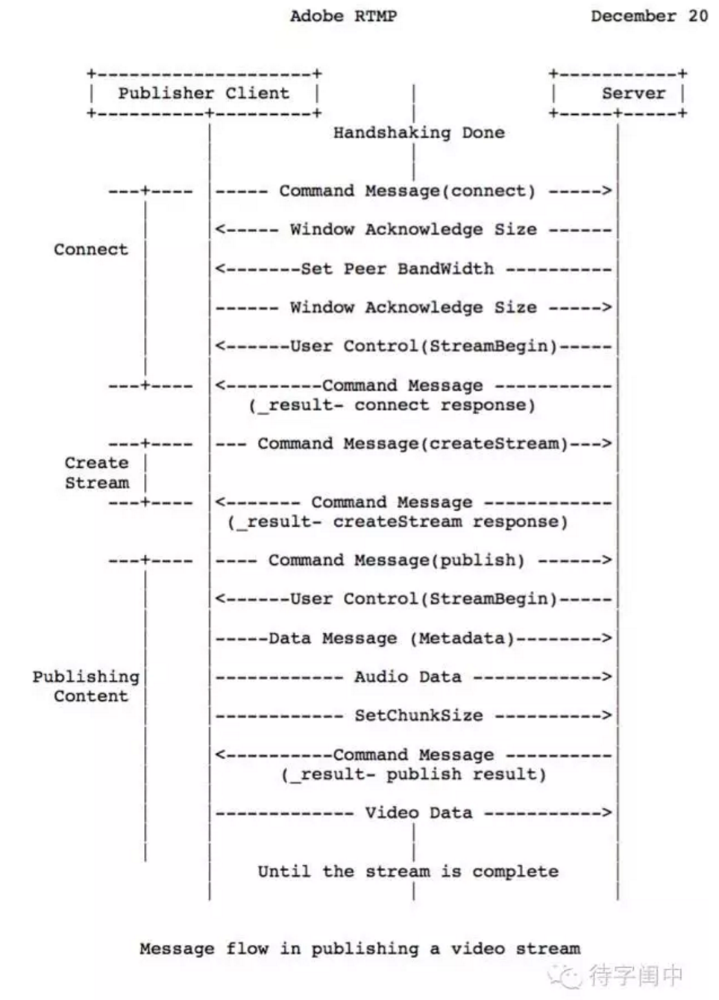

另一个是由客户端向服务器发起请求从服务器端接受数据，可以多次调用，这就是播放服务。流程如下。

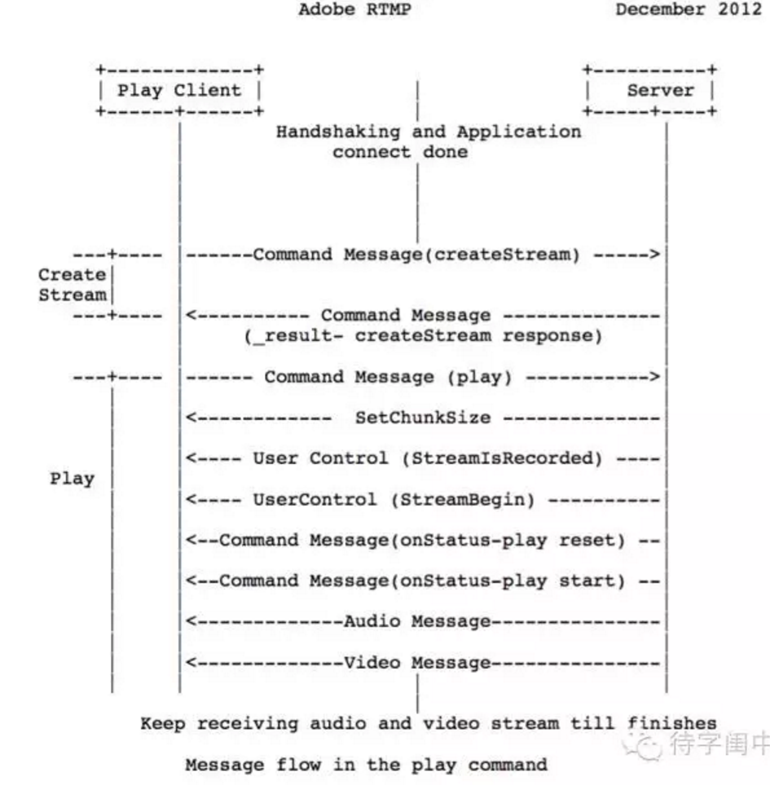

RTMP是直播后面的协议，有很多的开源软件实现了，细节我们不再细说。下面，我们看看怎么搭建后台服务系统。

## 安装和配置 LEMP

LEMP栈是指Linux（L）, NGINX（E）, MySQL（M）, PHP（P），还记得LAMP吗？LEMP既是将NGINX（E）取代了Apache（A）。

首先，用以下命令安装和启动NGINX web server。

```shell
sudo apt-get update
sudo apt-get install nginx
sudo service nginx start
```

接着， 安装 MySQL

```shell
sudo apt-get install mysql-server mysql php5-mysql
```

接着， 安装和配置 PHP

```shell
sudo apt-get install php5-fpm
```

nginx 配置文件

```c
location ~ .php$ {
  try_files $uri =404;
  fastcgi_pass unix:/var/run/php5-fpm.sock;
  fastcgi_index index.php;
  fastcgi_param SCRIPT_FILENAME $document_root$fastcgi_script_name;
  include fastcgi_params;
}
```

最后， 重新启动 NGINX web server

```shell
sudo service nginx restart
```

这样，后台的web server设置好了，可以对外提供网页和PHP服务了。但是，NGINX并不支持RTMP协议，我们需要下载，编译，安装和配置RTMP模块。

## 安装和配置 nginx-rtmp-module

首先，下载NGINX的源代码，确保环境下能正确的编译。

```shell
git clone https://github.com/nginx/nginx.git
```

然后，下载RTMP模块。

```shell
git clone https://github.com/arut/nginx-rtmp-module.git
```

然后，cd到NGINX的源代码目录，config，make和install 刚才下载的RTMP模块。

```shell
./configure --add-module=/path/to/nginx-rtmp-module make make install
make
make install
```

最后，在NGINX的配置文件中，加上RTMP相关的配置，并且重新启动NGINX server。

```
rtmp {
    server {
        listen 1935;
        chunk_size 4000;

        # HLS
        application hls {
            live on;
            hls on;
            hls_path /tmp/hls;
        }

        # MPEG-DASH is similar to HLS
        application dash {
            live on;
            dash on;
            dash_path /tmp/dash;
        }
    }
}

# HTTP can be used for accessing RTMP stats
http {
    server {
        listen      8080;

        # This URL provides RTMP statistics in XML
        location /stat {
            rtmp_stat all;
            # Use this stylesheet to view XML as web page
            # in browser
            rtmp_stat_stylesheet stat.xsl;
        }

        location /stat.xsl {
            # XML stylesheet to view RTMP stats.
            # Copy stat.xsl wherever you want
            # and put the full directory path here
            root /path/to/stat.xsl/;
        }

        location /hls {
            # Serve HLS fragments
            types {
                application/vnd.apple.mpegurl m3u8;
                video/mp2t ts;
            }
            root /tmp;
            add_header Cache-Control no-cache;
        }

        location /dash {
            # Serve DASH fragments
            root /tmp;
            add_header Cache-Control no-cache;
        }
    }
}
```

其中看到了服务器上视频存储的格式是 HLS， 下面需要介绍一下这个格式。

### HLS（HTTP Live Streaming）

HLS是一个由苹果公司提出的基于HTTP的流媒体网络传输协议，它把整个流分成一个个小的基于HTTP的文件来下载，每次只下载一些。当媒体流正在播放时，客户端可以选择从许多不同的备用源中以不同的速率下载同样的资源，允许流媒体会话适应不同的数据速率。开始播放时，客户端会下载一个包含元数据的extended M3U (m3u8)playlist文件，用于寻找可用的媒体流。工作原理如下。

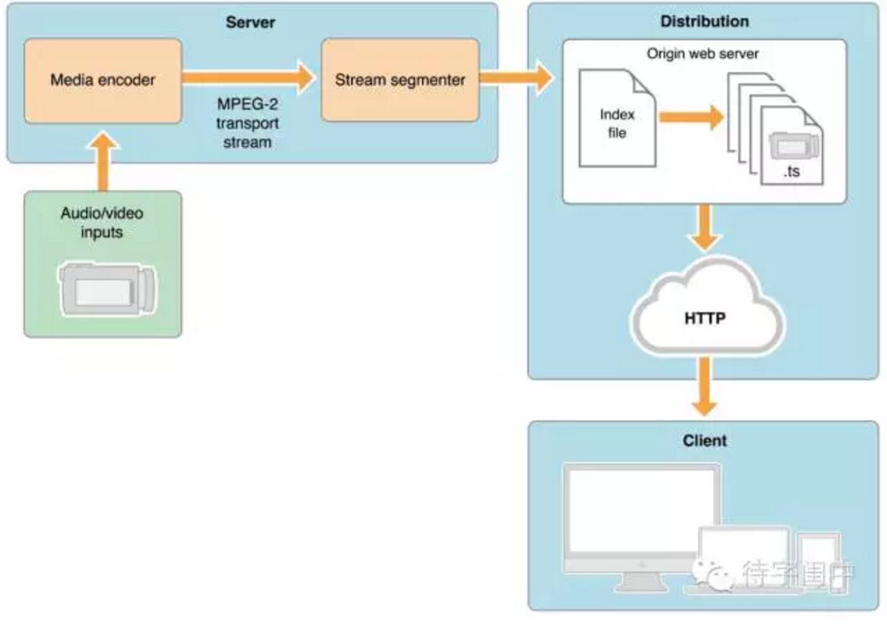

m3u8 playlist的文件结构，它不是一个单独的文件，而是由一系列文件组成。Index文件和很多的数据文件。

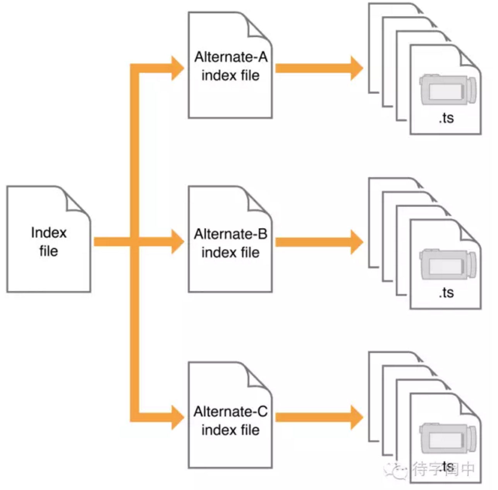

一个m3u8 playlist的index文件内容。

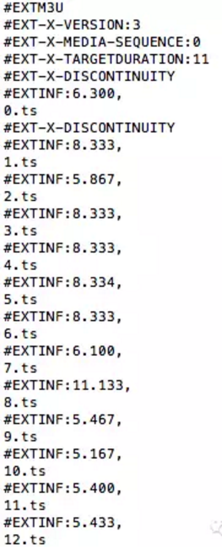

所有的数据文件，以.ts为后缀，存放在同一目录下面。

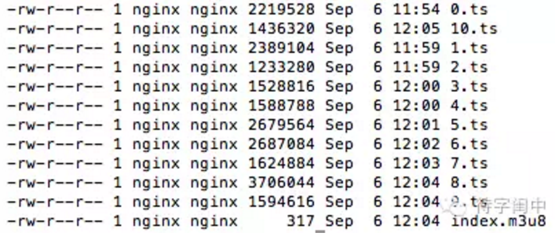

直播客户端（后面我们要介绍的OBS）将实时视频推送到NGINX的RTMP模块。RTMP模块会根据配置将视频流转换成HLS文件。这时，HLS文件可以使用两种模式播放。一是点播VOD模式，下载当前时间点可以获取到所有index文件和ts文件，并播放。这种模式允许客户端访问全部内容，不一定是实时内容。二是Live 模式，实时生成m3u8和ts文件。它的索引文件一直处于动态变化的，播放的时候需要不断下载index文件，以获得最新生成的ts文件播放视频。一般来说，实况直播时，会有一些延时。下面，来看一个JS实现的HLS player，嵌入到支持HTML5的浏览器就可以播放HLS文件。

### HLSPlayer

基于Javascript的HLS Player可以在PC浏览器（IE，Chrome，Firefox，Safari，等），iOS的Safari，Android的Chrome，等等支持HTML5的浏览器上播放。市面上有很多开源的，下面图中是其中的一种，对于不同浏览器的支持都很好。下载以后，按照它给的例子修改HLS的源就可以了。

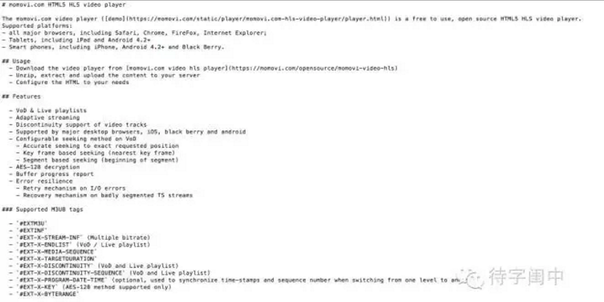

除了JS的播放器，还有独立的播放器，ffmpeg是广泛使用的一种命令行播放器，支持Windows，Linux，Mac等。

### ffmpeg

ffmpeg是一个非常快的视频/音频转换器，也可以现场抓取音频/视频源，并在任意采样率、尺寸之间调整视频，以及提供多种高品质的滤镜系统。ffmpeg从任意数量/形式的输入文件中进行读取，通过输入文件选项对输入文件进行设定，并写入到任意数量/形式的输出文件中。它不但可以对任何格式的音视频文件相互转化，而且可以播放任何格式的音视频文件。它的命令行选项超多，具体细节需要用到时自己去网上搜索和阅读。

例如，下面的命令将一个本地的视频文件movie.avi推送到服务器上可以生成HLS格式的文件。

```shell
ffmpeg -loglevel verbose -re -i movie.avi -vcodec libx264 -vprofile baseline -acodec libmp3lame -ar 44100 -ac 1 -f flv rtmp://localhost:1935/hls/movie
```

### OBS

OBS（Open Broadcaster Software／开源直播软件），它是目前世界上最火的免费开源直播软件。由于它是免费的，而且质量高，对比其它软件就有天生的优势，很多商业化的直播平台都支持和推荐使用。下面是它的基础界面。

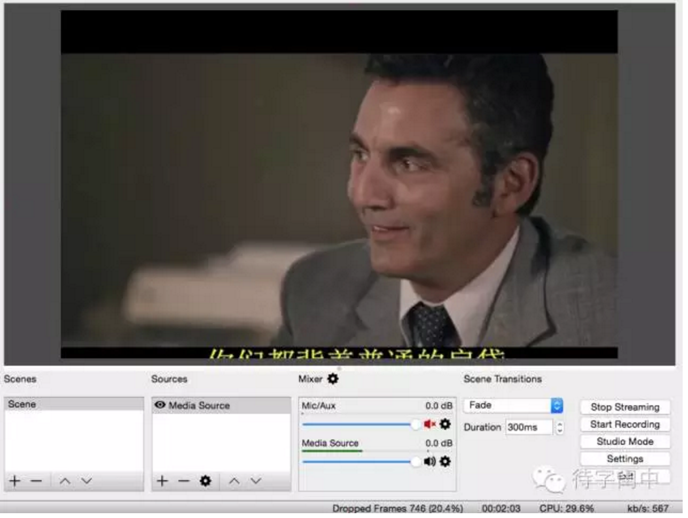

OBS能够讲视频流推送到支持RTMP协议的服务器上，需要进行一些简单的设置。服务器的地址，和流的密钥，这样，可以区分不同的用户，也保证了不同用户的内容安全。

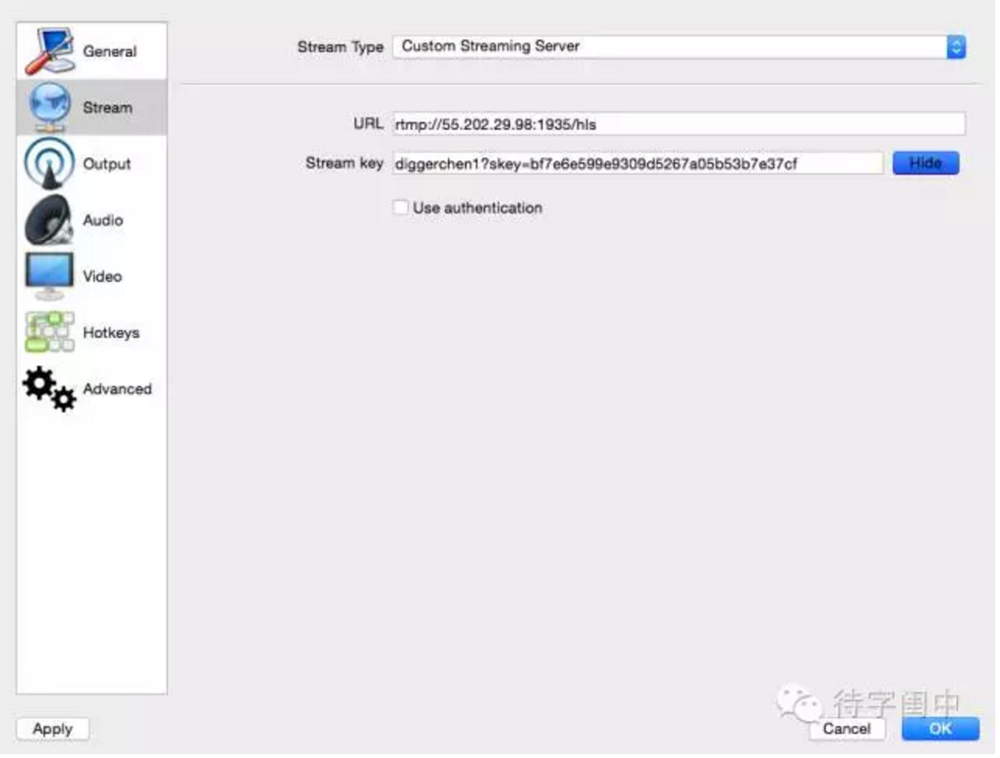

## 直播平台Demo

基于上面描述的技术和开源系统，我们用PHP实现了一个简单的支持多用户的直播平台。用户可以注册，登录，follow/unfollow，评论，标签，收看，直播（每个用户有自己的直播密钥），等等。

源代码文件目录。

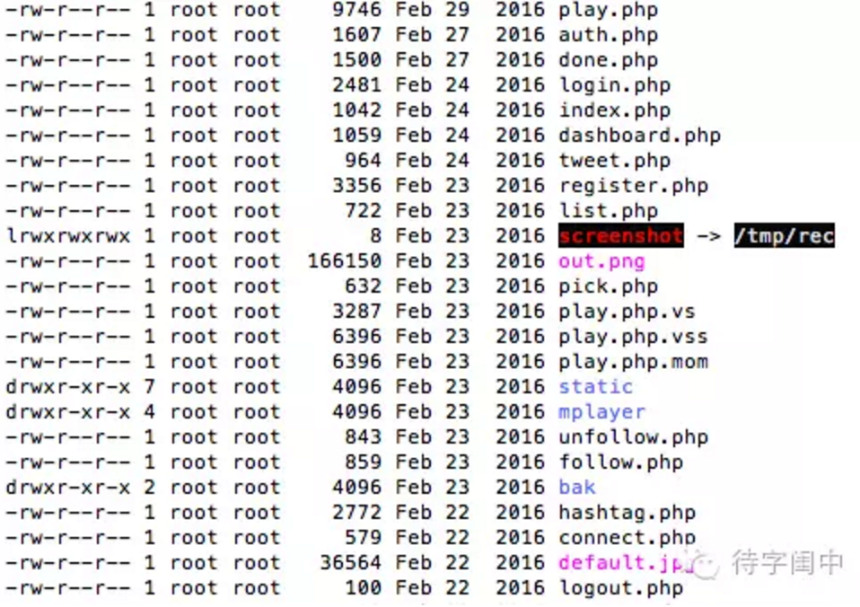

注册界面。

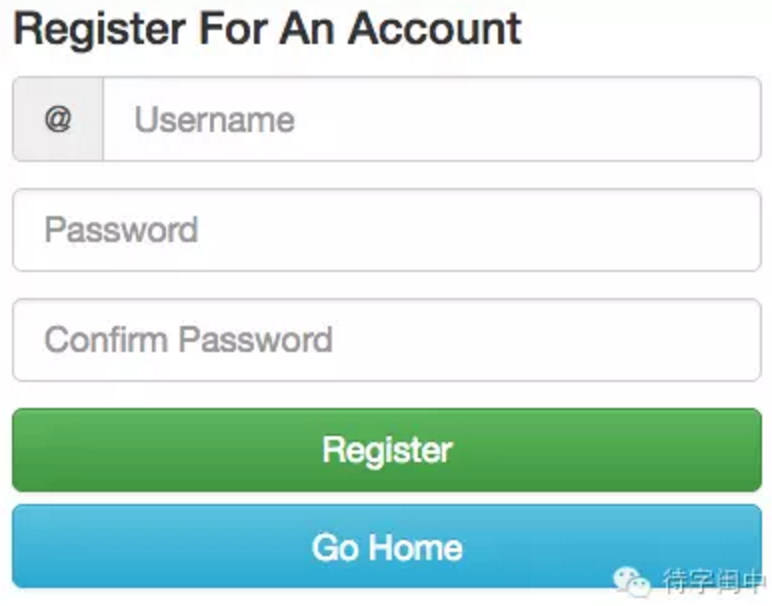

播放和评论界面。

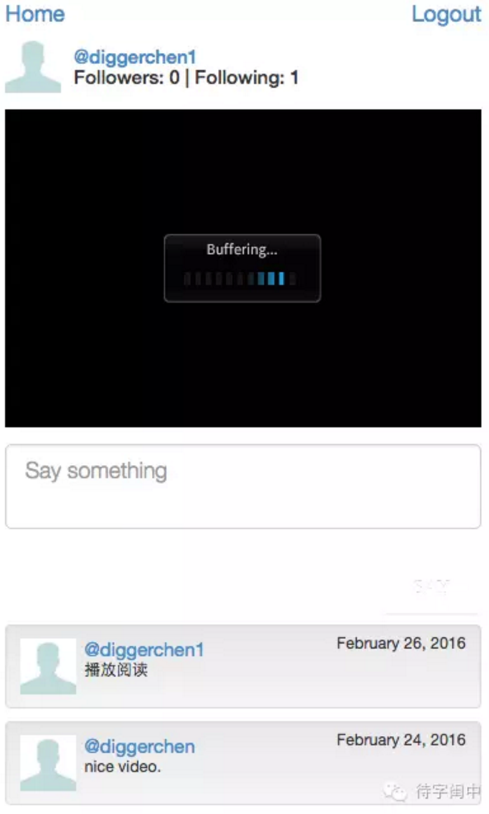

直播使用的是OBS，也可以使用你喜欢的直播移动App，需要设置系统给每个用户提供的密钥。收看时，直接选择用户和他正在播放视频就好了。

直播的精髓都应该讨论到了，如果将系统sharding，分层，SOA化，负载均衡，cache，就可以搭建出一个可扩展的大规模的直播平台。